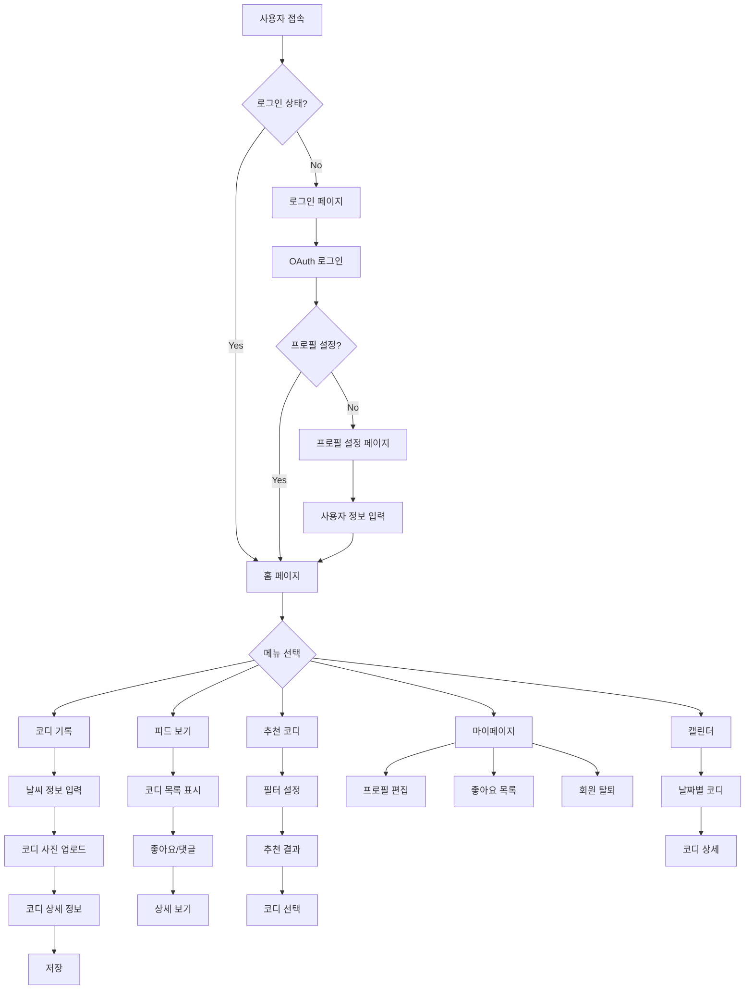
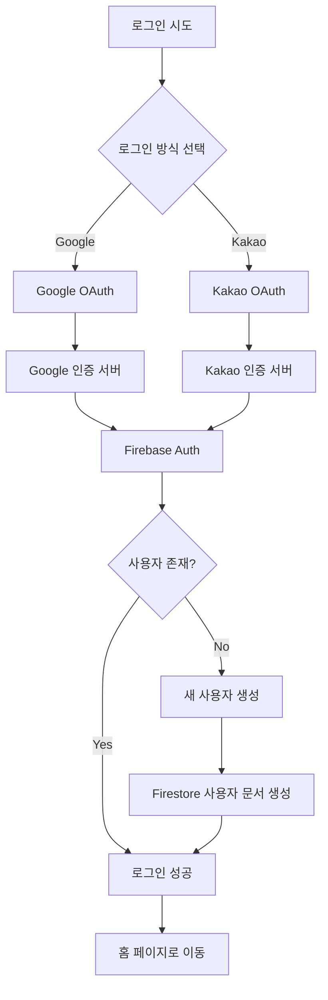
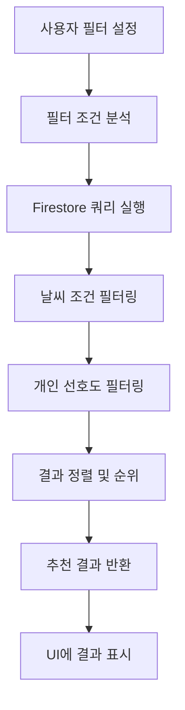
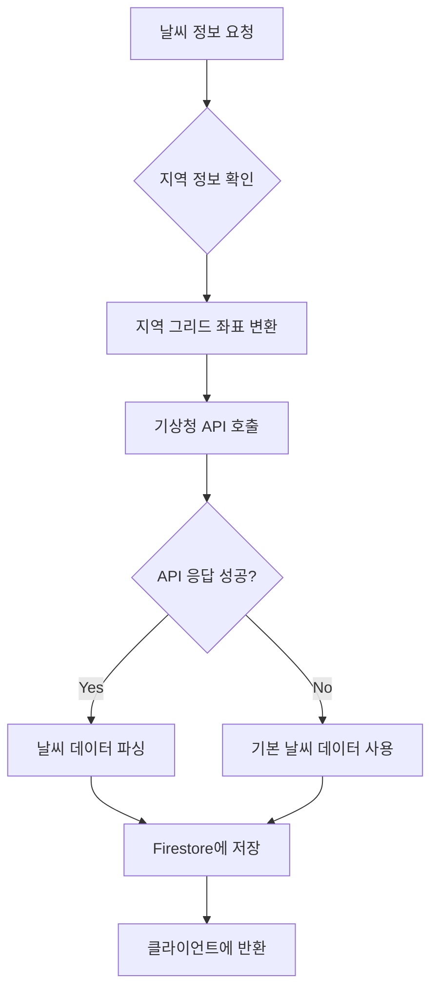
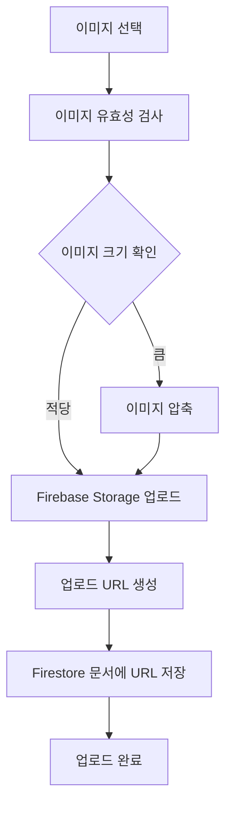

# 3. 구현내용 - 서버

## 3.1 Server

### 3.1.1 Circuit Diagram

#### System Architecture Overview

```
┌─────────────────┐    ┌─────────────────┐    ┌─────────────────┐
│   Client Side   │    │   Firebase      │    │   External      │
│   (React App)   │◄──►│   Services      │◄──►│   APIs          │
└─────────────────┘    └─────────────────┘    └─────────────────┘
         │                       │                       │
         │                       │                       │
         ▼                       ▼                       ▼
┌─────────────────┐    ┌─────────────────┐    ┌─────────────────┐
│   Browser       │    │   Authentication│    │   KMA Weather   │
│   Storage       │    │   (Google/Kakao)│    │   API           │
│   (Local/Session)│   │                 │    │   (기상청)       │
└─────────────────┘    └─────────────────┘    └─────────────────┘
         │                       │                       │
         │                       │                       │
         ▼                       ▼                       ▼
┌─────────────────┐    ┌─────────────────┐    ┌─────────────────┐
│   State         │    │   Firestore     │    │   Image         │
│   Management    │    │   Database      │    │   Storage       │
│   (Context/Redux)│   │                 │    │   (Cloud)       │
└─────────────────┘    └─────────────────┘    └─────────────────┘
```

#### Data Flow Architecture

```
User Input → React Components → API Calls → Firebase Services → External APIs
    ↑                                                              ↓
    └─────────────── Response Data ←─── Data Processing ←─────────┘
```

#### Component Communication Flow

```
┌─────────────┐    ┌─────────────┐    ┌─────────────┐
│   UI        │───►│   Hooks     │───►│   API       │
│ Components  │    │   (Custom)  │    │   Layer     │
└─────────────┘    └─────────────┘    └─────────────┘
       ▲                   ▲                   │
       │                   │                   ▼
       └───────────────────┼───────────────── Firebase
                           │                   Services
                           └─────────────────► Context
```

#### Authentication Flow

```
┌─────────────┐    ┌─────────────┐    ┌─────────────┐
│   Login     │───►│   Firebase  │───►│   User      │
│   Page      │    │   Auth      │    │   Profile   │
└─────────────┘    └─────────────┘    └─────────────┘
       │                   │                   │
       ▼                   ▼                   ▼
┌─────────────┐    ┌─────────────┐    ┌─────────────┐
│   OAuth     │    │   Token     │    │   Protected │
│   Providers │    │   Management│    │   Routes    │
└─────────────┘    └─────────────┘    └─────────────┘
```

### 3.1.2 Flow Chart

#### Main Application Flow



#### Authentication Flow



#### Data Flow for Outfit Recommendation



#### Weather API Integration Flow



#### Image Upload Flow



### 3.1.3 Database Schema (Structures)

#### Firestore Collections

##### Collection: users
Document ID: {uid} (Firebase Auth UID)

```javascript
{
  uid: string,                    // Firebase Auth UID
  email: string,                  // 사용자 이메일
  displayName: string,            // 사용자 이름
  photoURL: string,               // 프로필 사진 URL
  createdAt: timestamp,           // 계정 생성 시간
  updatedAt: timestamp,           // 정보 수정 시간
  
  // 프로필 정보
  profile: {
    nickname: string,             // 닉네임
    age: number,                  // 나이
    gender: string,               // 성별 (male/female)
    height: number,               // 키 (cm)
    weight: number,               // 몸무게 (kg)
    style: string[],              // 선호 스타일 배열
    region: string                // 주 활동 지역
  },
  
  // 설정 정보
  settings: {
    isPublic: boolean,            // 공개 프로필 여부
    notifications: boolean,        // 알림 수신 여부
    language: string              // 언어 설정
  }
}
```

##### Collection: outfitRecords
Document ID: {recordId} (자동 생성)

```javascript
{
  id: string,                     // 레코드 ID
  uid: string,                    // 작성자 UID
  region: string,                 // 지역
  date: timestamp,                // 기록 날짜
  weather: {
    temp: number,                 // 온도 (°C)
    rain: number,                 // 강수량 (mm)
    humidity: number,             // 습도 (%)
    icon: string,                 // 날씨 아이콘
    desc: string                  // 날씨 설명
  },
  feeling: string,                // 체감 온도 (더움/적당/추움)
  weatherEmojis: string[],        // 날씨 이모지 배열
  outfit: {
    outer: string[],              // 아우터 종류
    top: string[],                // 상의 종류
    bottom: string[],             // 하의 종류
    shoes: string[],              // 신발 종류
    acc: string[]                 // 액세서리 종류
  },
  imageUrls: string[],            // 이미지 URL 배열
  isPublic: boolean,              // 공개 여부
  likes: string[],                // 좋아요한 사용자 UID 배열
  likeCount: number,              // 좋아요 수
  commentCount: number,           // 댓글 수
  feedback: string,               // 피드백
  tags: string[],                 // 태그 배열
  season: string                  // 계절
}
```

##### Collection: likes
Document ID: {likeId} (자동 생성)

```javascript
{
  id: string,                     // 좋아요 ID
  recordId: string,               // 코디 레코드 ID
  uid: string,                    // 좋아요한 사용자 UID
  createdAt: timestamp,           // 좋아요 시간
  type: string                    // 좋아요 타입 (outfit/comment)
}
```

##### Collection: comments
Document ID: {commentId} (자동 생성)

```javascript
{
  id: string,                     // 댓글 ID
  recordId: string,               // 코디 레코드 ID
  uid: string,                    // 댓글 작성자 UID
  content: string,                // 댓글 내용
  createdAt: timestamp,           // 작성 시간
  updatedAt: timestamp,           // 수정 시간
  isEdited: boolean,              // 수정 여부
  likes: string[],                // 좋아요한 사용자 UID 배열
  parentId: string                // 부모 댓글 ID (대댓글용)
}
```

##### Collection: weatherData
Document ID: {weatherId} (자동 생성)

```javascript
{
  id: string,                     // 날씨 데이터 ID
  region: string,                 // 지역
  date: timestamp,                // 날짜
  baseTime: string,               // 기준 시간
  forecast: {
    temp: number,                 // 예보 온도
    rain: number,                 // 예보 강수량
    humidity: number,             // 예보 습도
    windSpeed: number,            // 풍속
    windDir: string,              // 풍향
    sky: string,                  // 하늘 상태
    precipitation: string          // 강수 형태
  },
  current: {
    temp: number,                 // 현재 온도
    rain: number,                 // 현재 강수량
    humidity: number,             // 현재 습도
    updatedAt: timestamp          // 업데이트 시간
  }
}
```

#### Database Relationships

##### One-to-Many Relationships
- **User → OutfitRecords**: 한 사용자가 여러 코디 기록 생성
- **User → Comments**: 한 사용자가 여러 댓글 작성
- **User → Likes**: 한 사용자가 여러 좋아요 표시
- **OutfitRecord → Comments**: 하나의 코디에 여러 댓글
- **OutfitRecord → Likes**: 하나의 코디에 여러 좋아요

##### Many-to-Many Relationships
- **Users ↔ OutfitRecords**: 사용자와 코디 간의 좋아요 관계
- **Users ↔ Comments**: 사용자와 댓글 간의 좋아요 관계

#### Firestore Indexes

##### Composite Indexes
```javascript
// outfitRecords collection
{
  region: Ascending,
  date: Descending,
  isPublic: Ascending
}

{
  weather.temp: Ascending,
  weather.rain: Ascending,
  date: Descending
}

{
  uid: Ascending,
  date: Descending
}

// likes collection
{
  recordId: Ascending,
  createdAt: Descending
}

// comments collection
{
  recordId: Ascending,
  createdAt: Ascending
}
```

#### Firestore Security Rules

##### Basic Security Rules
```javascript
rules_version = '2';
service cloud.firestore {
  match /databases/{database}/documents {
    // 사용자 문서
    match /users/{userId} {
      allow read: if request.auth != null;
      allow write: if request.auth != null && request.auth.uid == userId;
    }
    
    // 코디 레코드
    match /outfitRecords/{recordId} {
      allow read: if request.auth != null && 
        (resource.data.isPublic == true || 
         resource.data.uid == request.auth.uid);
      allow create: if request.auth != null && 
        request.resource.data.uid == request.auth.uid;
      allow update, delete: if request.auth != null && 
        resource.data.uid == request.auth.uid;
    }
    
    // 좋아요
    match /likes/{likeId} {
      allow read: if request.auth != null;
      allow write: if request.auth != null && 
        request.resource.data.uid == request.auth.uid;
    }
    
    // 댓글
    match /comments/{commentId} {
      allow read: if request.auth != null;
      allow create: if request.auth != null && 
        request.resource.data.uid == request.auth.uid;
      allow update, delete: if request.auth != null && 
        resource.data.uid == request.auth.uid;
    }
  }
}
```

#### Data Validation

##### Input Validation
- **이미지 파일**: JPG, PNG 형식, 최대 10MB
- **온도 범위**: -50°C ~ 50°C
- **습도 범위**: 0% ~ 100%
- **강수량 범위**: 0mm ~ 1000mm
- **텍스트 길이**: 코디 설명 최대 500자, 댓글 최대 200자

##### Business Logic Validation
- **사용자 인증**: 모든 보호된 작업에 로그인 필요
- **데이터 소유권**: 사용자는 자신의 데이터만 수정/삭제 가능
- **공개 설정**: 비공개 코디는 작성자만 조회 가능


