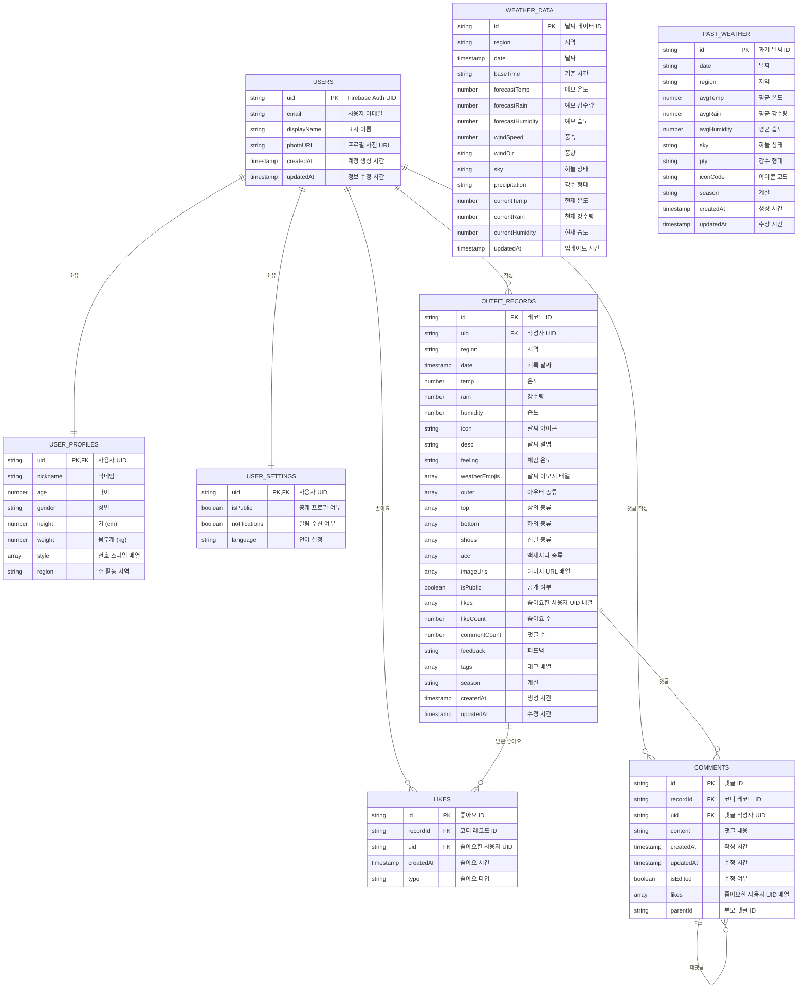
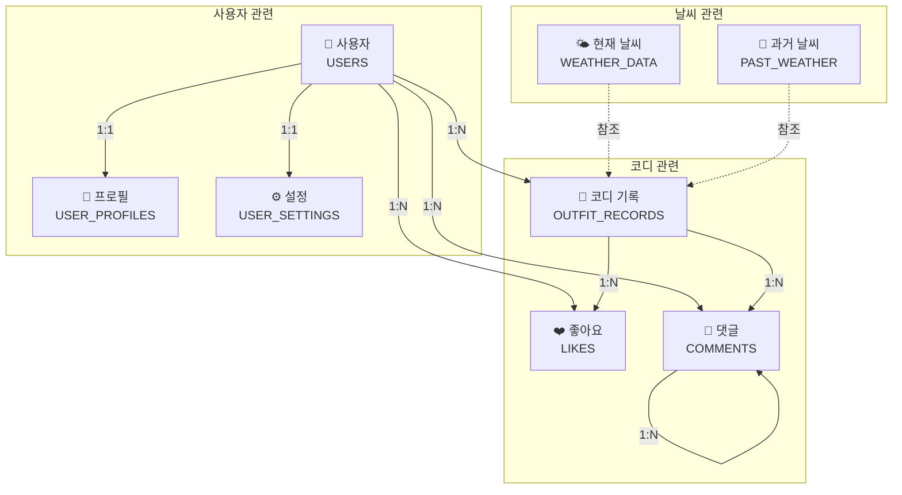
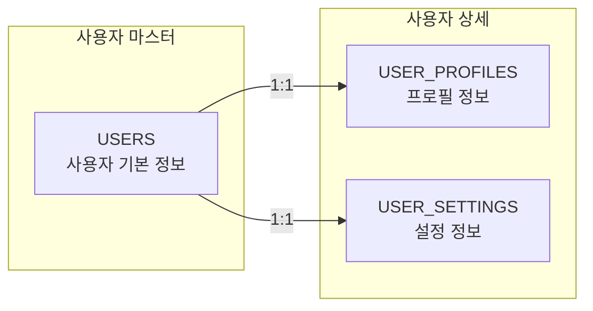
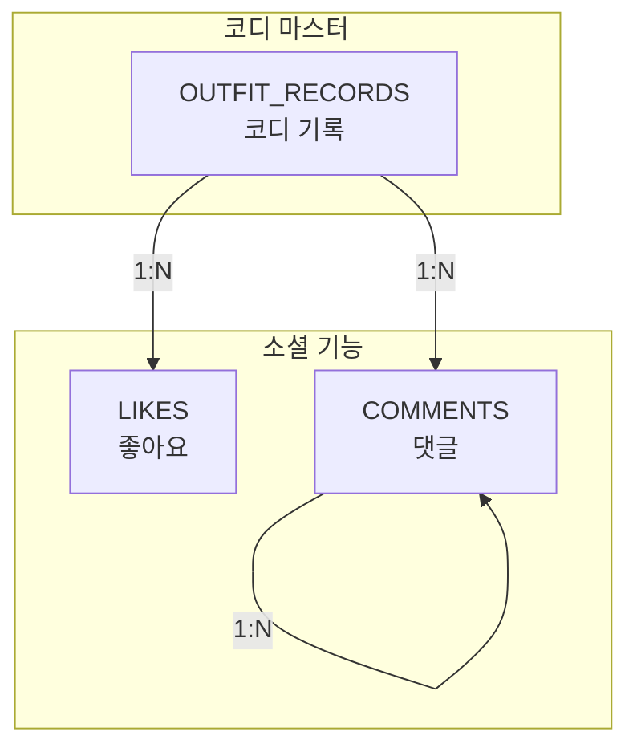
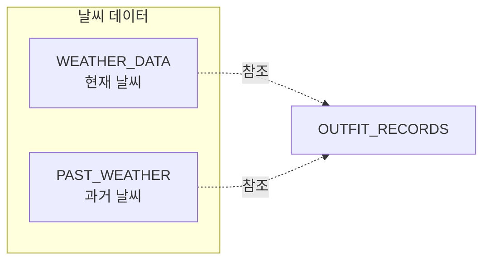
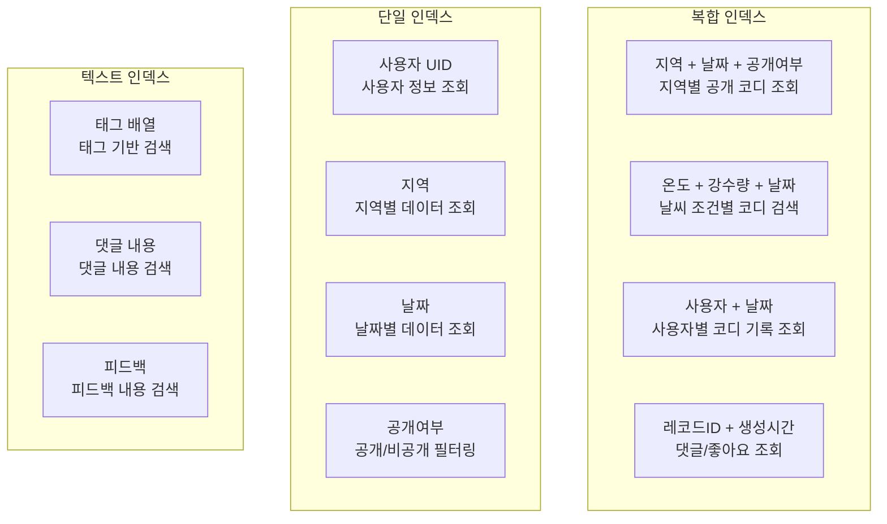
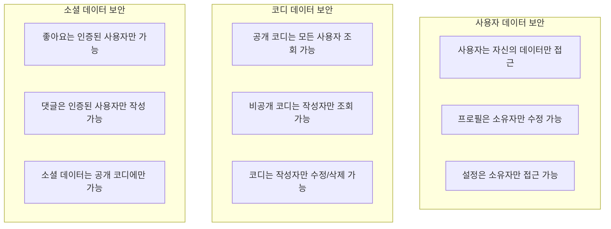

# FitWeather 데이터베이스 ERD

## 전체 데이터베이스 ERD

## 주요 엔티티 관계도

## 테이블별 상세 구조

### 1. 사용자 관련 테이블

### 2. 코디 관련 테이블

### 3. 날씨 관련 테이블

## 데이터베이스 인덱스 설계

## 보안 규칙 구조

## 주요 관계 요약

| 관계 | 테이블1 | 테이블2 | 관계 유형 | 설명 |
|------|---------|---------|-----------|------|
| 1 | USERS | USER_PROFILES | 1:1 | 사용자와 프로필 |
| 2 | USERS | USER_SETTINGS | 1:1 | 사용자와 설정 |
| 3 | USERS | OUTFIT_RECORDS | 1:N | 사용자와 코디 기록 |
| 4 | USERS | LIKES | 1:N | 사용자와 좋아요 |
| 5 | USERS | COMMENTS | 1:N | 사용자와 댓글 |
| 6 | OUTFIT_RECORDS | LIKES | 1:N | 코디와 좋아요 |
| 7 | OUTFIT_RECORDS | COMMENTS | 1:N | 코디와 댓글 |
| 8 | COMMENTS | COMMENTS | 1:N | 댓글과 대댓글 |

## 데이터베이스 특징

### ✅ **NoSQL 최적화**
- Firestore에 최적화된 구조
- 문서 기반 데이터 저장
- 실시간 동기화 지원

### ✅ **확장성**
- 사용자 증가에 대응 가능한 설계
- 수평적 확장 지원
- 자동 백업 및 복구

### ✅ **성능 최적화**
- 적절한 인덱스로 쿼리 성능 최적화
- 복합 인덱스를 통한 다중 조건 검색
- 캐싱을 통한 응답 속도 향상

### ✅ **보안 강화**
- 계층적 보안 규칙 적용
- 사용자별 데이터 접근 제어
- 암호화된 데이터 전송 및 저장

### ✅ **유연성**
- 배열 타입을 활용한 유연한 데이터 구조
- 동적 스키마 변경 지원
- 확장 가능한 메타데이터 구조
