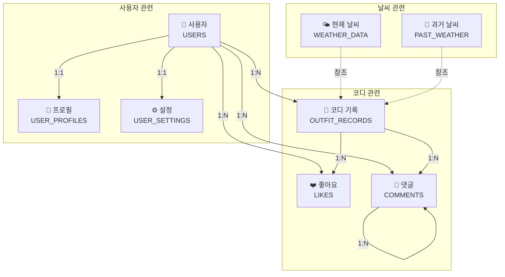
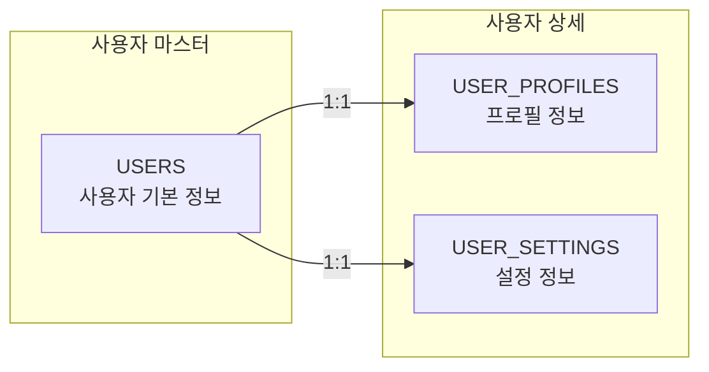
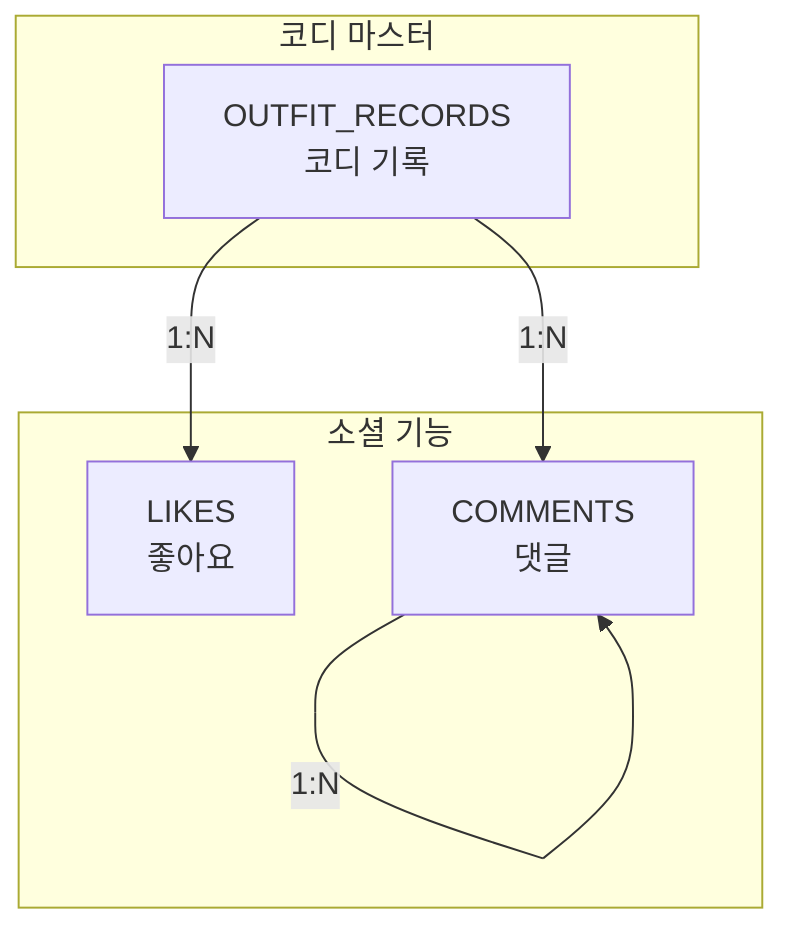
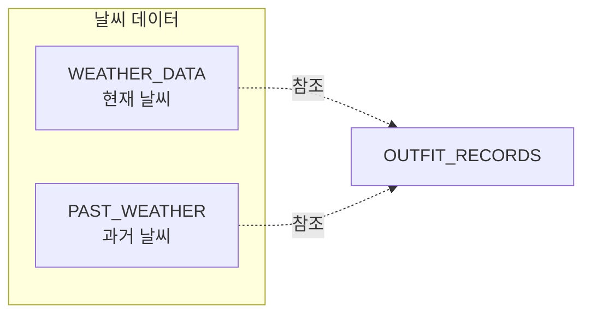
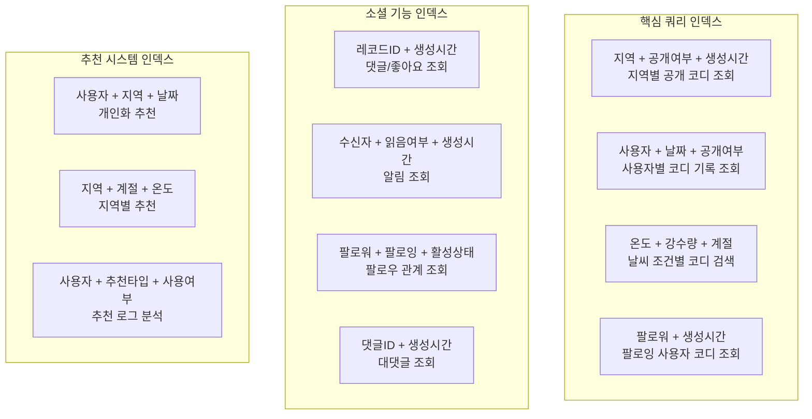
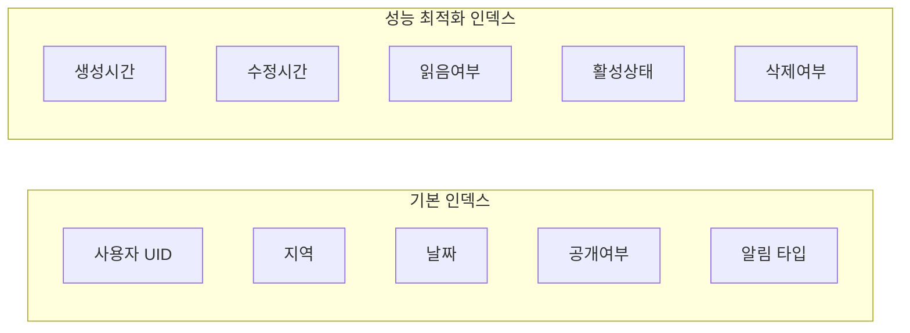
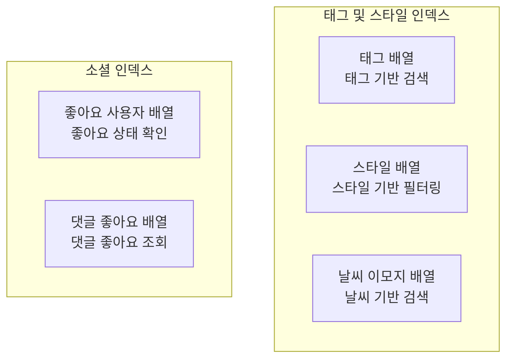
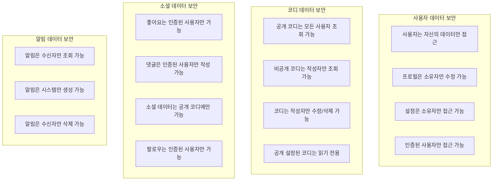

# FitWeather 데이터베이스 ERD

## 🗄️ 전체 데이터베이스 ERD (개선된 버전)

```mermaid
erDiagram
    USERS {
        string uid PK "Firebase Auth UID"
        string email "사용자 이메일"
        string displayName "표시 이름"
        string photoURL "프로필 사진 URL"
        timestamp createdAt "계정 생성 시간"
        timestamp updatedAt "정보 수정 시간"
        boolean isActive "계정 활성 상태"
    }
    
    USER_PROFILES {
        string uid PK,FK "사용자 UID"
        string nickname "닉네임"
        number age "나이"
        string gender "성별"
        number height "키 (cm)"
        number weight "몸무게 (kg)"
        array style "선호 스타일 배열"
        string region "주 활동 지역"
        string bio "자기소개"
        string profilePictureUrl "프로필 사진 URL"
        number followerCount "팔로워 수"
        number followingCount "팔로잉 수"
        timestamp lastActiveAt "마지막 활동 시간"
    }
    
    USER_SETTINGS {
        string uid PK,FK "사용자 UID"
        boolean isPublic "공개 프로필 여부"
        boolean notifications "알림 수신 여부"
        boolean emailNotifications "이메일 알림 여부"
        boolean pushNotifications "푸시 알림 여부"
        string language "언어 설정"
        string timezone "시간대 설정"
        boolean calendarSharing "캘린더 공유 여부"
    }
    
    OUTFIT_RECORDS {
        string id PK "레코드 ID"
        string uid FK "작성자 UID"
        string region "지역"
        timestamp date "기록 날짜"
        number temp "온도"
        number rain "강수량"
        number humidity "습도"
        string icon "날씨 아이콘"
        string desc "날씨 설명"
        string feeling "체감 온도"
        array weatherEmojis "날씨 이모지 배열"
        array outer "아우터 종류"
        array top "상의 종류"
        array bottom "하의 종류"
        array shoes "신발 종류"
        array acc "액세서리 종류"
        array imageUrls "이미지 URL 배열"
        boolean isPublic "공개 여부"
        number likeCount "좋아요 수"
        number commentCount "댓글 수"
        string feedback "피드백"
        array tags "태그 배열"
        string season "계절"
        timestamp createdAt "생성 시간"
        timestamp updatedAt "수정 시간"
    }
    
    LIKES {
        string id PK "좋아요 ID"
        string recordId FK "코디 레코드 ID"
        string uid FK "좋아요한 사용자 UID"
        timestamp createdAt "좋아요 시간"
        string type "좋아요 타입"
    }
    
    COMMENTS {
        string id PK "댓글 ID"
        string recordId FK "코디 레코드 ID"
        string uid FK "댓글 작성자 UID"
        string content "댓글 내용"
        timestamp createdAt "작성 시간"
        timestamp updatedAt "수정 시간"
        boolean isEdited "수정 여부"
        number likeCount "댓글 좋아요 수"
        string parentId "부모 댓글 ID"
        boolean isDeleted "삭제 여부"
    }
    
    FOLLOWS {
        string id PK "팔로우 ID"
        string followerId FK "팔로워 UID"
        string followingId FK "팔로잉 UID"
        timestamp createdAt "팔로우 시간"
        boolean isActive "활성 상태"
    }
    
    NOTIFICATIONS {
        string id PK "알림 ID"
        string recipient FK "수신자 UID"
        string senderId FK "발신자 UID"
        string type "알림 타입"
        string title "알림 제목"
        string message "알림 내용"
        string link "이동 경로"
        boolean isRead "읽음 여부"
        timestamp createdAt "생성 시간"
        timestamp readAt "읽은 시간"
        object metadata "추가 메타데이터"
    }
    
    WEATHER_DATA {
        string id PK "날씨 데이터 ID"
        string region "지역"
        timestamp date "날짜"
        string baseTime "기준 시간"
        number forecastTemp "예보 온도"
        number forecastRain "예보 강수량"
        number forecastHumidity "예보 습도"
        number windSpeed "풍속"
        string windDir "풍향"
        string sky "하늘 상태"
        string precipitation "강수 형태"
        number currentTemp "현재 온도"
        number currentRain "현재 강수량"
        number currentHumidity "현재 습도"
        timestamp updatedAt "업데이트 시간"
    }
    
    PAST_WEATHER {
        string id PK "과거 날씨 ID"
        string date "날짜"
        string region "지역"
        number avgTemp "평균 온도"
        number avgRain "평균 강수량"
        number avgHumidity "평균 습도"
        string sky "하늘 상태"
        string pty "강수 형태"
        string iconCode "아이콘 코드"
        string season "계절"
        timestamp createdAt "생성 시간"
        timestamp updatedAt "수정 시간"
    }
    
    RECOMMENDATION_LOGS {
        string id PK "추천 로그 ID"
        string uid FK "사용자 UID"
        string region "지역"
        timestamp date "추천 날짜"
        object weatherConditions "날씨 조건"
        object recommendedOutfit "추천 착장"
        string recommendationType "추천 타입"
        boolean isUsed "사용 여부"
        number rating "평점"
        timestamp createdAt "생성 시간"
    }
    
    %% 관계 정의
    USERS ||--|| USER_PROFILES : "소유"
    USERS ||--|| USER_SETTINGS : "소유"
    USERS ||--o{ OUTFIT_RECORDS : "작성"
    USERS ||--o{ LIKES : "좋아요"
    USERS ||--o{ COMMENTS : "댓글 작성"
    USERS ||--o{ FOLLOWS : "팔로워"
    USERS ||--o{ FOLLOWS : "팔로잉"
    USERS ||--o{ NOTIFICATIONS : "수신"
    USERS ||--o{ NOTIFICATIONS : "발신"
    USERS ||--o{ RECOMMENDATION_LOGS : "추천 기록"
    
    OUTFIT_RECORDS ||--o{ LIKES : "받은 좋아요"
    OUTFIT_RECORDS ||--o{ COMMENTS : "댓글"
    COMMENTS ||--o{ COMMENTS : "대댓글"
    
    WEATHER_DATA -.->|참조| OUTFIT_RECORDS
    PAST_WEATHER -.->|참조| OUTFIT_RECORDS
```

## 주요 엔티티 관계도



## 테이블별 상세 구조

### 1. 사용자 관련 테이블



### 2. 코디 관련 테이블



### 3. 날씨 관련 테이블



## 🔍 Firestore 인덱스 설계 (최적화된 버전)

### 복합 인덱스 (Composite Indexes)



### 단일 필드 인덱스



### 배열 필드 인덱스



### Firestore 보안 규칙 최적화

```javascript
// Firestore Security Rules 예시
rules_version = '2';
service cloud.firestore {
  match /databases/{database}/documents {
    // 사용자 데이터 보안
    match /users/{userId} {
      allow read, write: if request.auth != null && request.auth.uid == userId;
    }
    
    // 코디 기록 보안
    match /outfit_records/{recordId} {
      allow read: if resource.data.isPublic == true || 
                     (request.auth != null && request.auth.uid == resource.data.uid);
      allow write: if request.auth != null && request.auth.uid == resource.data.uid;
    }
    
    // 알림 보안
    match /notifications/{notificationId} {
      allow read, write: if request.auth != null && 
                            request.auth.uid == resource.data.recipient;
    }
    
    // 팔로우 보안
    match /follows/{followId} {
      allow read, write: if request.auth != null && 
                            (request.auth.uid == resource.data.followerId || 
                             request.auth.uid == resource.data.followingId);
    }
  }
}
```

## 🔒 보안 규칙 및 데이터 접근 제어

### 계층적 보안 구조



### 데이터 접근 권한 매트릭스

| 데이터 타입 | 읽기 권한 | 쓰기 권한 | 삭제 권한 | 비고 |
|-------------|------------|------------|-----------|------|
| **사용자 정보** | 본인만 | 본인만 | 본인만 | 인증 필수 |
| **프로필 정보** | 본인만 | 본인만 | 본인만 | 인증 필수 |
| **설정 정보** | 본인만 | 본인만 | 본인만 | 인증 필수 |
| **공개 코디** | 모든 사용자 | 작성자만 | 작성자만 | 공개 설정 |
| **비공개 코디** | 작성자만 | 작성자만 | 작성자만 | 비공개 설정 |
| **댓글** | 공개 코디만 | 인증된 사용자 | 작성자만 | 공개 코디에만 |
| **좋아요** | 공개 코디만 | 인증된 사용자 | 본인만 | 공개 코디에만 |
| **팔로우** | 본인 관계만 | 본인만 | 본인만 | 인증 필수 |
| **알림** | 수신자만 | 시스템만 | 수신자만 | 자동 생성 |
| **날씨 데이터** | 모든 사용자 | 시스템만 | 시스템만 | 읽기 전용 |

### Firestore 보안 규칙 상세

```javascript
rules_version = '2';
service cloud.firestore {
  match /databases/{database}/documents {
    
    // 사용자 데이터 보안
    match /users/{userId} {
      allow read, write: if request.auth != null && request.auth.uid == userId;
    }
    
    // 사용자 프로필 보안
    match /user_profiles/{userId} {
      allow read, write: if request.auth != null && request.auth.uid == userId;
    }
    
    // 사용자 설정 보안
    match /user_settings/{userId} {
      allow read, write: if request.auth != null && request.auth.uid == userId;
    }
    
    // 코디 기록 보안
    match /outfit_records/{recordId} {
      allow read: if resource.data.isPublic == true || 
                     (request.auth != null && request.auth.uid == resource.data.uid);
      allow write: if request.auth != null && request.auth.uid == resource.data.uid;
    }
    
    // 댓글 보안
    match /comments/{commentId} {
      allow read: if request.auth != null;
      allow create: if request.auth != null && 
                       request.auth.uid == request.resource.data.uid;
      allow update, delete: if request.auth != null && 
                               request.auth.uid == resource.data.uid;
    }
    
    // 좋아요 보안
    match /likes/{likeId} {
      allow read: if request.auth != null;
      allow create: if request.auth != null && 
                       request.auth.uid == request.resource.data.uid;
      allow delete: if request.auth != null && 
                       request.auth.uid == resource.data.uid;
    }
    
    // 팔로우 보안
    match /follows/{followId} {
      allow read, write: if request.auth != null && 
                            (request.auth.uid == resource.data.followerId || 
                             request.auth.uid == resource.data.followingId);
    }
    
    // 알림 보안
    match /notifications/{notificationId} {
      allow read, write: if request.auth != null && 
                            request.auth.uid == resource.data.recipient;
    }
    
    // 날씨 데이터 보안 (읽기 전용)
    match /weather_data/{weatherId} {
      allow read: if true;
      allow write: if false; // 시스템만 업데이트
    }
    
    // 과거 날씨 데이터 보안 (읽기 전용)
    match /past_weather/{weatherId} {
      allow read: if true;
      allow write: if false; // 시스템만 업데이트
    }
    
    // 추천 로그 보안
    match /recommendation_logs/{logId} {
      allow read, write: if request.auth != null && 
                            request.auth.uid == resource.data.uid;
    }
  }
}
```

## 주요 관계 요약

| 관계 | 테이블1 | 테이블2 | 관계 유형 | 설명 |
|------|---------|---------|-----------|------|
| 1 | USERS | USER_PROFILES | 1:1 | 사용자와 프로필 |
| 2 | USERS | USER_SETTINGS | 1:1 | 사용자와 설정 |
| 3 | USERS | OUTFIT_RECORDS | 1:N | 사용자와 코디 기록 |
| 4 | USERS | LIKES | 1:N | 사용자와 좋아요 |
| 5 | USERS | COMMENTS | 1:N | 사용자와 댓글 |
| 6 | OUTFIT_RECORDS | LIKES | 1:N | 코디와 좋아요 |
| 7 | OUTFIT_RECORDS | COMMENTS | 1:N | 코디와 댓글 |
| 8 | COMMENTS | COMMENTS | 1:N | 댓글과 대댓글 |

## 🚀 데이터베이스 특징 및 최적화 전략

### ✅ **NoSQL 최적화 (Firestore)**
- **문서 기반 구조**: 계층적 데이터 저장으로 복잡한 관계 표현
- **실시간 동기화**: WebSocket 기반 실시간 데이터 업데이트
- **자동 확장**: 사용자 증가에 따른 자동 스케일링
- **지역 분산**: 글로벌 CDN을 통한 빠른 데이터 접근

### ✅ **성능 최적화 전략**
- **복합 인덱스**: 다중 조건 쿼리 최적화
- **배치 작업**: 대량 데이터 처리 시 배치 업데이트
- **캐싱 전략**: 자주 조회되는 데이터 메모리 캐싱
- **페이징**: 대용량 데이터 조회 시 페이지네이션

### ✅ **보안 강화**
- **계층적 보안**: 사용자별 데이터 접근 제어
- **암호화**: 전송 및 저장 데이터 암호화
- **인증 통합**: Firebase Auth와 완전 통합
- **감사 로그**: 데이터 접근 및 수정 이력 추적

### ✅ **확장성 설계**
- **수평적 확장**: 샤딩을 통한 데이터 분산
- **자동 백업**: 일일 자동 백업 및 복구 시스템
- **모니터링**: 실시간 성능 및 오류 모니터링
- **알림 시스템**: 시스템 이상 시 자동 알림

### ✅ **개발자 친화적**
- **타입 안전성**: TypeScript 지원으로 타입 체크
- **API 일관성**: RESTful API 설계 원칙 준수
- **문서화**: 자동 생성 API 문서
- **테스트 지원**: 단위/통합 테스트 환경 제공

## 📊 성능 벤치마크 목표

| 메트릭 | 목표값 | 측정 방법 |
|--------|--------|-----------|
| **쿼리 응답 시간** | < 100ms | 평균 응답 시간 |
| **동시 사용자** | 10,000+ | 동시 접속 사용자 수 |
| **데이터 일관성** | 99.9% | ACID 속성 준수율 |
| **가용성** | 99.99% | 서비스 가동률 |
| **데이터 백업** | 24시간 | 자동 백업 주기 |

## 🔧 운영 및 유지보수

### 데이터 마이그레이션 전략
- **점진적 마이그레이션**: 서비스 중단 없는 스키마 변경
- **버전 관리**: 스키마 버전별 호환성 유지
- **롤백 계획**: 문제 발생 시 이전 버전으로 복구

### 모니터링 및 알림
- **성능 모니터링**: 쿼리 성능 및 응답 시간 추적
- **오류 추적**: 실시간 오류 감지 및 알림
- **용량 관리**: 데이터 증가율 모니터링
- **보안 감사**: 비정상적인 접근 패턴 감지

### 백업 및 복구
- **자동 백업**: 일일 전체 백업 + 실시간 증분 백업
- **지역 복제**: 다중 지역 데이터 복제
- **재해 복구**: 자연재해 대응 복구 계획
- **데이터 보존**: 법적 요구사항에 따른 데이터 보존 정책
