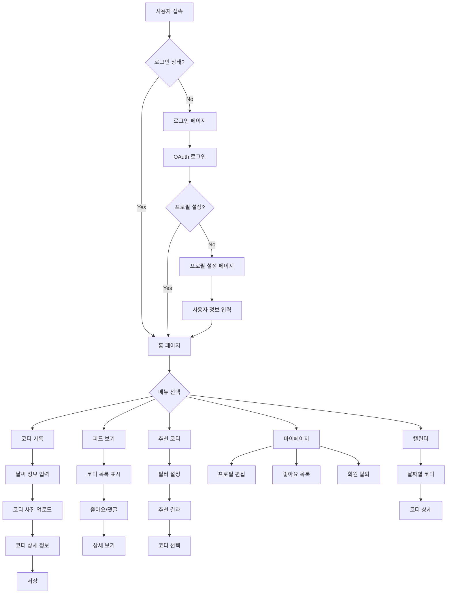
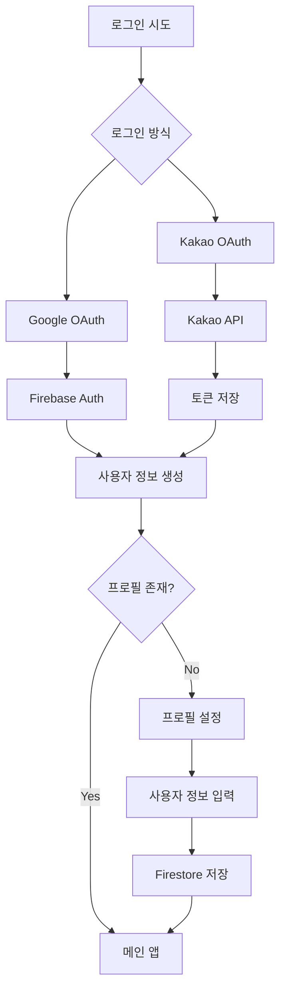
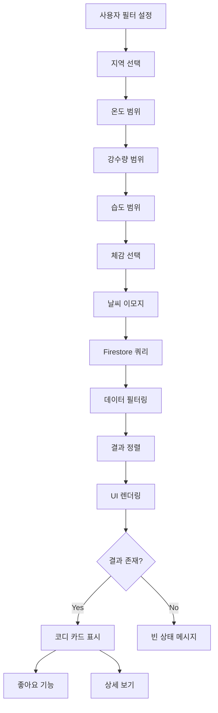
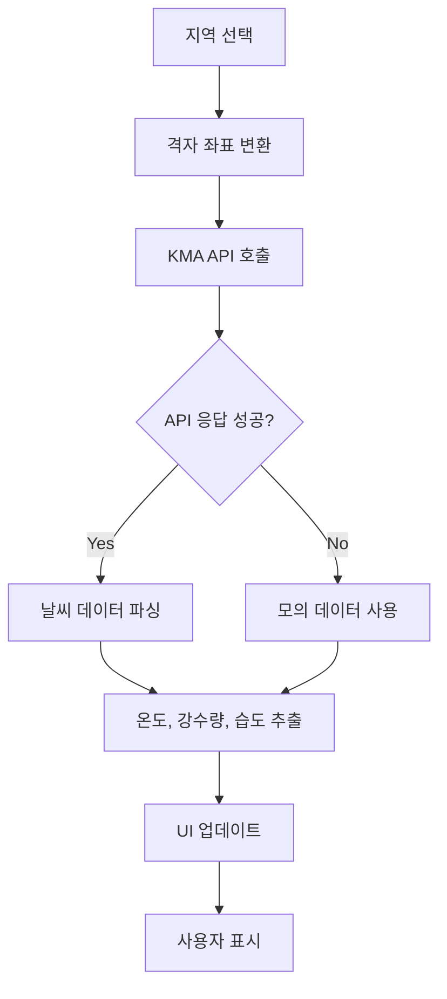
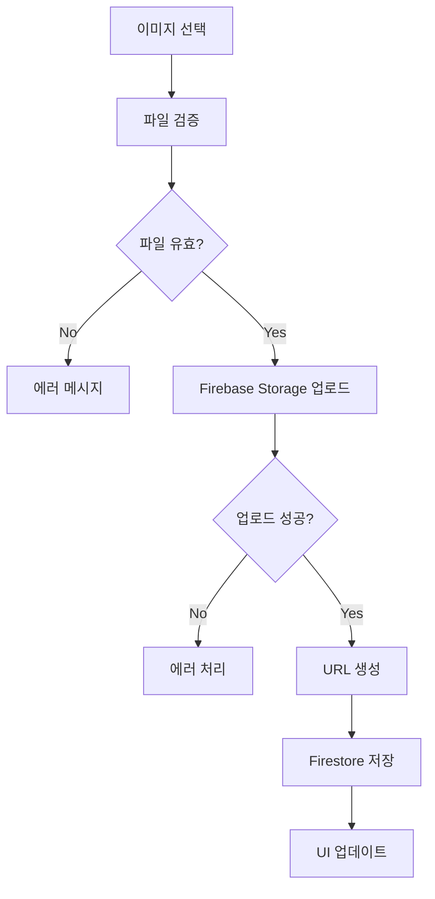

# 3.1.2 Flow Chart

## Main Application Flow

```mermaid
flowchart TD
    A[사용자 접속] --> B{로그인 상태?}
    B -->|No| C[로그인 페이지]
    B -->|Yes| D[홈 페이지]
    
    C --> E[OAuth 로그인]
    E --> F{프로필 설정?}
    F -->|No| G[프로필 설정 페이지]
    F -->|Yes| D
    
    G --> H[사용자 정보 입력]
    H --> D
    
    D --> I{메뉴 선택}
    I --> J[코디 기록]
    I --> K[피드 보기]
    I --> L[추천 코디]
    I --> M[마이페이지]
    I --> N[캘린더]
    
    J --> O[날씨 정보 입력]
    O --> P[코디 사진 업로드]
    P --> Q[코디 상세 정보]
    Q --> R[저장]
    
    K --> S[코디 목록 표시]
    S --> T[좋아요/댓글]
    T --> U[상세 보기]
    
    L --> V[필터 설정]
    V --> W[추천 결과]
    W --> X[코디 선택]
    
    M --> Y[프로필 편집]
    M --> Z[좋아요 목록]
    M --> AA[회원 탈퇴]
    
    N --> BB[날짜별 코디]
    BB --> CC[코디 상세]
```

## Authentication Flow

```mermaid
flowchart TD
    A[로그인 시도] --> B{로그인 방식}
    B --> C[Google OAuth]
    B --> D[Kakao OAuth]
    
    C --> E[Firebase Auth]
    D --> F[Kakao API]
    
    E --> G[사용자 정보 생성]
    F --> H[토큰 저장]
    H --> G
    
    G --> I{프로필 존재?}
    I -->|No| J[프로필 설정]
    I -->|Yes| K[메인 앱]
    
    J --> L[사용자 정보 입력]
    L --> M[Firestore 저장]
    M --> K
```

## Data Flow for Outfit Recommendation

```mermaid
flowchart TD
    A[사용자 필터 설정] --> B[지역 선택]
    B --> C[온도 범위]
    C --> D[강수량 범위]
    D --> E[습도 범위]
    E --> F[체감 선택]
    F --> G[날씨 이모지]
    
    G --> H[Firestore 쿼리]
    H --> I[데이터 필터링]
    I --> J[결과 정렬]
    J --> K[UI 렌더링]
    
    K --> L{결과 존재?}
    L -->|Yes| M[코디 카드 표시]
    L -->|No| N[빈 상태 메시지]
    
    M --> O[좋아요 기능]
    M --> P[상세 보기]
```

## Weather API Integration Flow

```mermaid
flowchart TD
    A[지역 선택] --> B[격자 좌표 변환]
    B --> C[KMA API 호출]
    C --> D{API 응답 성공?}
    
    D -->|Yes| E[날씨 데이터 파싱]
    D -->|No| F[모의 데이터 사용]
    
    E --> G[온도, 강수량, 습도 추출]
    F --> G
    
    G --> H[UI 업데이트]
    H --> I[사용자 표시]
```

## Image Upload Flow

```mermaid
flowchart TD
    A[이미지 선택] --> B[파일 검증]
    B --> C{파일 유효?}
    
    C -->|No| D[에러 메시지]
    C -->|Yes| E[Firebase Storage 업로드]
    
    E --> F{업로드 성공?}
    F -->|No| G[에러 처리]
    F -->|Yes| H[URL 생성]
    
    H --> I[Firestore 저장]
    I --> J[UI 업데이트]
```

