# 3.2.2 Class Diagram

## React Component Class Structure

```mermaid
classDiagram
    class App {
        +BrowserRouter router
        +AuthProvider authProvider
        +ToastContainer toastContainer
        +render()
    }

    class AuthProvider {
        +user: User
        +loading: boolean
        +loginWithGoogle()
        +logout()
        +logoutKakao()
        +value: AuthContextValue
    }

    class AuthContext {
        +user: User
        +loading: boolean
        +loginWithGoogle()
        +logout()
        +logoutKakao()
    }

    class User {
        +uid: string
        +email: string
        +displayName: string
        +photoURL: string
        +profile: UserProfile
        +settings: UserSettings
    }

    class UserProfile {
        +nickname: string
        +age: number
        +gender: string
        +height: number
        +weight: number
        +style: string[]
        +region: string
    }

    class UserSettings {
        +isPublic: boolean
        +notifications: boolean
        +language: string
    }

    class Home {
        +user: User
        +currentWeather: WeatherData
        +navigate()
        +render()
    }

    class WeatherCard {
        +weather: WeatherData
        +region: string
        +render()
    }

    class WeatherData {
        +temp: number
        +rain: number
        +humidity: number
        +icon: string
        +desc: string
    }

    class Record {
        +user: User
        +formData: RecordFormData
        +images: File[]
        +handleSubmit()
        +handleImageUpload()
        +render()
    }

    class RecordForm {
        +formData: RecordFormData
        +onSubmit: function
        +onChange: function
        +render()
    }

    class RecordFormData {
        +region: string
        +temp: number
        +rain: number
        +humidity: number
        +feeling: string
        +weatherEmojis: string[]
        +outfit: OutfitData
        +feedback: string
        +isPublic: boolean
    }

    class OutfitData {
        +outer: string[]
        +top: string[]
        +bottom: string[]
        +shoes: string[]
        +acc: string[]
    }

    class Feed {
        +records: OutfitRecord[]
        +filteredRecords: OutfitRecord[]
        +filters: FeedFilters
        +handleFilterChange()
        +render()
    }

    class FeedCard {
        +record: OutfitRecord
        +currentUserUid: string
        +onToggleLike: function
        +render()
    }

    class OutfitRecord {
        +id: string
        +uid: string
        +region: string
        +date: Date
        +weather: WeatherData
        +feeling: string
        +weatherEmojis: string[]
        +outfit: OutfitData
        +imageUrls: string[]
        +isPublic: boolean
        +likes: string[]
        +likeCount: number
        +commentCount: number
        +feedback: string
        +tags: string[]
        +season: string
    }

    class FeedFilters {
        +region: string
        +sortBy: string
        +searchQuery: string
    }

    class Recommend {
        +outfits: OutfitRecord[]
        +filteredOutfits: OutfitRecord[]
        +filters: RecommendFilters
        +hasActiveFilters: boolean
        +handleFilterChange()
        +applyFilters()
        +render()
    }

    class RecommendFilters {
        +region: string
        +tempRange: Range
        +rainRange: Range
        +humidityRange: Range
        +feeling: string
        +weatherEmojis: string[]
        +excludeMyRecords: boolean
        +onlyMyRecords: boolean
    }

    class Range {
        +min: number
        +max: number
    }

    class TemperatureSlider {
        +min: number
        +max: number
        +onChange: function
        +isDragging: boolean
        +dragType: string
        +handleMouseDown()
        +handleMouseMove()
        +handleMouseUp()
        +render()
    }

    class Sidebar {
        +isOpen: boolean
        +onClose: function
        +user: User
        +navigate()
        +render()
    }

    class AuthRouteGuard {
        +children: ReactNode
        +user: User
        +loading: boolean
        +render()
    }

    class ProfileGuard {
        +children: ReactNode
        +user: User
        +profile: UserProfile
        +render()
    }

    class FeedDetail {
        +recordId: string
        +record: OutfitRecord
        +comments: Comment[]
        +currentUserUid: string
        +fetchRecord()
        +addComment()
        +render()
    }

    class Comment {
        +id: string
        +recordId: string
        +uid: string
        +content: string
        +createdAt: Date
        +updatedAt: Date
        +isEdited: boolean
        +likes: string[]
    }

    class Calendar {
        +user: User
        +records: OutfitRecord[]
        +selectedDate: Date
        +handleDateSelect()
        +render()
    }

    class MyPageUserInfo {
        +user: User
        +profile: UserProfile
        +handleEdit()
        +render()
    }

    class ProfileEdit {
        +user: User
        +profile: UserProfile
        +formData: UserProfile
        +handleSubmit()
        +handleChange()
        +render()
    }

    class MyPageLikes {
        +user: User
        +likedRecords: OutfitRecord[]
        +selectedDate: Date
        +handleDateChange()
        +render()
    }

    class LikedDatePicker {
        +selectedDate: Date
        +onDateChange: function
        +render()
    }

    class LikedList {
        +records: OutfitRecord[]
        +currentUserUid: string
        +onToggleLike: function
        +render()
    }

    class LikeCard {
        +record: OutfitRecord
        +currentUserUid: string
        +onToggleLike: function
        +render()
    }

    class Skeleton {
        +type: string
        +render()
    }

    class KakaoCallback {
        +code: string
        +handleCallback()
        +render()
    }

    class Withdraw {
        +user: User
        +handleWithdraw()
        +render()
    }

    %% Relationships
    App --> AuthProvider
    App --> Home
    App --> Record
    App --> Feed
    App --> Recommend
    App --> Calendar
    App --> MyPageUserInfo
    App --> ProfileEdit
    App --> MyPageLikes
    App --> Withdraw
    App --> KakaoCallback

    AuthProvider --> AuthContext
    AuthContext --> User
    User --> UserProfile
    User --> UserSettings

    Home --> WeatherCard
    WeatherCard --> WeatherData

    Record --> RecordForm
    RecordForm --> RecordFormData
    RecordFormData --> OutfitData

    Feed --> FeedCard
    FeedCard --> OutfitRecord
    Feed --> FeedFilters

    Recommend --> RecommendFilters
    Recommend --> TemperatureSlider
    RecommendFilters --> Range

    FeedDetail --> OutfitRecord
    FeedDetail --> Comment

    Calendar --> OutfitRecord

    MyPageUserInfo --> UserProfile
    ProfileEdit --> UserProfile

    MyPageLikes --> LikedDatePicker
    MyPageLikes --> LikedList
    LikedList --> LikeCard
    LikeCard --> OutfitRecord

    Sidebar --> User
    AuthRouteGuard --> User
    ProfileGuard --> User
    ProfileGuard --> UserProfile
```



## Component Props and State

### Core Components with Props

```typescript
// AuthProvider Component
interface AuthProviderProps {
  children: ReactNode;
}

interface AuthContextValue {
  user: User | null;
  loading: boolean;
  loginWithGoogle: () => Promise<UserCredential>;
  logout: () => Promise<void>;
  logoutKakao: () => Promise<void>;
}

// FeedCard Component
interface FeedCardProps {
  record: OutfitRecord;
  currentUserUid: string;
  onToggleLike: (recordId: string, liked: boolean) => Promise<void>;
  currentFilters?: RecommendFilters;
}

// TemperatureSlider Component
interface TemperatureSliderProps {
  min: number;
  max: number;
  onChange: (range: Range) => void;
}

// Sidebar Component
interface SidebarProps {
  isOpen: boolean;
  onClose: () => void;
  user: User | null;
}
```

### State Management

```typescript
// Recommend Component State
interface RecommendState {
  outfits: OutfitRecord[];
  filteredOutfits: OutfitRecord[];
  filters: RecommendFilters;
  hasActiveFilters: boolean;
  sidebarOpen: boolean;
  excludeMyRecords: boolean;
  onlyMyRecords: boolean;
}

// Record Component State
interface RecordState {
  formData: RecordFormData;
  images: File[];
  isSubmitting: boolean;
  error: string | null;
}

// Feed Component State
interface FeedState {
  records: OutfitRecord[];
  filteredRecords: OutfitRecord[];
  filters: FeedFilters;
  loading: boolean;
  error: string | null;
}
```

## Custom Hooks

```typescript
// useAuth Hook
interface UseAuthReturn {
  user: User | null;
  loading: boolean;
  loginWithGoogle: () => Promise<UserCredential>;
  logout: () => Promise<void>;
  logoutKakao: () => Promise<void>;
}

// useUserProfile Hook
interface UseUserProfileReturn {
  profile: UserProfile | null;
  loading: boolean;
  error: string | null;
  updateProfile: (data: Partial<UserProfile>) => Promise<void>;
}

// useWeather Hook
interface UseWeatherReturn {
  weather: WeatherData | null;
  loading: boolean;
  error: string | null;
  fetchWeather: (region: string) => Promise<void>;
}
```

## Component Lifecycle Methods

```typescript
// Class Component Lifecycle (if using class components)
class Recommend extends React.Component<RecommendProps, RecommendState> {
  componentDidMount() {
    this.fetchAllRecords();
  }

  componentDidUpdate(prevProps: RecommendProps, prevState: RecommendState) {
    if (prevState.filters !== this.state.filters) {
      this.applyFilters();
    }
  }

  componentWillUnmount() {
    // Cleanup
  }
}

// Functional Component with Hooks
function Recommend() {
  useEffect(() => {
    fetchAllRecords();
  }, []);

  useEffect(() => {
    applyFilters();
  }, [filters]);

  useEffect(() => {
    return () => {
      // Cleanup
    };
  }, []);
}
```

## Event Handlers

```typescript
// Event Handler Interfaces
interface EventHandlers {
  // Form Events
  handleSubmit: (e: FormEvent) => void;
  handleChange: (e: ChangeEvent<HTMLInputElement | HTMLSelectElement>) => void;
  handleImageUpload: (e: ChangeEvent<HTMLInputElement>) => void;
  
  // User Interaction Events
  handleToggleLike: (recordId: string, liked: boolean) => Promise<void>;
  handleFilterChange: (filters: Partial<RecommendFilters>) => void;
  handleDateSelect: (date: Date) => void;
  
  // Navigation Events
  handleNavigate: (path: string) => void;
  handleBack: () => void;
  
  // UI Events
  handleSidebarToggle: () => void;
  handleModalClose: () => void;
}
```


