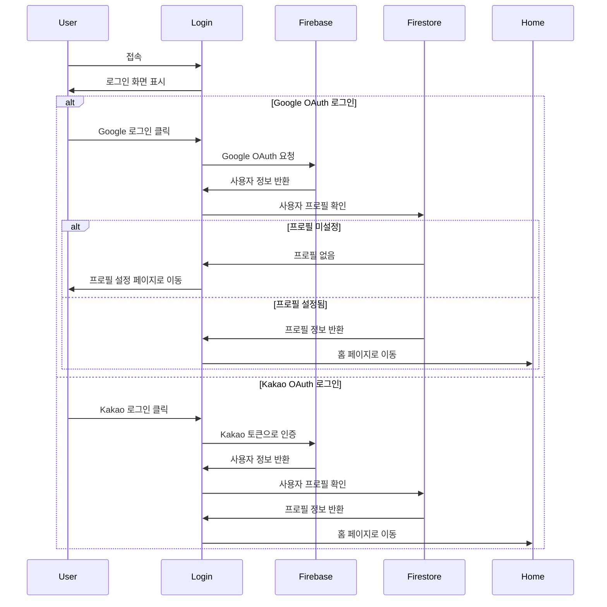
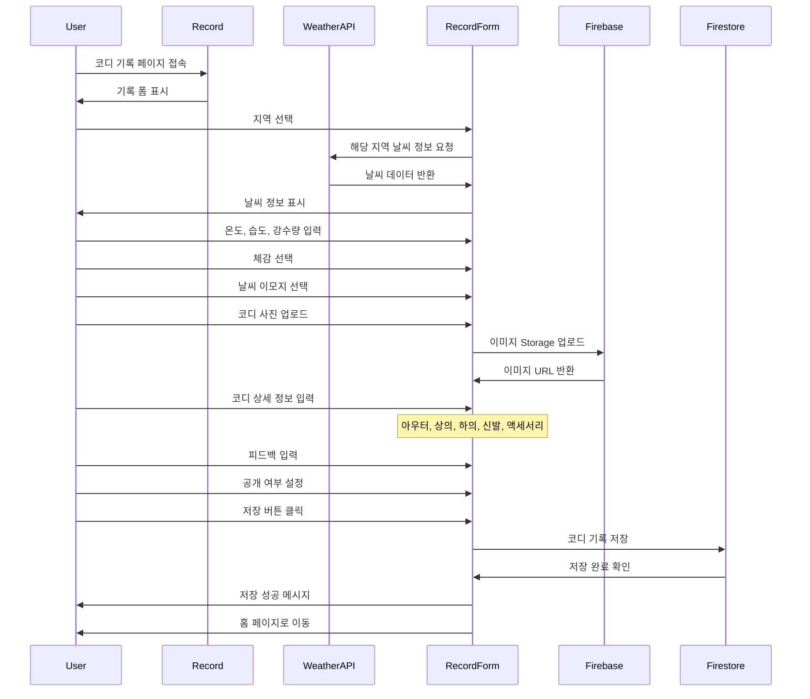
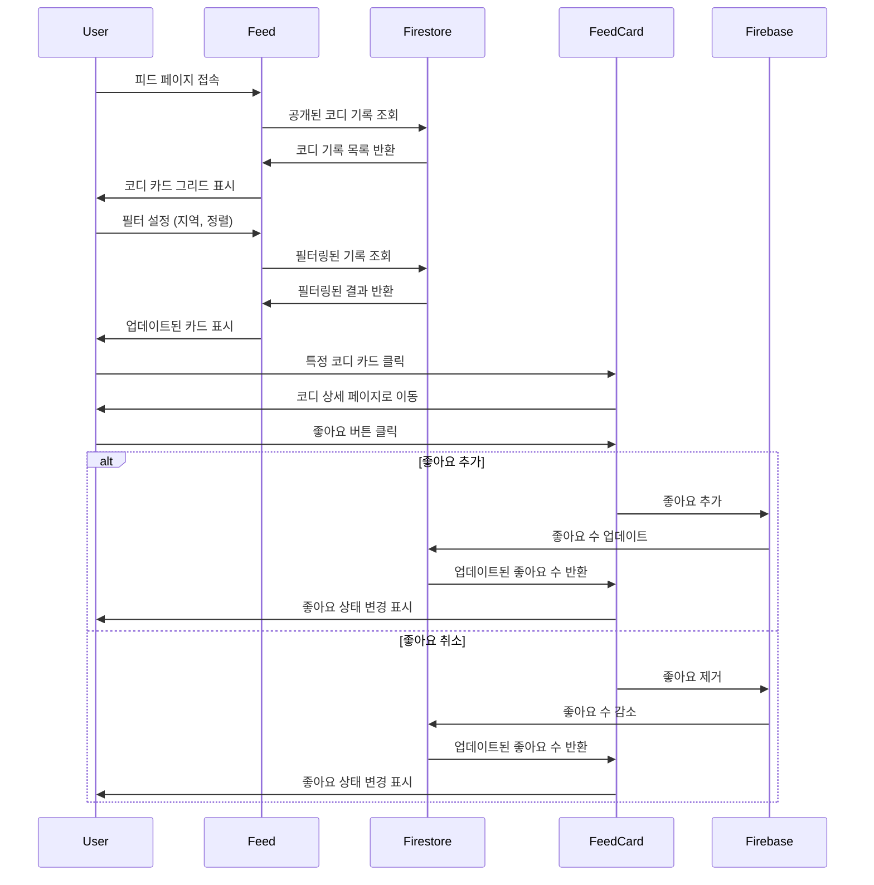
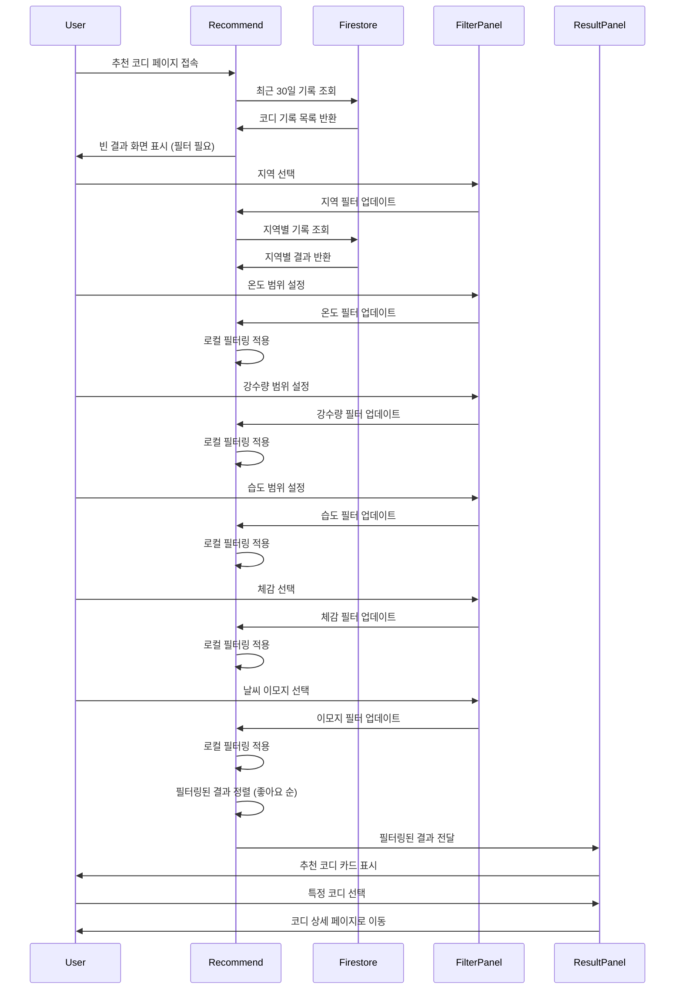
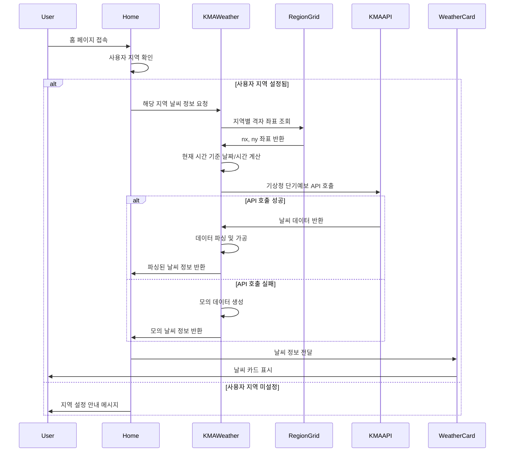
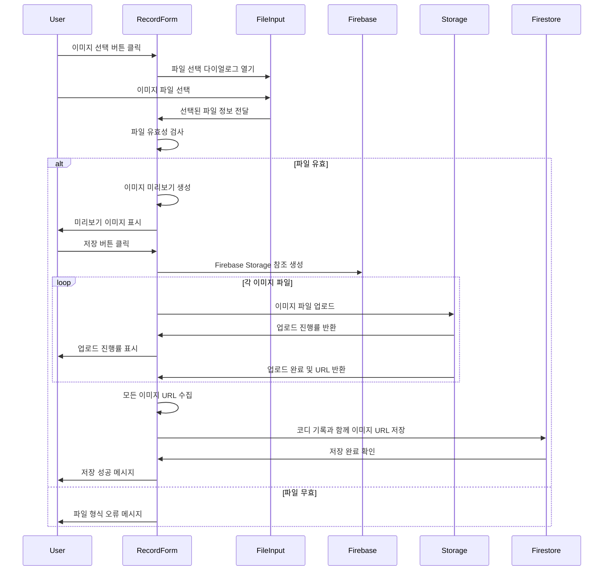
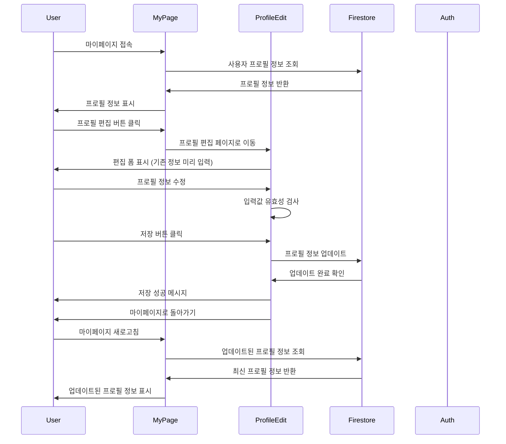
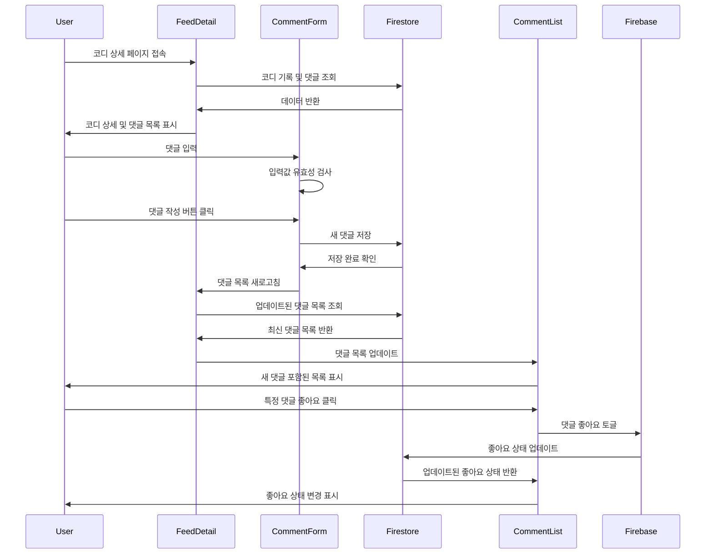
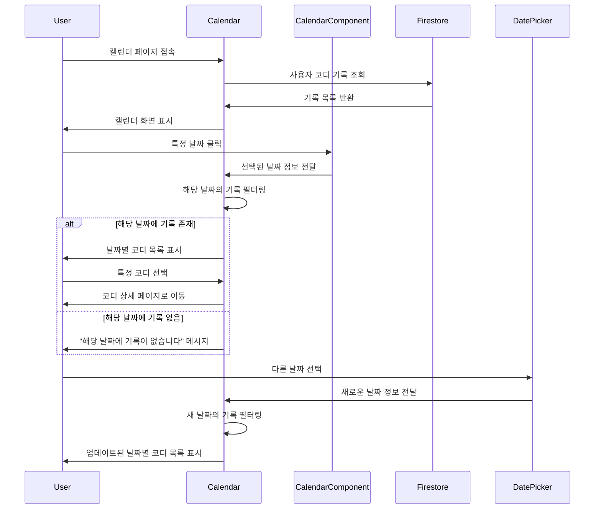
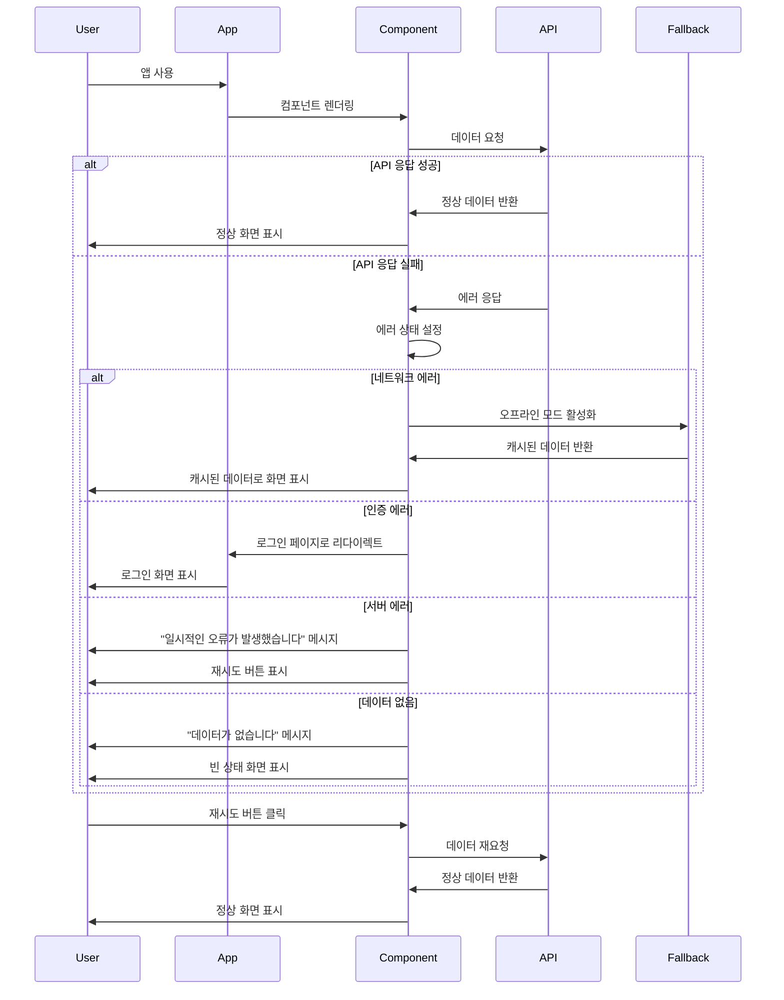

# 3.2.3 Sequence Diagram

## Main User Authentication Flow

## Outfit Recording Flow

## Feed Browsing and Interaction Flow

## Outfit Recommendation Flow

## Weather Data Integration Flow

## Image Upload and Storage Flow

## User Profile Management Flow

## Comment and Interaction Flow

## Calendar and Date-based Navigation Flow

## Error Handling and Fallback Flow

