# Fitweather 회로도 (Circuit Diagram)

## 📋 목차

1. [전체 시스템 회로도](#전체-시스템-회로도)
2. [인증 회로도](#인증-회로도)
3. [날씨 데이터 회로도](#날씨-데이터-회로도)
4. [착장 기록 저장 회로도](#착장-기록-저장-회로도)
5. [추천 시스템 회로도](#추천-시스템-회로도)
6. [소셜 기능 회로도](#소셜-기능-회로도)
7. [알림 시스템 회로도](#알림-시스템-회로도)
8. [실시간 동기화 회로도](#실시간-동기화-회로도)

---

## 전체 시스템 회로도

### 시스템 전체 흐름

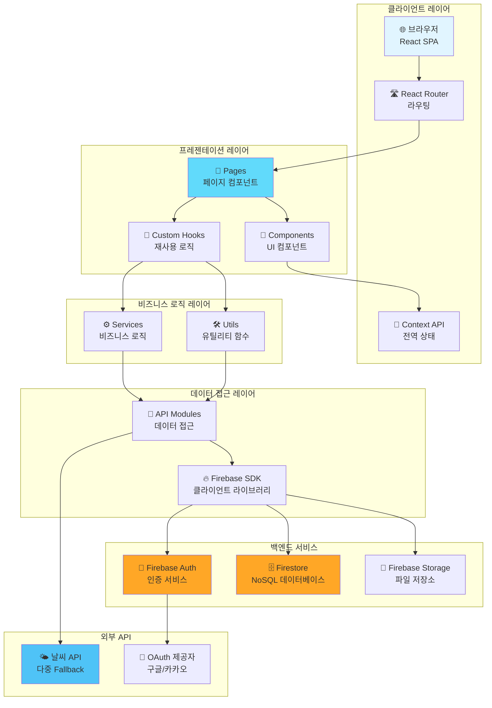
```mermaid
graph TB
    subgraph "클라이언트 레이어"
        Browser[🌐 브라우저<br/>React SPA]
        Router[🛣️ React Router<br/>라우팅]
        Context[🔄 Context API<br/>전역 상태]
    end
    
    subgraph "프레젠테이션 레이어"
        Pages[📄 Pages<br/>페이지 컴포넌트]
        Components[🧩 Components<br/>UI 컴포넌트]
        Hooks[🎣 Custom Hooks<br/>재사용 로직]
    end
    
    subgraph "비즈니스 로직 레이어"
        Services[⚙️ Services<br/>비즈니스 로직]
        Utils[🛠️ Utils<br/>유틸리티 함수]
    end
    
    subgraph "데이터 접근 레이어"
        API[📡 API Modules<br/>데이터 접근]
        FirebaseSDK[🔥 Firebase SDK<br/>클라이언트 라이브러리]
    end
    
    subgraph "백엔드 서비스"
        FirebaseAuth[🔐 Firebase Auth<br/>인증 서비스]
        Firestore[🗄️ Firestore<br/>NoSQL 데이터베이스]
        Storage[📁 Firebase Storage<br/>파일 저장소]
    end
    
    subgraph "외부 API"
        WeatherAPIs[🌤️ 날씨 API<br/>다중 Fallback]
        OAuthProviders[🔑 OAuth 제공자<br/>구글/카카오]
    end
    
    Browser --> Router
    Router --> Pages
    Pages --> Components
    Pages --> Hooks
    Components --> Context
    Hooks --> Services
    Hooks --> Utils
    Services --> API
    Utils --> API
    API --> FirebaseSDK
    FirebaseSDK --> FirebaseAuth
    FirebaseSDK --> Firestore
    FirebaseSDK --> Storage
    API --> WeatherAPIs
    FirebaseAuth --> OAuthProviders
    
    style Browser fill:#e1f5ff
    style Pages fill:#61dafb
    style FirebaseAuth fill:#ffa726
    style Firestore fill:#ffa726
    style WeatherAPIs fill:#4fc3f7
```

### 요청-응답 사이클

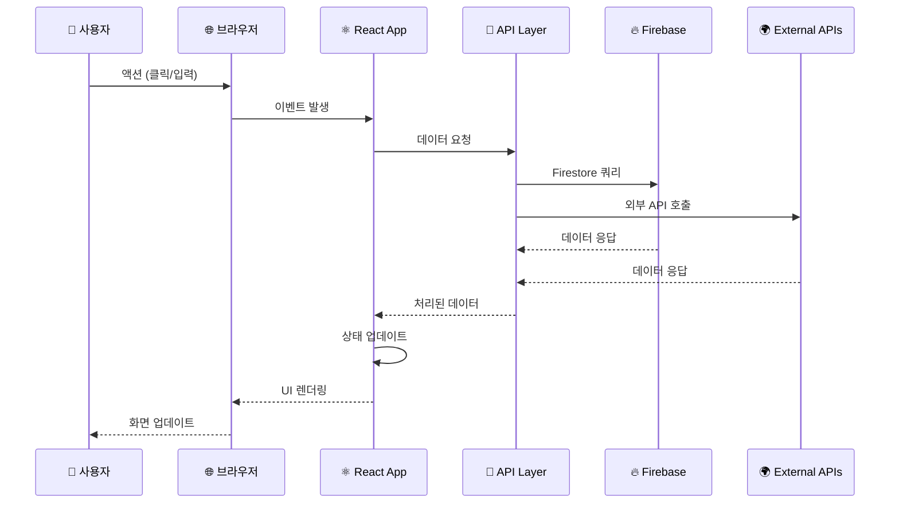
```mermaid
sequenceDiagram
    participant User as 👤 사용자
    participant Browser as 🌐 브라우저
    participant React as ⚛️ React App
    participant API as 📡 API Layer
    participant Firebase as 🔥 Firebase
    participant External as 🌍 External APIs
    
    User->>Browser: 액션 (클릭/입력)
    Browser->>React: 이벤트 발생
    React->>API: 데이터 요청
    API->>Firebase: Firestore 쿼리
    API->>External: 외부 API 호출
    Firebase-->>API: 데이터 응답
    External-->>API: 데이터 응답
    API-->>React: 처리된 데이터
    React->>React: 상태 업데이트
    React-->>Browser: UI 렌더링
    Browser-->>User: 화면 업데이트
```

---

## 인증 회로도

### 구글 OAuth 인증 플로우

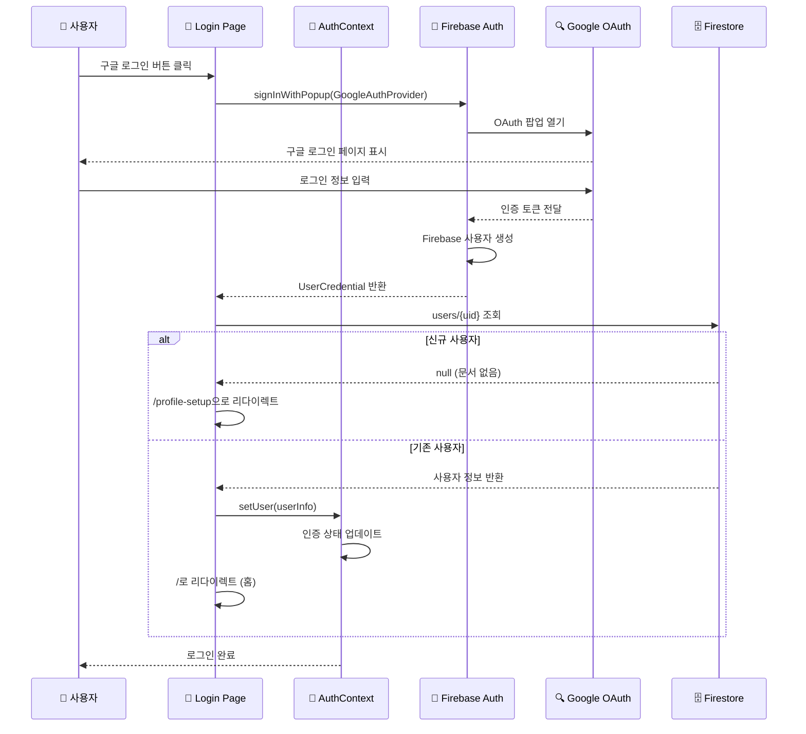
```mermaid
sequenceDiagram
    participant User as 👤 사용자
    participant Login as 📄 Login Page
    participant AuthContext as 🔄 AuthContext
    participant FirebaseAuth as 🔐 Firebase Auth
    participant GoogleAuth as 🔍 Google OAuth
    participant Firestore as 🗄️ Firestore
    
    User->>Login: 구글 로그인 버튼 클릭
    Login->>FirebaseAuth: signInWithPopup(GoogleAuthProvider)
    FirebaseAuth->>GoogleAuth: OAuth 팝업 열기
    GoogleAuth-->>User: 구글 로그인 페이지 표시
    User->>GoogleAuth: 로그인 정보 입력
    GoogleAuth-->>FirebaseAuth: 인증 토큰 전달
    FirebaseAuth->>FirebaseAuth: Firebase 사용자 생성
    FirebaseAuth-->>Login: UserCredential 반환
    Login->>Firestore: users/{uid} 조회
    alt 신규 사용자
        Firestore-->>Login: null (문서 없음)
        Login->>Login: /profile-setup으로 리다이렉트
    else 기존 사용자
        Firestore-->>Login: 사용자 정보 반환
        Login->>AuthContext: setUser(userInfo)
        AuthContext->>AuthContext: 인증 상태 업데이트
        Login->>Login: /로 리다이렉트 (홈)
    end
    AuthContext-->>User: 로그인 완료
```

### 카카오 OAuth 인증 플로우

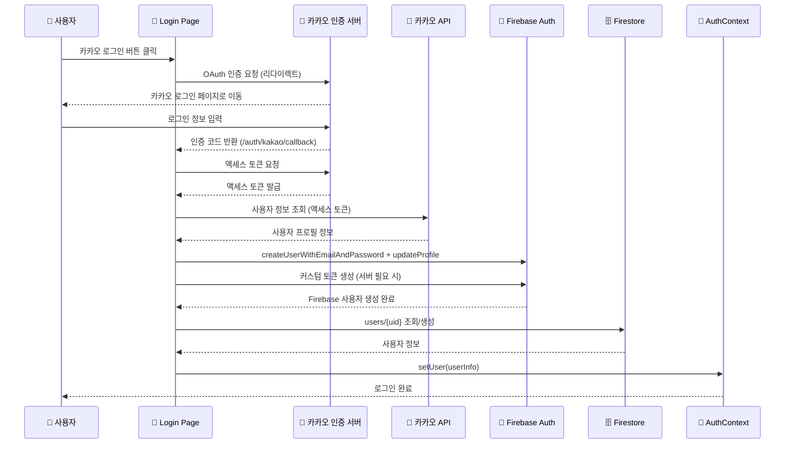
```mermaid
sequenceDiagram
    participant User as 👤 사용자
    participant Login as 📄 Login Page
    participant KakaoAuth as 🔗 카카오 인증 서버
    participant KakaoAPI as 📡 카카오 API
    participant FirebaseAuth as 🔐 Firebase Auth
    participant Firestore as 🗄️ Firestore
    participant AuthContext as 🔄 AuthContext
    
    User->>Login: 카카오 로그인 버튼 클릭
    Login->>KakaoAuth: OAuth 인증 요청 (리다이렉트)
    KakaoAuth-->>User: 카카오 로그인 페이지로 이동
    User->>KakaoAuth: 로그인 정보 입력
    KakaoAuth-->>Login: 인증 코드 반환 (/auth/kakao/callback)
    Login->>KakaoAuth: 액세스 토큰 요청
    KakaoAuth-->>Login: 액세스 토큰 발급
    Login->>KakaoAPI: 사용자 정보 조회 (액세스 토큰)
    KakaoAPI-->>Login: 사용자 프로필 정보
    Login->>FirebaseAuth: createUserWithEmailAndPassword + updateProfile
    Login->>FirebaseAuth: 커스텀 토큰 생성 (서버 필요 시)
    FirebaseAuth-->>Login: Firebase 사용자 생성 완료
    Login->>Firestore: users/{uid} 조회/생성
    Firestore-->>Login: 사용자 정보
    Login->>AuthContext: setUser(userInfo)
    AuthContext-->>User: 로그인 완료
```

### 인증 상태 관리 회로

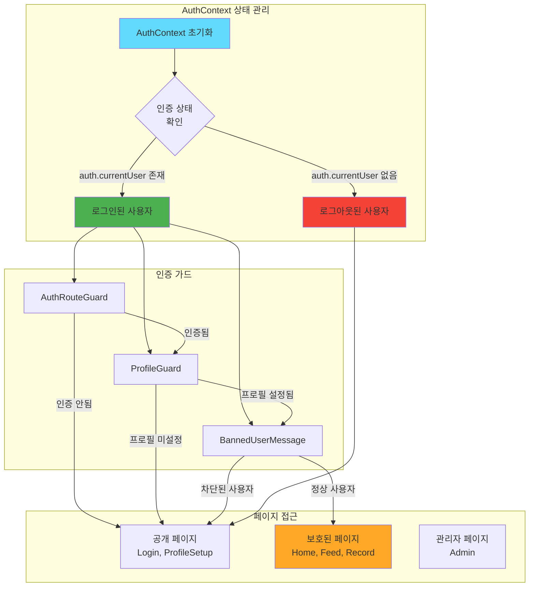
```mermaid
graph TB
    subgraph "AuthContext 상태 관리"
        AuthInit[AuthContext 초기화]
        AuthCheck{인증 상태<br/>확인}
        UserLoggedIn[로그인된 사용자]
        UserLoggedOut[로그아웃된 사용자]
    end
    
    subgraph "인증 가드"
        AuthGuard[AuthRouteGuard]
        ProfileGuard[ProfileGuard]
        BannedGuard[BannedUserMessage]
    end
    
    subgraph "페이지 접근"
        PublicPage[공개 페이지<br/>Login, ProfileSetup]
        ProtectedPage[보호된 페이지<br/>Home, Feed, Record]
        AdminPage[관리자 페이지<br/>Admin]
    end
    
    AuthInit --> AuthCheck
    AuthCheck -->|auth.currentUser 존재| UserLoggedIn
    AuthCheck -->|auth.currentUser 없음| UserLoggedOut
    
    UserLoggedIn --> AuthGuard
    UserLoggedIn --> ProfileGuard
    UserLoggedIn --> BannedGuard
    
    AuthGuard -->|인증됨| ProfileGuard
    AuthGuard -->|인증 안됨| PublicPage
    
    ProfileGuard -->|프로필 설정됨| BannedGuard
    ProfileGuard -->|프로필 미설정| PublicPage
    
    BannedGuard -->|정상 사용자| ProtectedPage
    BannedGuard -->|차단된 사용자| PublicPage
    
    UserLoggedOut --> PublicPage
    
    style AuthInit fill:#61dafb
    style UserLoggedIn fill:#4caf50
    style UserLoggedOut fill:#f44336
    style ProtectedPage fill:#ffa726
```

---

## 날씨 데이터 회로도

### 날씨 API Fallback 회로

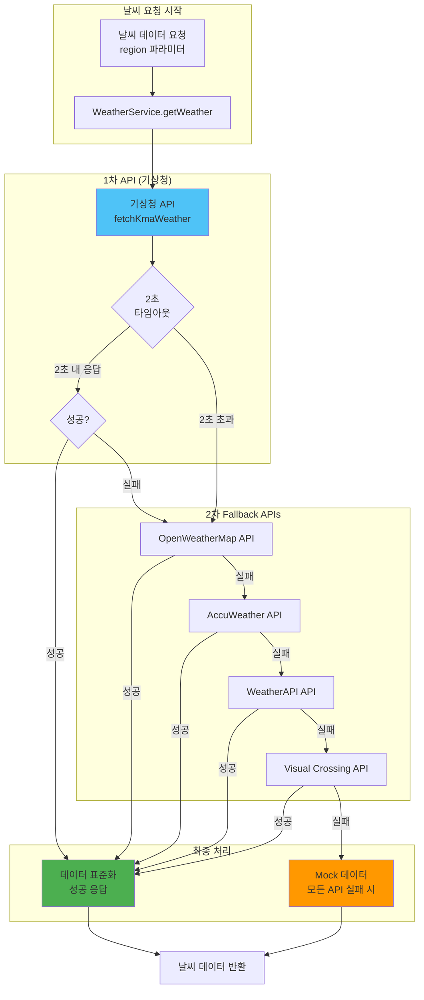
```mermaid
graph TB
    subgraph "날씨 요청 시작"
        Request[날씨 데이터 요청<br/>region 파라미터]
        WeatherService[WeatherService.getWeather]
    end
    
    subgraph "1차 API (기상청)"
        KMA[기상청 API<br/>fetchKmaWeather]
        Timeout{2초<br/>타임아웃}
        KMAResult{성공?}
    end
    
    subgraph "2차 Fallback APIs"
        OWM[OpenWeatherMap API]
        AccuWeather[AccuWeather API]
        WeatherAPI[WeatherAPI API]
        VisualCrossing[Visual Crossing API]
    end
    
    subgraph "최종 처리"
        Success[데이터 표준화<br/>성공 응답]
        Mock[Mock 데이터<br/>모든 API 실패 시]
    end
    
    Request --> WeatherService
    WeatherService --> KMA
    KMA --> Timeout
    Timeout -->|2초 내 응답| KMAResult
    Timeout -->|2초 초과| OWM
    
    KMAResult -->|성공| Success
    KMAResult -->|실패| OWM
    
    OWM -->|성공| Success
    OWM -->|실패| AccuWeather
    
    AccuWeather -->|성공| Success
    AccuWeather -->|실패| WeatherAPI
    
    WeatherAPI -->|성공| Success
    WeatherAPI -->|실패| VisualCrossing
    
    VisualCrossing -->|성공| Success
    VisualCrossing -->|실패| Mock
    
    Success --> Response[날씨 데이터 반환]
    Mock --> Response
    
    style KMA fill:#4fc3f7
    style Success fill:#4caf50
    style Mock fill:#ff9800
```

### 날씨 데이터 변환 회로

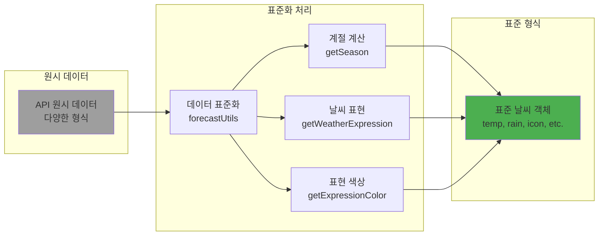
```mermaid
graph LR
    subgraph "원시 데이터"
        RawData[API 원시 데이터<br/>다양한 형식]
    end
    
    subgraph "표준화 처리"
        Standardize[데이터 표준화<br/>forecastUtils]
        Season[계절 계산<br/>getSeason]
        Expression[날씨 표현<br/>getWeatherExpression]
        Color[표현 색상<br/>getExpressionColor]
    end
    
    subgraph "표준 형식"
        StandardData[표준 날씨 객체<br/>temp, rain, icon, etc.]
    end
    
    RawData --> Standardize
    Standardize --> Season
    Standardize --> Expression
    Standardize --> Color
    Season --> StandardData
    Expression --> StandardData
    Color --> StandardData
    
    style RawData fill:#9e9e9e
    style StandardData fill:#4caf50
```

---

## 착장 기록 저장 회로도

### 기록 작성 플로우

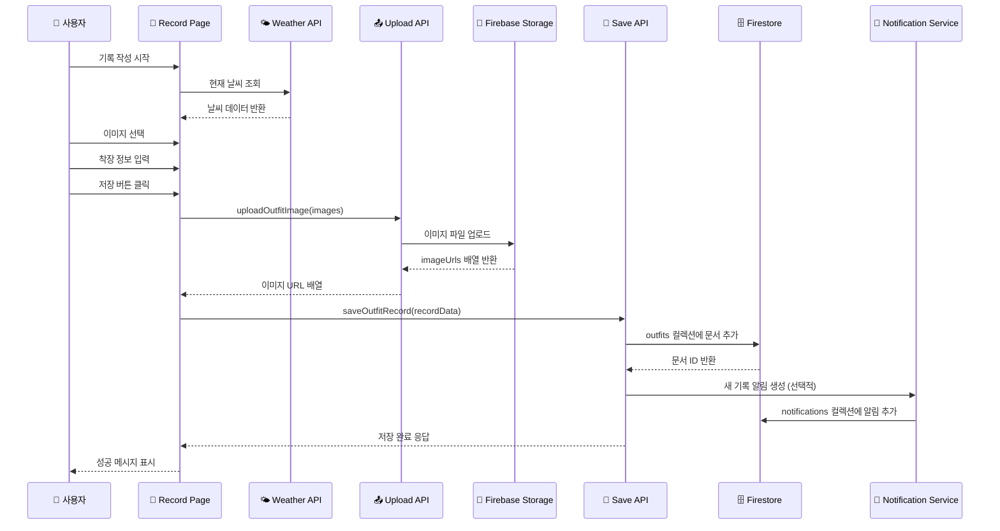
```mermaid
sequenceDiagram
    participant User as 👤 사용자
    participant Record as 📄 Record Page
    participant WeatherAPI as 🌤️ Weather API
    participant UploadAPI as 📤 Upload API
    participant Storage as 📁 Firebase Storage
    participant SaveAPI as 💾 Save API
    participant Firestore as 🗄️ Firestore
    participant NotificationService as 🔔 Notification Service
    
    User->>Record: 기록 작성 시작
    Record->>WeatherAPI: 현재 날씨 조회
    WeatherAPI-->>Record: 날씨 데이터 반환
    
    User->>Record: 이미지 선택
    User->>Record: 착장 정보 입력
    User->>Record: 저장 버튼 클릭
    
    Record->>UploadAPI: uploadOutfitImage(images)
    UploadAPI->>Storage: 이미지 파일 업로드
    Storage-->>UploadAPI: imageUrls 배열 반환
    UploadAPI-->>Record: 이미지 URL 배열
    
    Record->>SaveAPI: saveOutfitRecord(recordData)
    SaveAPI->>Firestore: outfits 컬렉션에 문서 추가
    Firestore-->>SaveAPI: 문서 ID 반환
    
    SaveAPI->>NotificationService: 새 기록 알림 생성 (선택적)
    NotificationService->>Firestore: notifications 컬렉션에 알림 추가
    
    SaveAPI-->>Record: 저장 완료 응답
    Record-->>User: 성공 메시지 표시
```

### 이미지 업로드 회로

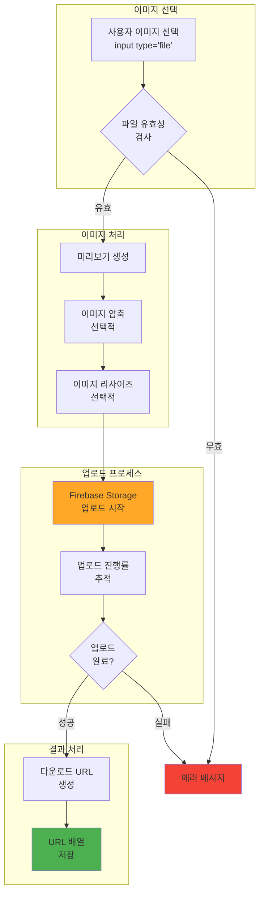
```mermaid
graph TB
    subgraph "이미지 선택"
        Select[사용자 이미지 선택<br/>input type='file']
        Validation{파일 유효성<br/>검사}
    end
    
    subgraph "이미지 처리"
        Preview[미리보기 생성]
        Compress[이미지 압축<br/>선택적]
        Resize[이미지 리사이즈<br/>선택적]
    end
    
    subgraph "업로드 프로세스"
        Upload[Firebase Storage<br/>업로드 시작]
        Progress[업로드 진행률<br/>추적]
        Complete{업로드<br/>완료?}
    end
    
    subgraph "결과 처리"
        GetURL[다운로드 URL<br/>생성]
        SaveURL[URL 배열<br/>저장]
    end
    
    Select --> Validation
    Validation -->|유효| Preview
    Validation -->|무효| Error[에러 메시지]
    Preview --> Compress
    Compress --> Resize
    Resize --> Upload
    Upload --> Progress
    Progress --> Complete
    Complete -->|성공| GetURL
    Complete -->|실패| Error
    GetURL --> SaveURL
    
    style Upload fill:#ffa726
    style SaveURL fill:#4caf50
    style Error fill:#f44336
```

---

## 추천 시스템 회로도

### 홈 추천 알고리즘 회로

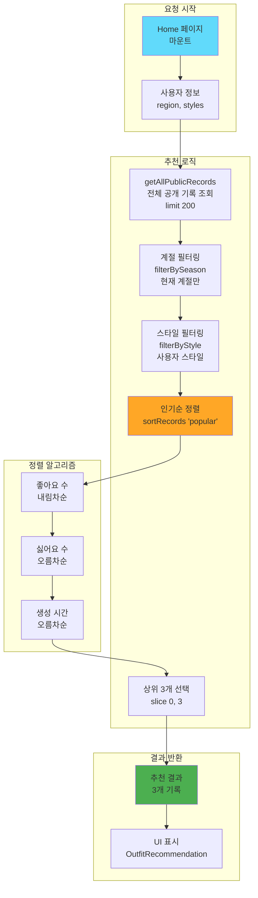
```mermaid
graph TB
    subgraph "요청 시작"
        HomePage[Home 페이지<br/>마운트]
        UserInfo[사용자 정보<br/>region, styles]
    end
    
    subgraph "추천 로직"
        GetAllRecords[getAllPublicRecords<br/>전체 공개 기록 조회<br/>limit 200]
        FilterSeason[계절 필터링<br/>filterBySeason<br/>현재 계절만]
        FilterStyle[스타일 필터링<br/>filterByStyle<br/>사용자 스타일]
        SortPopular[인기순 정렬<br/>sortRecords 'popular']
        SelectTop3[상위 3개 선택<br/>slice 0, 3]
    end
    
    subgraph "정렬 알고리즘"
        SortLike[좋아요 수<br/>내림차순]
        SortDislike[싫어요 수<br/>오름차순]
        SortTime[생성 시간<br/>오름차순]
    end
    
    subgraph "결과 반환"
        Recommendations[추천 결과<br/>3개 기록]
        Display[UI 표시<br/>OutfitRecommendation]
    end
    
    HomePage --> UserInfo
    UserInfo --> GetAllRecords
    GetAllRecords --> FilterSeason
    FilterSeason --> FilterStyle
    FilterStyle --> SortPopular
    
    SortPopular --> SortLike
    SortLike --> SortDislike
    SortDislike --> SortTime
    SortTime --> SelectTop3
    
    SelectTop3 --> Recommendations
    Recommendations --> Display
    
    style HomePage fill:#61dafb
    style Recommendations fill:#4caf50
    style SortPopular fill:#ffa726
```

### 추천 새로고침 회로

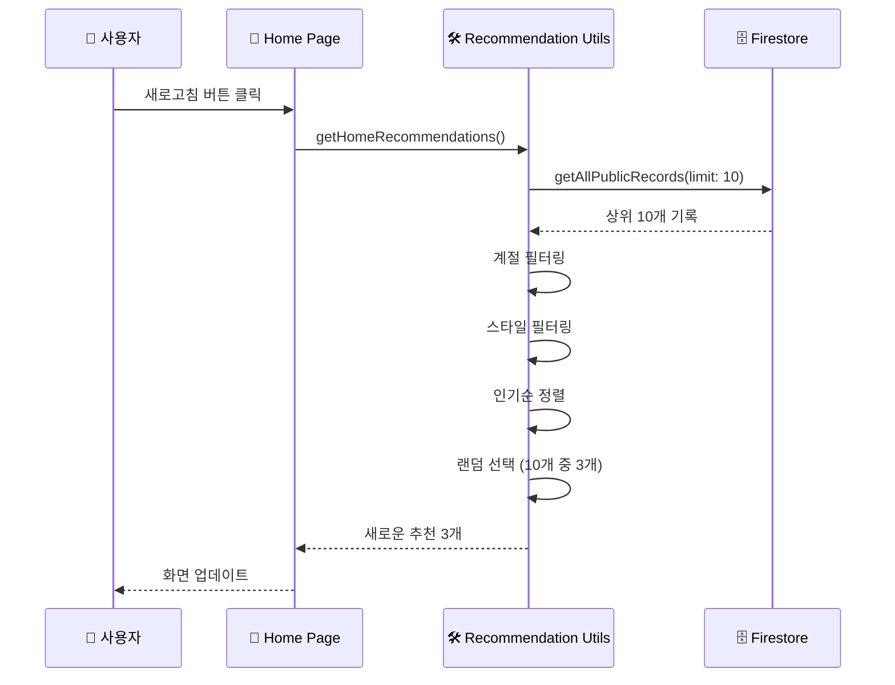
```mermaid
sequenceDiagram
    participant User as 👤 사용자
    participant Home as 📄 Home Page
    participant RecommendationUtils as 🛠️ Recommendation Utils
    participant Firestore as 🗄️ Firestore
    
    User->>Home: 새로고침 버튼 클릭
    Home->>RecommendationUtils: getHomeRecommendations()
    RecommendationUtils->>Firestore: getAllPublicRecords(limit: 10)
    Firestore-->>RecommendationUtils: 상위 10개 기록
    
    RecommendationUtils->>RecommendationUtils: 계절 필터링
    RecommendationUtils->>RecommendationUtils: 스타일 필터링
    RecommendationUtils->>RecommendationUtils: 인기순 정렬
    
    RecommendationUtils->>RecommendationUtils: 랜덤 선택 (10개 중 3개)
    RecommendationUtils-->>Home: 새로운 추천 3개
    Home-->>User: 화면 업데이트
```

---

## 소셜 기능 회로도

### 좋아요/싫어요 회로

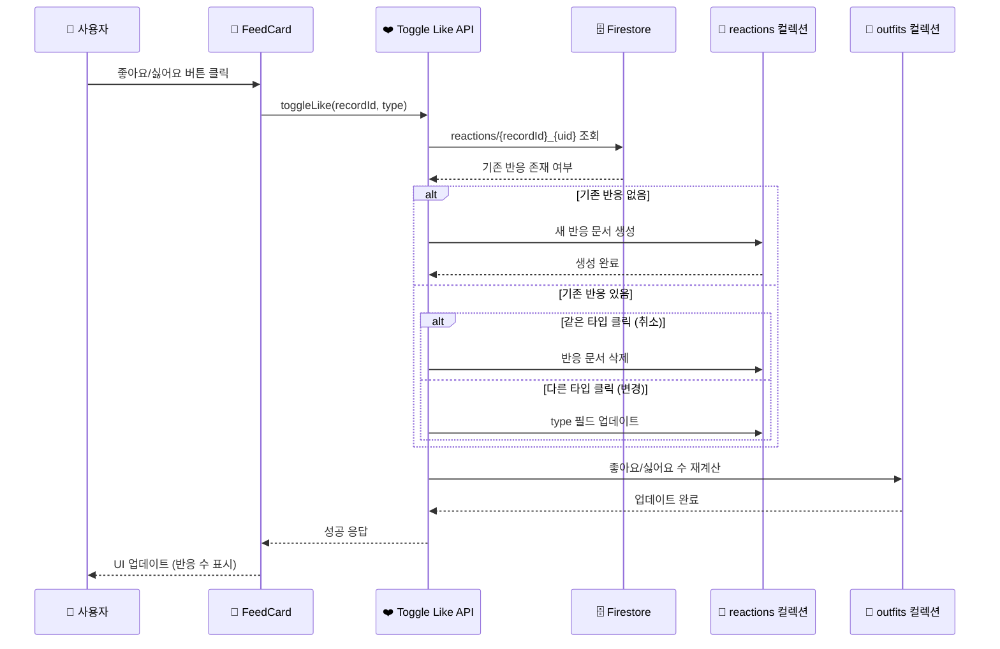
```mermaid
sequenceDiagram
    participant User as 👤 사용자
    participant FeedCard as 🎴 FeedCard
    participant ToggleLikeAPI as ❤️ Toggle Like API
    participant Firestore as 🗄️ Firestore
    participant ReactionsCollection as 🔗 reactions 컬렉션
    participant OutfitsCollection as 👗 outfits 컬렉션
    
    User->>FeedCard: 좋아요/싫어요 버튼 클릭
    FeedCard->>ToggleLikeAPI: toggleLike(recordId, type)
    
    ToggleLikeAPI->>Firestore: reactions/{recordId}_{uid} 조회
    Firestore-->>ToggleLikeAPI: 기존 반응 존재 여부
    
    alt 기존 반응 없음
        ToggleLikeAPI->>ReactionsCollection: 새 반응 문서 생성
        ReactionsCollection-->>ToggleLikeAPI: 생성 완료
    else 기존 반응 있음
        alt 같은 타입 클릭 (취소)
            ToggleLikeAPI->>ReactionsCollection: 반응 문서 삭제
        else 다른 타입 클릭 (변경)
            ToggleLikeAPI->>ReactionsCollection: type 필드 업데이트
        end
    end
    
    ToggleLikeAPI->>OutfitsCollection: 좋아요/싫어요 수 재계산
    OutfitsCollection-->>ToggleLikeAPI: 업데이트 완료
    ToggleLikeAPI-->>FeedCard: 성공 응답
    FeedCard-->>User: UI 업데이트 (반응 수 표시)
```

### 댓글 작성 회로

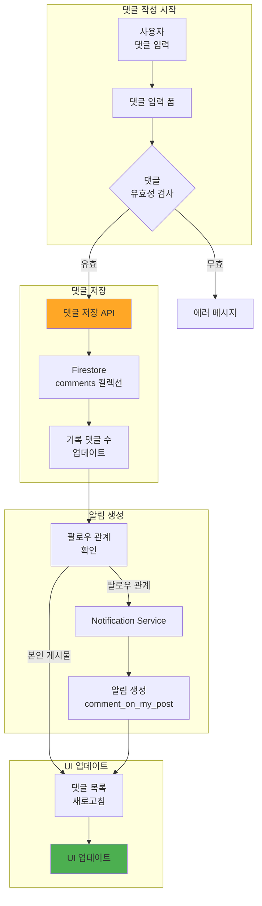
```mermaid
graph TB
    subgraph "댓글 작성 시작"
        User[사용자<br/>댓글 입력]
        CommentForm[댓글 입력 폼]
        Validation{댓글<br/>유효성 검사}
    end
    
    subgraph "댓글 저장"
        SaveComment[댓글 저장 API]
        Firestore[Firestore<br/>comments 컬렉션]
        UpdateCount[기록 댓글 수<br/>업데이트]
    end
    
    subgraph "알림 생성"
        NotificationService[Notification Service]
        CheckFollow[팔로우 관계<br/>확인]
        CreateNoti[알림 생성<br/>comment_on_my_post]
    end
    
    subgraph "UI 업데이트"
        RefreshComments[댓글 목록<br/>새로고침]
        UpdateUI[UI 업데이트]
    end
    
    User --> CommentForm
    CommentForm --> Validation
    Validation -->|유효| SaveComment
    Validation -->|무효| Error[에러 메시지]
    
    SaveComment --> Firestore
    Firestore --> UpdateCount
    UpdateCount --> CheckFollow
    CheckFollow -->|팔로우 관계| NotificationService
    CheckFollow -->|본인 게시물| RefreshComments
    NotificationService --> CreateNoti
    CreateNoti --> RefreshComments
    RefreshComments --> UpdateUI
    
    style SaveComment fill:#ffa726
    style UpdateUI fill:#4caf50
```

### 팔로우 회로

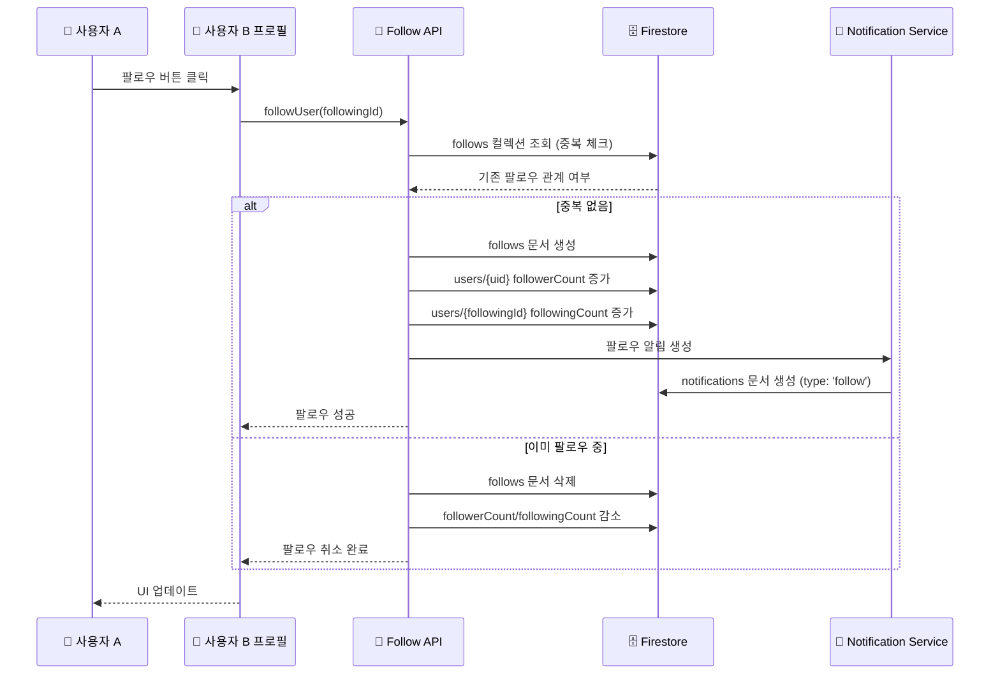
```mermaid
sequenceDiagram
    participant User as 👤 사용자 A
    participant Profile as 👤 사용자 B 프로필
    participant FollowAPI as 👥 Follow API
    participant Firestore as 🗄️ Firestore
    participant NotificationService as 🔔 Notification Service
    
    User->>Profile: 팔로우 버튼 클릭
    Profile->>FollowAPI: followUser(followingId)
    
    FollowAPI->>Firestore: follows 컬렉션 조회 (중복 체크)
    Firestore-->>FollowAPI: 기존 팔로우 관계 여부
    
    alt 중복 없음
        FollowAPI->>Firestore: follows 문서 생성
        FollowAPI->>Firestore: users/{uid} followerCount 증가
        FollowAPI->>Firestore: users/{followingId} followingCount 증가
        
        FollowAPI->>NotificationService: 팔로우 알림 생성
        NotificationService->>Firestore: notifications 문서 생성 (type: 'follow')
        
        FollowAPI-->>Profile: 팔로우 성공
    else 이미 팔로우 중
        FollowAPI->>Firestore: follows 문서 삭제
        FollowAPI->>Firestore: followerCount/followingCount 감소
        FollowAPI-->>Profile: 팔로우 취소 완료
    end
    
    Profile-->>User: UI 업데이트
```

---

## 알림 시스템 회로도

### 알림 생성 회로

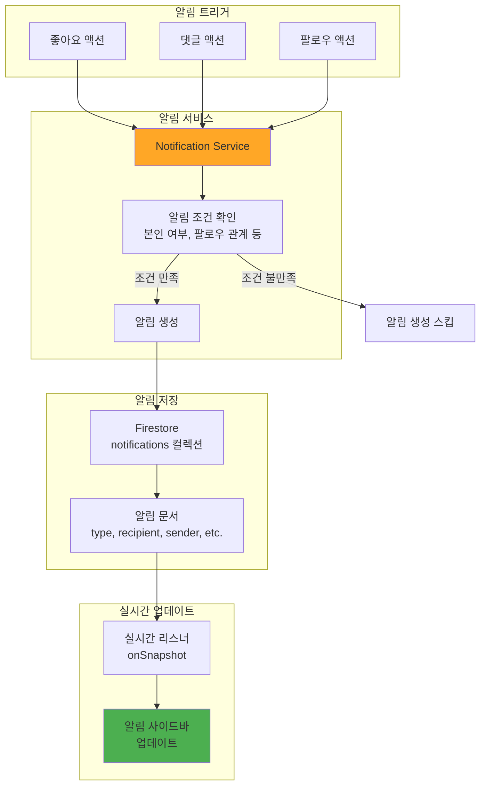
```mermaid
graph TB
    subgraph "알림 트리거"
        LikeAction[좋아요 액션]
        CommentAction[댓글 액션]
        FollowAction[팔로우 액션]
    end
    
    subgraph "알림 서비스"
        NotificationService[Notification Service]
        CheckConditions[알림 조건 확인<br/>본인 여부, 팔로우 관계 등]
        CreateNotification[알림 생성]
    end
    
    subgraph "알림 저장"
        Firestore[Firestore<br/>notifications 컬렉션]
        NotificationDoc[알림 문서<br/>type, recipient, sender, etc.]
    end
    
    subgraph "실시간 업데이트"
        RealTimeListener[실시간 리스너<br/>onSnapshot]
        UpdateSidebar[알림 사이드바<br/>업데이트]
    end
    
    LikeAction --> NotificationService
    CommentAction --> NotificationService
    FollowAction --> NotificationService
    
    NotificationService --> CheckConditions
    CheckConditions -->|조건 만족| CreateNotification
    CheckConditions -->|조건 불만족| Skip[알림 생성 스킵]
    
    CreateNotification --> Firestore
    Firestore --> NotificationDoc
    NotificationDoc --> RealTimeListener
    RealTimeListener --> UpdateSidebar
    
    style NotificationService fill:#ffa726
    style UpdateSidebar fill:#4caf50
```

### 알림 조회 회로

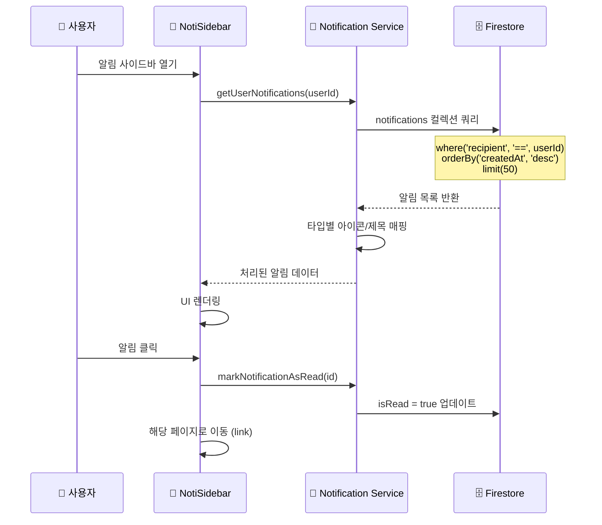
```mermaid
sequenceDiagram
    participant User as 👤 사용자
    participant NotiSidebar as 🔔 NotiSidebar
    participant NotificationService as 📡 Notification Service
    participant Firestore as 🗄️ Firestore
    
    User->>NotiSidebar: 알림 사이드바 열기
    NotiSidebar->>NotificationService: getUserNotifications(userId)
    
    NotificationService->>Firestore: notifications 컬렉션 쿼리
    Note over Firestore: where('recipient', '==', userId)<br/>orderBy('createdAt', 'desc')<br/>limit(50)
    
    Firestore-->>NotificationService: 알림 목록 반환
    NotificationService->>NotificationService: 타입별 아이콘/제목 매핑
    NotificationService-->>NotiSidebar: 처리된 알림 데이터
    
    NotiSidebar->>NotiSidebar: UI 렌더링
    
    User->>NotiSidebar: 알림 클릭
    NotiSidebar->>NotificationService: markNotificationAsRead(id)
    NotificationService->>Firestore: isRead = true 업데이트
    NotiSidebar->>NotiSidebar: 해당 페이지로 이동 (link)
```

---

## 실시간 동기화 회로도

### Firestore 실시간 리스너 회로

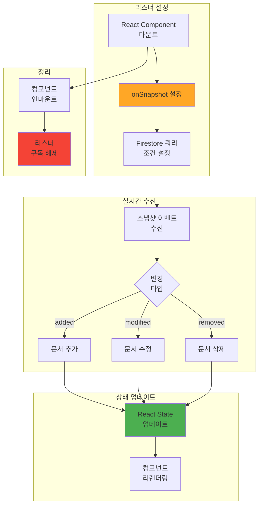
```mermaid
graph TB
    subgraph "리스너 설정"
        Component[React Component<br/>마운트]
        SetupListener[onSnapshot 설정]
        Query[Firestore 쿼리<br/>조건 설정]
    end
    
    subgraph "실시간 수신"
        Snapshot[스냅샷 이벤트<br/>수신]
        ChangeType{변경<br/>타입}
        Added[문서 추가]
        Modified[문서 수정]
        Removed[문서 삭제]
    end
    
    subgraph "상태 업데이트"
        UpdateState[React State<br/>업데이트]
        ReRender[컴포넌트<br/>리렌더링]
    end
    
    subgraph "정리"
        Unmount[컴포넌트<br/>언마운트]
        Unsubscribe[리스너<br/>구독 해제]
    end
    
    Component --> SetupListener
    SetupListener --> Query
    Query --> Snapshot
    Snapshot --> ChangeType
    ChangeType -->|added| Added
    ChangeType -->|modified| Modified
    ChangeType -->|removed| Removed
    Added --> UpdateState
    Modified --> UpdateState
    Removed --> UpdateState
    UpdateState --> ReRender
    
    Component --> Unmount
    Unmount --> Unsubscribe
    
    style SetupListener fill:#ffa726
    style UpdateState fill:#4caf50
    style Unsubscribe fill:#f44336
```

### 실시간 업데이트 예시: 댓글

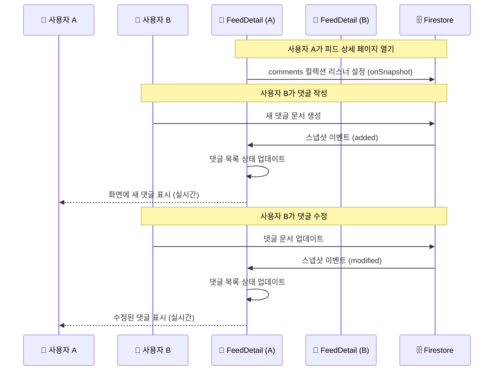
```mermaid
sequenceDiagram
    participant UserA as 👤 사용자 A
    participant UserB as 👤 사용자 B
    participant FeedDetailA as 📄 FeedDetail (A)
    participant FeedDetailB as 📄 FeedDetail (B)
    participant Firestore as 🗄️ Firestore
    
    Note over FeedDetailA,Firestore: 사용자 A가 피드 상세 페이지 열기
    FeedDetailA->>Firestore: comments 컬렉션 리스너 설정 (onSnapshot)
    
    Note over UserB,Firestore: 사용자 B가 댓글 작성
    UserB->>Firestore: 새 댓글 문서 생성
    Firestore->>FeedDetailA: 스냅샷 이벤트 (added)
    FeedDetailA->>FeedDetailA: 댓글 목록 상태 업데이트
    FeedDetailA-->>UserA: 화면에 새 댓글 표시 (실시간)
    
    Note over UserB,Firestore: 사용자 B가 댓글 수정
    UserB->>Firestore: 댓글 문서 업데이트
    Firestore->>FeedDetailA: 스냅샷 이벤트 (modified)
    FeedDetailA->>FeedDetailA: 댓글 목록 상태 업데이트
    FeedDetailA-->>UserA: 수정된 댓글 표시 (실시간)
```

---

## 데이터 흐름 회로도

### 단방향 데이터 흐름

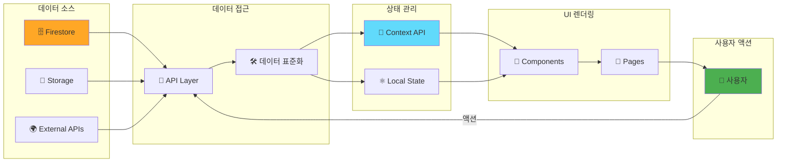
```mermaid
graph LR
    subgraph "데이터 소스"
        Firestore[🗄️ Firestore]
        Storage[📁 Storage]
        APIs[🌍 External APIs]
    end
    
    subgraph "데이터 접근"
        APILayer[📡 API Layer]
        Standardize[🛠️ 데이터 표준화]
    end
    
    subgraph "상태 관리"
        Context[🔄 Context API]
        LocalState[⚛️ Local State]
    end
    
    subgraph "UI 렌더링"
        Components[🧩 Components]
        Pages[📄 Pages]
    end
    
    subgraph "사용자 액션"
        User[👤 사용자]
    end
    
    Firestore --> APILayer
    Storage --> APILayer
    APIs --> APILayer
    APILayer --> Standardize
    Standardize --> Context
    Standardize --> LocalState
    Context --> Components
    LocalState --> Components
    Components --> Pages
    Pages --> User
    User -->|액션| APILayer
    
    style Firestore fill:#ffa726
    style Context fill:#61dafb
    style User fill:#4caf50
```

---

## 에러 처리 회로도

### 에러 핸들링 플로우

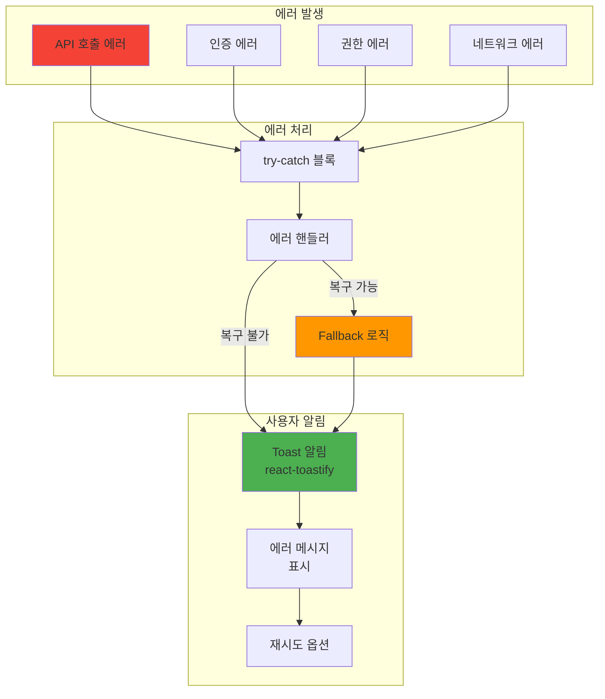
```mermaid
graph TB
    subgraph "에러 발생"
        APIError[API 호출 에러]
        AuthError[인증 에러]
        PermissionError[권한 에러]
        NetworkError[네트워크 에러]
    end
    
    subgraph "에러 처리"
        TryCatch[try-catch 블록]
        ErrorHandler[에러 핸들러]
        Fallback[Fallback 로직]
    end
    
    subgraph "사용자 알림"
        Toast[Toast 알림<br/>react-toastify]
        ErrorMsg[에러 메시지<br/>표시]
        Retry[재시도 옵션]
    end
    
    APIError --> TryCatch
    AuthError --> TryCatch
    PermissionError --> TryCatch
    NetworkError --> TryCatch
    
    TryCatch --> ErrorHandler
    ErrorHandler -->|복구 가능| Fallback
    ErrorHandler -->|복구 불가| Toast
    Fallback --> Toast
    Toast --> ErrorMsg
    ErrorMsg --> Retry
    
    style APIError fill:#f44336
    style Fallback fill:#ff9800
    style Toast fill:#4caf50
```

---

## 성능 최적화 회로도

### 메모이제이션 회로

```mermaid
graph TB
    subgraph "컴포넌트 렌더링"
        Render[컴포넌트 렌더링]
        MemoCheck{React.memo<br/>체크}
        PropsCompare{Props<br/>비교}
    end
    
    subgraph "계산 최적화"
        ExpensiveCalc[비용이 큰 계산]
        UseMemo[useMemo<br/>캐싱]
        UseCallback[useCallback<br/>함수 캐싱]
    end
    
    subgraph "데이터 최적화"
        QueryLimit[쿼리 제한<br/>limit]
        Pagination[페이지네이션]
        Cache[캐시 활용]
    end
    
    Render --> MemoCheck
    MemoCheck -->|Props 변경 없음| Skip[리렌더링 스킵]
    MemoCheck -->|Props 변경| PropsCompare
    PropsCompare --> ExpensiveCalc
    ExpensiveCalc --> UseMemo
    ExpensiveCalc --> UseCallback
    
    QueryLimit --> Pagination
    Pagination --> Cache
    
    style MemoCheck fill:#61dafb
    style UseMemo fill:#4caf50
    style Cache fill:#ffa726
```

---

## 주요 회로 패턴 요약

### 1. 요청-응답 패턴
- **클라이언트 → API → Firebase/External → API → 클라이언트**
- 비동기 Promise 기반 처리
- 에러 핸들링 및 Fallback 메커니즘

### 2. 실시간 동기화 패턴
- **Firestore onSnapshot 리스너 → React State 업데이트 → UI 리렌더링**
- 자동 구독 관리 (마운트/언마운트)
- 스냅샷 이벤트 처리 (added, modified, removed)

### 3. 상태 관리 패턴
- **Context API (전역 상태) + Local State (컴포넌트 상태)**
- 단방향 데이터 흐름
- 상태 업데이트 → 리렌더링 사이클

### 4. 인증 가드 패턴
- **AuthContext → AuthRouteGuard → ProfileGuard → BannedGuard → 페이지 접근**
- 계층적 권한 체크
- 자동 리다이렉트

### 5. Fallback 패턴
- **주요 API 실패 → Fallback API 순차 시도 → 최종 Fallback (Mock)**
- 타임아웃 처리
- 서비스 지속성 보장

---

*최종 업데이트: 2024*
