# Fitweather 클래스 다이어그램 (Class Diagram)

## 📋 목차

1. [전체 클래스 구조](#전체-클래스-구조)
2. [프레젠테이션 레이어](#프레젠테이션-레이어)
3. [비즈니스 로직 레이어](#비즈니스-로직-레이어)
4. [데이터 접근 레이어](#데이터-접근-레이어)
5. [상태 관리](#상태-관리)
6. [유틸리티 클래스](#유틸리티-클래스)
7. [데이터 모델](#데이터-모델)
8. [클래스 관계도](#클래스-관계도)

---

## 전체 클래스 구조

### 시스템 아키텍처 레이어별 클래스 분류

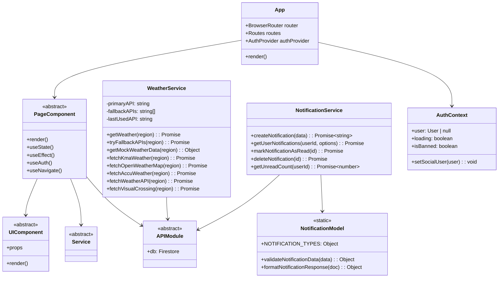

---

## 프레젠테이션 레이어

### 페이지 컴포넌트 클래스

```mermaid
classDiagram
    class PageComponent {
        <<abstract>>
        +props: Object
        +state: Object
        +render(): JSX.Element
        +componentDidMount(): void
        +componentWillUnmount(): void
    }
    
    class Home {
        -recommendations: OutfitRecord[]
        -loading: boolean
        -userStyle: string[]
        +loadRecommendations(): Promise
        +handleRefresh(): void
        +render(): JSX.Element
    }
    
    class Feed {
        -records: OutfitRecord[]
        -filters: FilterObject
        -sortBy: string
        -loading: boolean
        +loadFeedRecords(): Promise
        +handleFilterChange(): void
        +handleSortChange(): void
        +render(): JSX.Element
    }
    
    class FeedDetail {
        -recordId: string
        -record: OutfitRecord | null
        -comments: Comment[]
        -loading: boolean
        +loadRecordDetail(): Promise
        +loadComments(): Promise
        +handleLike(): void
        +handleComment(): void
        +render(): JSX.Element
    }
    
    class Record {
        -isEditMode: boolean
        -recordId: string | null
        -formData: RecordFormData
        -weather: WeatherData | null
        -images: File[]
        +loadWeather(): Promise
        +handleImageUpload(): Promise
        +handleSubmit(): Promise
        +render(): JSX.Element
    }
    
    class Calendar {
        -userId: string
        -records: OutfitRecord[]
        -selectedDate: Date
        +loadCalendarRecords(): Promise
        +handleDateClick(): void
        +render(): JSX.Element
    }
    
    class Login {
        -loading: boolean
        +handleGoogleLogin(): Promise
        +handleKakaoLogin(): void
        +render(): JSX.Element
    }
    
    class ProfileSetup {
        -nickname: string
        -region: string
        -error: string
        +handleSave(): Promise
        +validateInput(): boolean
        +render(): JSX.Element
    }
    
    class Admin {
        -reports: Report[]
        -users: User[]
        -loading: boolean
        +loadReports(): Promise
        +handleBlockUser(): Promise
        +handleDeleteContent(): Promise
        +render(): JSX.Element
    }
    
    PageComponent <|-- Home
    PageComponent <|-- Feed
    PageComponent <|-- FeedDetail
    PageComponent <|-- Record
    PageComponent <|-- Calendar
    PageComponent <|-- Login
    PageComponent <|-- ProfileSetup
    PageComponent <|-- Admin
```

### UI 컴포넌트 클래스

```mermaid
classDiagram
    class UIComponent {
        <<abstract>>
        +props: Object
        +render(): JSX.Element
    }
    
    class WeatherCard {
        +weather: WeatherData
        +region: string
        +apiSource: string
        +render(): JSX.Element
    }
    
    class FeedCard {
        +record: OutfitRecord
        +onLike(): void
        +onComment(): void
        +onClick(): void
        +render(): JSX.Element
    }
    
    class OutfitRecommendation {
        +recommendations: OutfitRecord[]
        +onRefresh(): void
        +render(): JSX.Element
    }
    
    class CommentSection {
        +recordId: string
        +comments: Comment[]
        +onAddComment(): void
        +onEditComment(): void
        +onDeleteComment(): void
        +render(): JSX.Element
    }
    
    class MenuSidebar {
        +isOpen: boolean
        +onClose(): void
        +handleNavigation(): void
        +render(): JSX.Element
    }
    
    class NotiSidebar {
        -notifications: Notification[]
        -isOpen: boolean
        -loading: boolean
        +loadNotifications(): Promise
        +handleNotificationClick(): void
        +markAsRead(): Promise
        +render(): JSX.Element
    }
    
    class AuthRouteGuard {
        +children: ReactNode
        +redirectTo: string
        +checkAuth(): boolean
        +render(): JSX.Element
    }
    
    class ProfileGuard {
        +children: ReactNode
        +checkProfile(): boolean
        +render(): JSX.Element
    }
    
    class ReportModal {
        +isOpen: boolean
        +targetType: string
        +targetId: string
        +onClose(): void
        +onSubmit(): Promise
        +render(): JSX.Element
    }
    
    UIComponent <|-- WeatherCard
    UIComponent <|-- FeedCard
    UIComponent <|-- OutfitRecommendation
    UIComponent <|-- CommentSection
    UIComponent <|-- MenuSidebar
    UIComponent <|-- NotiSidebar
    UIComponent <|-- AuthRouteGuard
    UIComponent <|-- ProfileGuard
    UIComponent <|-- ReportModal
```

---

## 비즈니스 로직 레이어

### 서비스 클래스

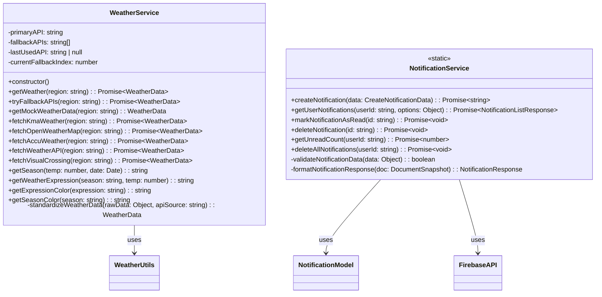

---

## 데이터 접근 레이어

### API 모듈 클래스

```mermaid
classDiagram
    class APIModule {
        <<abstract>>
        +db: Firestore
        +auth: Auth
        +storage: Storage
    }
    
    class UserAPI {
        <<static>>
        +getUser(uid: string): Promise~User~
        +updateUser(uid: string, data: Object): Promise~void~
        +checkNicknameDuplicate(nickname: string): Promise~boolean~
        +createUser(uid: string, data: Object): Promise~void~
    }
    
    class OutfitAPI {
        <<static>>
        +saveOutfitRecord(record: OutfitRecord): Promise~string~
        +getAllRecords(limit: number): Promise~OutfitRecord[]~
        +getRecords(uid: string): Promise~OutfitRecord[]~
        +getRecordById(id: string): Promise~OutfitRecord~
        +updateRecord(id: string, data: Object): Promise~void~
        +deleteRecord(id: string): Promise~void~
        +getRecordsByDate(uid: string, date: string): Promise~OutfitRecord[]~
    }
    
    class WeatherAPI {
        <<static>>
        +fetchKmaForecast(region: string): Promise~WeatherData~
        +fetchKmaPastWeather(region: string, date: string): Promise~WeatherData~
        +getWeatherService(): WeatherService
    }
    
    class ReactionAPI {
        <<static>>
        +toggleLike(recordId: string, type: string): Promise~void~
        +getReactions(recordId: string): Promise~Reaction[]~
        +deleteReaction(recordId: string, uid: string): Promise~void~
    }
    
    class CommentAPI {
        <<static>>
        +addComment(recordId: string, content: string, parentId: string | null): Promise~string~
        +getComments(recordId: string): Promise~Comment[]~
        +updateComment(id: string, content: string): Promise~void~
        +deleteComment(id: string): Promise~void~
    }
    
    class FollowAPI {
        <<static>>
        +followUser(followingId: string): Promise~void~
        +unfollowUser(followingId: string): Promise~void~
        +getFollowers(userId: string): Promise~User[]~
        +getFollowing(userId: string): Promise~User[]~
        +checkFollowing(followerId: string, followingId: string): Promise~boolean~
    }
    
    class ReportAPI {
        <<static>>
        +reportContent(targetType: string, targetId: string, reason: string): Promise~string~
        +getReports(status: string): Promise~Report[]~
        +updateReportStatus(id: string, status: string): Promise~void~
    }
    
    class UploadAPI {
        <<static>>
        +uploadOutfitImage(images: File[]): Promise~string[]~
        +deleteImage(url: string): Promise~void~
    }
    
    APIModule <|-- UserAPI
    APIModule <|-- OutfitAPI
    APIModule <|-- WeatherAPI
    APIModule <|-- ReactionAPI
    APIModule <|-- CommentAPI
    APIModule <|-- FollowAPI
    APIModule <|-- ReportAPI
    APIModule <|-- UploadAPI
```

---

## 상태 관리

### Context 클래스

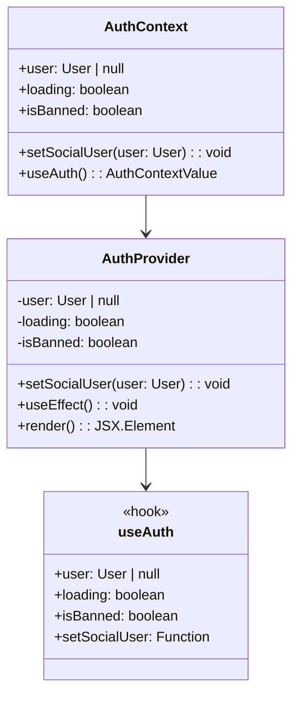

### Custom Hooks

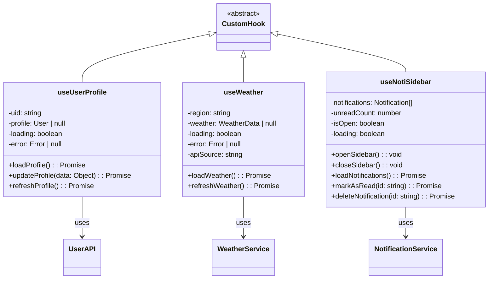

---

## 유틸리티 클래스

### 유틸리티 모듈

```mermaid
classDiagram
    class Utils {
        <<namespace>>
    }
    
    class SortingUtils {
        <<static>>
        +sortRecords(records: OutfitRecord[], sortType: string): OutfitRecord[]
        +sortByPopular(records: OutfitRecord[]): OutfitRecord[]
        +sortByRecent(records: OutfitRecord[]): OutfitRecord[]
        +compareByLikes(a: OutfitRecord, b: OutfitRecord): number
        +compareByDislikes(a: OutfitRecord, b: OutfitRecord): number
        +compareByDate(a: OutfitRecord, b: OutfitRecord): number
    }
    
    class SeasonUtils {
        <<static>>
        +getSeason(temp: number, date: Date): string
        +getSeasonInfo(date: Date): Object
        +isSpring(date: Date): boolean
        +isSummer(date: Date): boolean
        +isFall(date: Date): boolean
        +isWinter(date: Date): boolean
    }
    
    class WeatherUtils {
        <<static>>
        +getWeatherIcon(code: string): string
        +getWeatherDescription(code: string): string
        +formatTemperature(temp: number): string
        +getWeatherColor(weather: string): string
    }
    
    class ForecastUtils {
        <<static>>
        +getSeason(temp: number, date: Date): string
        +getWeatherExpression(season: string, temp: number): string
        +getExpressionColor(expression: string): string
        +standardizeWeatherData(data: Object): WeatherData
    }
    
    class TimeUtils {
        <<static>>
        +formatDate(date: Date): string
        +formatDateTime(date: Date): string
        +getRelativeTime(date: Date): string
        +parseDate(dateString: string): Date
    }
    
    class StyleUtils {
        <<static>>
        +convertStyleToKorean(style: string): string
        +convertStyleToEnglish(style: string): string
        +getStyleOptions(): string[]
        +validateStyle(style: string): boolean
    }
    
    class RecommendationUtils {
        <<static>>
        +getHomeRecommendations(userStyle: string[], exactSeason: boolean): Promise~OutfitRecord[]~
        +filterBySeason(records: OutfitRecord[], season: string): OutfitRecord[]
        +filterByStyle(records: OutfitRecord[], styles: string[]): OutfitRecord[]
        +getRecommendationsByRegion(region: string): Promise~OutfitRecord[]~
    }
    
    class FirebaseQueries {
        <<static>>
        +getAllPublicRecords(limit: number): Promise~OutfitRecord[]~
        +getRecordsByRegion(region: string, date: string): Promise~OutfitRecord[]~
        +getUserRecords(uid: string): Promise~OutfitRecord[]~
        +getRecordsByDateRange(uid: string, startDate: string, endDate: string): Promise~OutfitRecord[]~
    }
    
    Utils <|-- SortingUtils
    Utils <|-- SeasonUtils
    Utils <|-- WeatherUtils
    Utils <|-- ForecastUtils
    Utils <|-- TimeUtils
    Utils <|-- StyleUtils
    Utils <|-- RecommendationUtils
    Utils <|-- FirebaseQueries
```

---

## 데이터 모델

### 데이터 모델 클래스

```mermaid
classDiagram
    class NotificationModel {
        <<static>>
        +NOTIFICATION_TYPES: Object
        +validateNotificationData(data: Object): ValidationResult
        +formatNotificationResponse(doc: DocumentSnapshot): NotificationResponse
        -validateRequiredFields(data: Object): string[]
        -validateNotificationType(type: string): boolean
    }
    
    class User {
        +uid: string
        +email: string | null
        +displayName: string | null
        +photoURL: string | null
        +nickname: string
        +region: string
        +provider: string
        +isPublic: boolean
        +styles: string[]
        +status: string
        +createdAt: Timestamp
        +updatedAt: Timestamp
    }
    
    class OutfitRecord {
        +id: string
        +uid: string
        +nickname: string
        +date: string
        +region: string
        +temp: number | null
        +rain: number | null
        +humidity: number | null
        +weather: WeatherObject
        +weatherEmojis: string[]
        +outfit: OutfitObject
        +style: string
        +styles: string[]
        +season: string[]
        +feeling: string
        +feedback: string
        +memo: string
        +imageUrls: string[]
        +isPublic: boolean
        +likeCount: number
        +commentCount: number
        +createdAt: Timestamp
        +updatedAt: Timestamp
    }
    
    class Comment {
        +id: string
        +recordId: string
        +uid: string
        +nickname: string
        +content: string
        +parentId: string | null
        +isEdited: boolean
        +isDeleted: boolean
        +likeCount: number
        +createdAt: Timestamp
        +updatedAt: Timestamp
    }
    
    class Reaction {
        +id: string
        +recordId: string
        +uid: string
        +type: string
        +createdAt: Timestamp
    }
    
    class Notification {
        +id: string
        +recipient: string
        +sender: SenderObject
        +type: string
        +title: string
        +message: string
        +link: string
        +isRead: boolean
        +createdAt: Timestamp
        +readAt: Timestamp | null
    }
    
    class WeatherData {
        +temp: number
        +rain: number
        +humidity: number
        +icon: string
        +desc: string
        +season: string
        +weatherExpression: string
        +apiSource: string
    }
    
    class Follow {
        +id: string
        +followerId: string
        +followingId: string
        +createdAt: Timestamp
    }
    
    class Report {
        +id: string
        +reporterId: string
        +targetType: string
        +targetId: string
        +reason: string
        +description: string | null
        +status: string
        +createdAt: Timestamp
        +resolvedAt: Timestamp | null
        +resolvedBy: string | null
    }
```

---

## 클래스 관계도

### 전체 시스템 클래스 관계

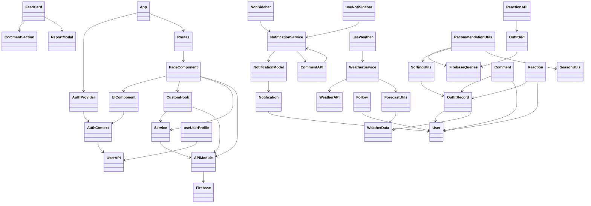

### 상세 관계 다이어그램

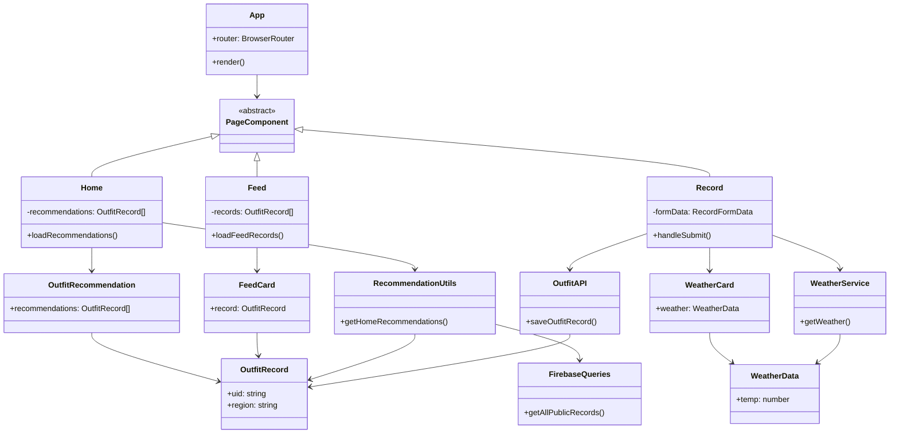

---

## 주요 클래스 상세

### WeatherService 클래스

```typescript
class WeatherService {
  // Properties
  private primaryAPI: string;
  private fallbackAPIs: string[];
  private lastUsedAPI: string | null;
  private currentFallbackIndex: number;
  
  // Constructor
  constructor()
  
  // Public Methods
  + async getWeather(region: string): Promise<WeatherData>
  + async tryFallbackAPIs(region: string): Promise<WeatherData>
  + getMockWeatherData(region: string): WeatherData
  + getSeason(temp: number, date: Date): string
  + getWeatherExpression(season: string, temp: number): string
  + getExpressionColor(expression: string): string
  
  // Private Methods
  - async fetchKmaWeather(region: string): Promise<WeatherData>
  - async fetchOpenWeatherMap(region: string): Promise<WeatherData>
  - async fetchAccuWeather(region: string): Promise<WeatherData>
  - async fetchWeatherAPI(region: string): Promise<WeatherData>
  - async fetchVisualCrossing(region: string): Promise<WeatherData>
  - standardizeWeatherData(rawData: Object, apiSource: string): WeatherData
}
```

### NotificationService 클래스

```typescript
class NotificationService {
  // Static Methods
  + static async createNotification(data: CreateNotificationData): Promise<string>
  + static async getUserNotifications(userId: string, options: Object): Promise<NotificationListResponse>
  + static async markNotificationAsRead(id: string): Promise<void>
  + static async deleteNotification(id: string): Promise<void>
  + static async getUnreadCount(userId: string): Promise<number>
  + static async deleteAllNotifications(userId: string): Promise<void>
  
  // Private Methods
  - static validateNotificationData(data: Object): boolean
  - static formatNotificationResponse(doc: DocumentSnapshot): NotificationResponse
}
```

### AuthContext 클래스

```typescript
interface AuthContextValue {
  user: User | null;
  loading: boolean;
  isBanned: boolean;
  setSocialUser: (user: User) => void;
}

class AuthProvider {
  // State
  - user: User | null
  - loading: boolean
  - isBanned: boolean
  
  // Methods
  + setSocialUser(user: User): void
  + render(): JSX.Element
  
  // Lifecycle
  + useEffect(): void
}

class useAuth {
  // Returns AuthContextValue
  + (): AuthContextValue
}
```

---

## 컴포넌트 계층 구조

### 페이지 컴포넌트 계층

```
App
├── AuthProvider
│   └── Routes
│       ├── Home
│       │   ├── MenuSidebar
│       │   ├── NotiSidebar
│       │   └── OutfitRecommendation
│       ├── Feed
│       │   ├── MenuSidebar
│       │   ├── WeatherCard
│       │   └── FeedCard[]
│       │       ├── CommentSection
│       │       └── ReportModal
│       ├── FeedDetail
│       │   ├── MenuSidebar
│       │   ├── FeedCard
│       │   │   ├── CommentSection
│       │   │   └── ReportModal
│       │   └── WeatherCard
│       ├── Record
│       │   ├── MenuSidebar
│       │   ├── WeatherCard
│       │   └── RecordForm
│       └── Calendar
│           ├── MenuSidebar
│           └── CalendarView
```

---

## 클래스 설계 패턴

### 1. Singleton 패턴
- **WeatherService**: 애플리케이션 전체에서 단일 인스턴스 사용
- **Firebase 인스턴스**: `firebase.js`에서 단일 인스턴스 생성

### 2. Factory 패턴
- **NotificationService**: 알림 객체 생성 및 검증
- **API 모듈들**: 다양한 데이터 타입의 객체 생성

### 3. Observer 패턴
- **AuthContext**: 인증 상태 변화 관찰 및 구독자 알림
- **Firestore 리스너**: 실시간 데이터 업데이트

### 4. Strategy 패턴
- **SortingUtils**: 다양한 정렬 전략 구현
- **WeatherService**: 여러 API fallback 전략

### 5. HOC (Higher Order Component) 패턴
- **AuthRouteGuard**: 인증 필요 컴포넌트 래핑
- **ProfileGuard**: 프로필 설정 확인 컴포넌트 래핑

---

## 의존성 관계

### 주요 의존성

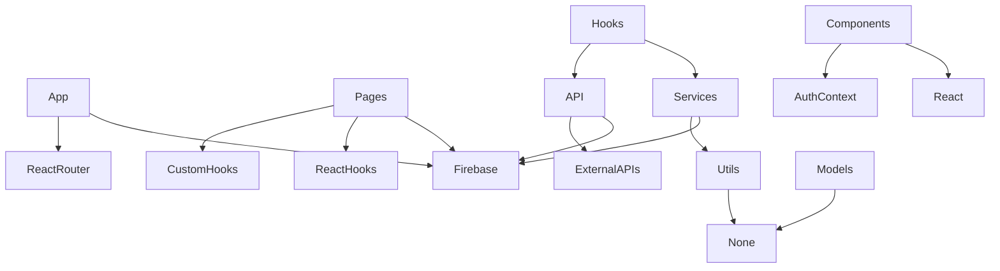

---

## 클래스 책임 분리

### Single Responsibility Principle

| 클래스 | 책임 |
|--------|------|
| `WeatherService` | 날씨 데이터 조회 및 표준화 |
| `NotificationService` | 알림 CRUD 및 비즈니스 로직 |
| `SortingUtils` | 데이터 정렬 알고리즘 |
| `SeasonUtils` | 계절 계산 및 판단 |
| `AuthContext` | 인증 상태 관리 |
| `UserAPI` | 사용자 데이터 CRUD |
| `OutfitAPI` | 착장 기록 데이터 CRUD |

---

*최종 업데이트: 2024*

