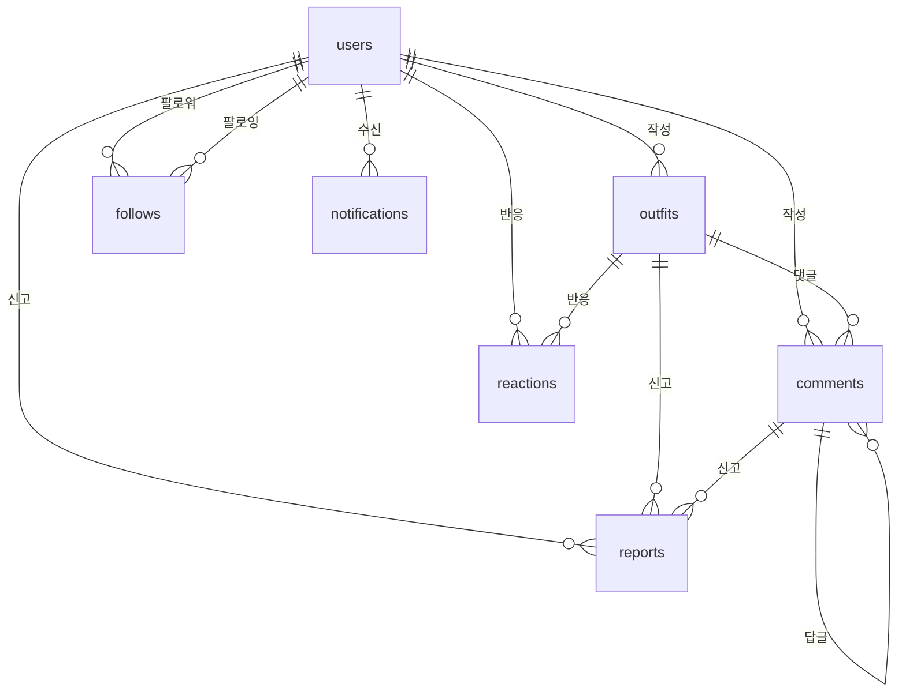

# Fitweather 데이터베이스 스키마 (Database Schema)

## 📋 목차

1. [데이터베이스 개요](#데이터베이스-개요)
2. [컬렉션 목록](#컬렉션-목록)
3. [컬렉션 상세 스키마](#컬렉션-상세-스키마)
4. [데이터 타입 및 제약조건](#데이터-타입-및-제약조건)
5. [인덱스 구조](#인덱스-구조)
6. [관계 다이어그램](#관계-다이어그램)
7. [보안 규칙](#보안-규칙)
8. [샘플 데이터 구조](#샘플-데이터-구조)

---

## 데이터베이스 개요

### 기술 스택
- **데이터베이스**: Firebase Firestore (NoSQL Document Database)
- **스토리지**: Firebase Storage (이미지 파일)
- **인증**: Firebase Authentication

### 데이터베이스 특징
- **문서 기반**: JSON 형태의 문서 저장
- **실시간 동기화**: WebSocket 기반 실시간 업데이트
- **수평 확장**: 자동 스케일링
- **NoSQL**: 스키마 유연성

---

## 컬렉션 목록

| 컬렉션명 | 설명 | 문서 ID 형식 |
|---------|------|-------------|
| `users` | 사용자 프로필 정보 | Firebase Auth UID |
| `outfits` | 착장 기록 | 자동 생성 (Firestore ID) |
| `comments` | 댓글 | 자동 생성 (Firestore ID) |
| `reactions` | 좋아요/싫어요 반응 | `{recordId}_{uid}` |
| `follows` | 팔로우 관계 | 자동 생성 (Firestore ID) |
| `notifications` | 알림 | 자동 생성 (Firestore ID) |
| `reports` | 신고 | 자동 생성 (Firestore ID) |

---

## 컬렉션 상세 스키마

### 1. `users` 컬렉션

사용자 기본 프로필 정보를 저장하는 컬렉션입니다.

#### 문서 ID
- 형식: `{uid}` (Firebase Authentication UID)
- 예시: `abc123xyz456`

#### 필드 구조

```javascript
{
  // 기본 정보
  uid: string,                    // Firebase Auth UID (문서 ID와 동일)
  email: string | null,            // 이메일 주소
  displayName: string | null,      // 표시 이름 (OAuth에서 제공)
  photoURL: string | null,         // 프로필 사진 URL
  
  // 프로필 정보
  nickname: string,               // 닉네임 (필수, 고유)
  region: string,                  // 주 활동 지역 (예: "Seoul")
  provider: string,                // 로그인 제공자 ("google" | "kakao")
  
  // 설정
  isPublic: boolean,              // 캘린더 공개 여부 (기본값: false)
  styles: string[],                // 선호 스타일 배열 (예: ["캐주얼", "포멀"])
  status: string,                  // 계정 상태 ("active" | "banned" | "inactive")
  
  // 메타데이터
  createdAt: timestamp,            // 계정 생성 시간
  updatedAt: timestamp,            // 정보 수정 시간
  lastActiveAt: timestamp          // 마지막 활동 시간
}
```

#### 필드 상세

| 필드명 | 타입 | 필수 | 기본값 | 설명 | 제약조건 |
|--------|------|------|-------|------|----------|
| `uid` | string | ✅ | - | 사용자 고유 ID | Firebase Auth UID |
| `email` | string \| null | ❌ | null | 이메일 주소 | 유효한 이메일 형식 |
| `displayName` | string \| null | ❌ | null | 표시 이름 | 최대 50자 |
| `photoURL` | string \| null | ❌ | null | 프로필 사진 URL | 유효한 URL 형식 |
| `nickname` | string | ✅ | - | 닉네임 | 2-20자, 고유값 |
| `region` | string | ✅ | - | 주 활동 지역 | 지역 코드 (예: "Seoul") |
| `provider` | string | ✅ | - | 로그인 제공자 | "google" \| "kakao" |
| `isPublic` | boolean | ✅ | false | 캘린더 공개 여부 | - |
| `styles` | string[] | ❌ | [] | 선호 스타일 | 배열 최대 5개 |
| `status` | string | ✅ | "active" | 계정 상태 | "active" \| "banned" \| "inactive" |
| `createdAt` | timestamp | ✅ | - | 생성 시간 | - |
| `updatedAt` | timestamp | ✅ | - | 수정 시간 | - |
| `lastActiveAt` | timestamp | ❌ | null | 마지막 활동 시간 | - |

#### 인덱스
- 단일 인덱스: `nickname` (고유)
- 단일 인덱스: `region`
- 단일 인덱스: `status`
- 단일 인덱스: `isPublic`

---

### 2. `outfits` 컬렉션

착장 기록을 저장하는 컬렉션입니다.

#### 문서 ID
- 형식: 자동 생성 (Firestore 자동 ID)
- 예시: `abc123def456`

#### 필드 구조

```javascript
{
  // 작성자 정보
  uid: string,                     // 작성자 UID
  nickname: string,                 // 작성자 닉네임 (캐싱)
  
  // 날짜 및 지역
  date: string,                    // 기록 날짜 (ISO 문자열)
  region: string,                  // 지역 (예: "Seoul")
  regionName: string,              // 지역명 (예: "서울")
  recordedDate: string,            // 기록 날짜 (YYYY-MM-DD)
  recordedTime: string,             // 기록 시간 (HH:mm)
  
  // 날씨 정보
  temp: number | null,             // 온도 (°C)
  rain: number | null,             // 강수량 (mm)
  humidity: number | null,         // 습도 (%)
  icon: string | null,             // 날씨 아이콘 코드
  desc: string | null,             // 날씨 설명
  weather: {                       // 날씨 객체
    temp: number | null,
    rain: number | null,
    humidity: number | null,
    icon: string | null,
    season: string                 // 계절
  },
  weatherEmojis: string[],          // 날씨 이모지 배열 (최대 2개)
  
  // 착장 정보
  outfit: {                        // 착장 객체
    outer: string[],               // 아우터 배열
    top: string[],                 // 상의 배열
    bottom: string[],              // 하의 배열
    shoes: string[],               // 신발 배열
    acc: string[]                 // 악세서리 배열
  },
  
  // 스타일 및 계절
  style: string,                   // 스타일 (한글)
  styles: string[],                // 스타일 배열
  season: string[],                 // 계절 배열 (예: ["봄"])
  
  // 피드백
  feeling: string,                 // 체감 온도 이모지 (예: "👍")
  feedback: string,                // 피드백 텍스트 (메모)
  memo: string,                    // 메모
  
  // 미디어
  imageUrls: string[],             // 이미지 URL 배열 (최대 5개)
  
  // 공개 설정
  isPublic: boolean,               // 공개 여부
  
  // 소셜 메트릭 (계산된 값)
  likeCount: number,               // 좋아요 수 (기본값: 0)
  commentCount: number,            // 댓글 수 (기본값: 0)
  
  // 메타데이터
  createdAt: timestamp,            // 생성 시간
  updatedAt: timestamp,            // 수정 시간
  recordedAt: timestamp            // 기록 시간
}
```

#### 필드 상세

| 필드명 | 타입 | 필수 | 기본값 | 설명 | 제약조건 |
|--------|------|------|-------|------|----------|
| `uid` | string | ✅ | - | 작성자 UID | users 컬렉션 참조 |
| `nickname` | string | ✅ | - | 작성자 닉네임 | - |
| `date` | string | ✅ | - | 기록 날짜 | ISO 문자열 형식 |
| `region` | string | ✅ | - | 지역 코드 | - |
| `regionName` | string | ✅ | - | 지역명 | - |
| `recordedDate` | string | ✅ | - | 기록 날짜 | YYYY-MM-DD 형식 |
| `recordedTime` | string | ✅ | - | 기록 시간 | HH:mm 형식 |
| `temp` | number \| null | ❌ | null | 온도 | -50 ~ 50 범위 |
| `rain` | number \| null | ❌ | null | 강수량 | 0 이상 |
| `humidity` | number \| null | ❌ | null | 습도 | 0 ~ 100 |
| `icon` | string \| null | ❌ | null | 날씨 아이콘 | - |
| `desc` | string \| null | ❌ | null | 날씨 설명 | - |
| `weather` | object | ✅ | - | 날씨 객체 | - |
| `weatherEmojis` | string[] | ✅ | [] | 날씨 이모지 | 최대 2개 |
| `outfit` | object | ✅ | - | 착장 정보 | - |
| `style` | string | ❌ | "" | 스타일 (한글) | - |
| `styles` | string[] | ❌ | [] | 스타일 배열 | - |
| `season` | string[] | ✅ | [] | 계절 배열 | - |
| `feeling` | string | ❌ | "" | 체감 온도 이모지 | 단일 이모지 |
| `feedback` | string | ❌ | "" | 피드백 | 최대 500자 |
| `memo` | string | ❌ | "" | 메모 | 최대 500자 |
| `imageUrls` | string[] | ❌ | [] | 이미지 URL | 최대 5개 |
| `isPublic` | boolean | ✅ | false | 공개 여부 | - |
| `likeCount` | number | ✅ | 0 | 좋아요 수 | 0 이상 |
| `commentCount` | number | ✅ | 0 | 댓글 수 | 0 이상 |
| `createdAt` | timestamp | ✅ | - | 생성 시간 | - |
| `updatedAt` | timestamp | ✅ | - | 수정 시간 | - |
| `recordedAt` | timestamp | ✅ | - | 기록 시간 | - |

#### 인덱스
- 복합 인덱스: `region` + `isPublic` + `createdAt` (내림차순)
- 복합 인덱스: `uid` + `date` + `isPublic`
- 복합 인덱스: `region` + `date` + `isPublic`
- 단일 인덱스: `uid`
- 단일 인덱스: `isPublic`
- 단일 인덱스: `createdAt` (내림차순)

---

### 3. `comments` 컬렉션

댓글을 저장하는 컬렉션입니다.

#### 문서 ID
- 형식: 자동 생성 (Firestore 자동 ID)
- 예시: `comment123abc`

#### 필드 구조

```javascript
{
  // 참조 정보
  recordId: string,                // 착장 기록 ID (outfits 참조)
  uid: string,                     // 댓글 작성자 UID
  nickname: string,                // 작성자 닉네임 (캐싱)
  
  // 댓글 내용
  content: string,                 // 댓글 내용
  parentId: string | null,         // 부모 댓글 ID (답글인 경우)
  
  // 상태
  isEdited: boolean,               // 수정 여부
  isDeleted: boolean,              // 삭제 여부 (소프트 삭제)
  
  // 메트릭
  likeCount: number,               // 댓글 좋아요 수
  
  // 메타데이터
  createdAt: timestamp,            // 작성 시간
  updatedAt: timestamp             // 수정 시간
}
```

#### 필드 상세

| 필드명 | 타입 | 필수 | 기본값 | 설명 | 제약조건 |
|--------|------|------|-------|------|----------|
| `recordId` | string | ✅ | - | 착장 기록 ID | outfits 컬렉션 참조 |
| `uid` | string | ✅ | - | 작성자 UID | users 컬렉션 참조 |
| `nickname` | string | ✅ | - | 작성자 닉네임 | - |
| `content` | string | ✅ | - | 댓글 내용 | 1-500자 |
| `parentId` | string \| null | ❌ | null | 부모 댓글 ID | comments 컬렉션 참조 |
| `isEdited` | boolean | ✅ | false | 수정 여부 | - |
| `isDeleted` | boolean | ✅ | false | 삭제 여부 | - |
| `likeCount` | number | ✅ | 0 | 댓글 좋아요 수 | 0 이상 |
| `createdAt` | timestamp | ✅ | - | 작성 시간 | - |
| `updatedAt` | timestamp | ✅ | - | 수정 시간 | - |

#### 인덱스
- 복합 인덱스: `recordId` + `createdAt` (내림차순)
- 복합 인덱스: `parentId` + `createdAt` (내림차순)
- 단일 인덱스: `uid`
- 단일 인덱스: `recordId`
- 단일 인덱스: `isDeleted`

---

### 4. `reactions` 컬렉션

좋아요/싫어요 반응을 저장하는 컬렉션입니다.

#### 문서 ID
- 형식: `{recordId}_{uid}`
- 예시: `abc123def456_user789xyz`

#### 필드 구조

```javascript
{
  recordId: string,                // 착장 기록 ID
  uid: string,                     // 반응한 사용자 UID
  type: string,                    // 반응 타입 ("up" | "down")
  createdAt: timestamp              // 반응 시간
}
```

#### 필드 상세

| 필드명 | 타입 | 필수 | 기본값 | 설명 | 제약조건 |
|--------|------|------|-------|------|----------|
| `recordId` | string | ✅ | - | 착장 기록 ID | outfits 컬렉션 참조 |
| `uid` | string | ✅ | - | 사용자 UID | users 컬렉션 참조 |
| `type` | string | ✅ | - | 반응 타입 | "up" \| "down" |
| `createdAt` | timestamp | ✅ | - | 반응 시간 | - |

#### 인덱스
- 복합 인덱스: `recordId` + `type` + `createdAt`
- 단일 인덱스: `uid`
- 단일 인덱스: `recordId`

---

### 5. `follows` 컬렉션

팔로우 관계를 저장하는 컬렉션입니다.

#### 문서 ID
- 형식: 자동 생성 (Firestore 자동 ID)
- 예시: `follow123abc`

#### 필드 구조

```javascript
{
  followerId: string,              // 팔로워 UID (팔로우하는 사람)
  followingId: string,             // 팔로잉 UID (팔로우받는 사람)
  createdAt: timestamp             // 팔로우 시간
}
```

#### 필드 상세

| 필드명 | 타입 | 필수 | 기본값 | 설명 | 제약조건 |
|--------|------|------|-------|------|----------|
| `followerId` | string | ✅ | - | 팔로워 UID | users 컬렉션 참조 |
| `followingId` | string | ✅ | - | 팔로잉 UID | users 컬렉션 참조 |
| `createdAt` | timestamp | ✅ | - | 팔로우 시간 | - |

#### 제약조건
- `followerId` ≠ `followingId` (본인 팔로우 불가)
- `followerId` + `followingId` 조합은 고유해야 함 (중복 팔로우 방지)

#### 인덱스
- 복합 인덱스: `followerId` + `createdAt` (내림차순)
- 복합 인덱스: `followingId` + `createdAt` (내림차순)
- 단일 인덱스: `followerId`
- 단일 인덱스: `followingId`

---

### 6. `notifications` 컬렉션

알림을 저장하는 컬렉션입니다.

#### 문서 ID
- 형식: 자동 생성 (Firestore 자동 ID)
- 예시: `noti123abc`

#### 필드 구조

```javascript
{
  recipient: string,              // 수신자 UID
  sender: {                        // 발신자 정보 객체
    uid: string,                   // 발신자 UID
    nickname: string,               // 발신자 닉네임
    photoURL: string | null        // 발신자 프로필 사진
  },
  type: string,                     // 알림 타입
                                   // "follow" | "comment_on_my_post" | "reply_to_my_comment"
  title: string,                   // 알림 제목
  message: string,                  // 알림 내용
  link: string,                     // 이동할 링크 (경로)
  isRead: boolean,                  // 읽음 여부
  createdAt: timestamp,             // 생성 시간
  readAt: timestamp | null          // 읽은 시간
}
```

#### 필드 상세

| 필드명 | 타입 | 필수 | 기본값 | 설명 | 제약조건 |
|--------|------|------|-------|------|----------|
| `recipient` | string | ✅ | - | 수신자 UID | users 컬렉션 참조 |
| `sender` | object | ✅ | - | 발신자 정보 | - |
| `sender.uid` | string | ✅ | - | 발신자 UID | users 컬렉션 참조 |
| `sender.nickname` | string | ✅ | - | 발신자 닉네임 | - |
| `sender.photoURL` | string \| null | ❌ | null | 발신자 프로필 사진 | - |
| `type` | string | ✅ | - | 알림 타입 | "follow" \| "comment_on_my_post" \| "reply_to_my_comment" |
| `title` | string | ✅ | - | 알림 제목 | 최대 100자 |
| `message` | string | ✅ | - | 알림 내용 | 최대 200자 |
| `link` | string | ✅ | - | 이동할 링크 | 유효한 경로 |
| `isRead` | boolean | ✅ | false | 읽음 여부 | - |
| `createdAt` | timestamp | ✅ | - | 생성 시간 | - |
| `readAt` | timestamp \| null | ❌ | null | 읽은 시간 | - |

#### 인덱스
- 복합 인덱스: `recipient` + `isRead` + `createdAt` (내림차순)
- 복합 인덱스: `recipient` + `createdAt` (내림차순)
- 단일 인덱스: `recipient`
- 단일 인덱스: `isRead`

---

### 7. `reports` 컬렉션

신고 정보를 저장하는 컬렉션입니다. (관리자 기능)

#### 문서 ID
- 형식: 자동 생성 (Firestore 자동 ID)
- 예시: `report123abc`

#### 필드 구조

```javascript
{
  reporterId: string,              // 신고자 UID
  targetType: string,              // 신고 대상 타입 ("post" | "comment")
  targetId: string,                // 신고 대상 ID
  reason: string,                   // 신고 사유
  description: string | null,       // 신고 상세 설명
  status: string,                   // 처리 상태 ("pending" | "resolved" | "dismissed")
  createdAt: timestamp,             // 신고 시간
  resolvedAt: timestamp | null,     // 처리 시간
  resolvedBy: string | null          // 처리한 관리자 UID
}
```

#### 필드 상세

| 필드명 | 타입 | 필수 | 기본값 | 설명 | 제약조건 |
|--------|------|------|-------|------|----------|
| `reporterId` | string | ✅ | - | 신고자 UID | users 컬렉션 참조 |
| `targetType` | string | ✅ | - | 신고 대상 타입 | "post" \| "comment" |
| `targetId` | string | ✅ | - | 신고 대상 ID | outfits/comments 참조 |
| `reason` | string | ✅ | - | 신고 사유 | - |
| `description` | string \| null | ❌ | null | 상세 설명 | 최대 500자 |
| `status` | string | ✅ | "pending" | 처리 상태 | "pending" \| "resolved" \| "dismissed" |
| `createdAt` | timestamp | ✅ | - | 신고 시간 | - |
| `resolvedAt` | timestamp \| null | ❌ | null | 처리 시간 | - |
| `resolvedBy` | string \| null | ❌ | null | 처리한 관리자 | - |

#### 인덱스
- 복합 인덱스: `status` + `createdAt` (내림차순)
- 복합 인덱스: `targetType` + `targetId`
- 단일 인덱스: `reporterId`
- 단일 인덱스: `status`

---

## 데이터 타입 및 제약조건

### Firestore 데이터 타입

| 타입 | 설명 | 예시 |
|------|------|------|
| `string` | 문자열 | `"Seoul"`, `"안녕하세요"` |
| `number` | 숫자 | `25`, `-10`, `3.14` |
| `boolean` | 불리언 | `true`, `false` |
| `timestamp` | 타임스탬프 | `Timestamp(seconds=1234567890)` |
| `array` | 배열 | `["캐주얼", "포멀"]` |
| `object` | 객체 | `{ outer: ["자켓"] }` |
| `null` | null 값 | `null` |
| `reference` | 참조 | DocumentReference |

### 제약조건

#### 1. 필수 필드 검증
- 필수 필드가 없으면 문서 생성 실패
- 클라이언트 측에서 검증 필요

#### 2. 데이터 타입 검증
- Firestore는 자동 타입 검증 수행
- 잘못된 타입은 저장 실패

#### 3. 길이 제한
- `nickname`: 2-20자
- `content` (댓글): 1-500자
- `feedback`: 최대 500자
- `title` (알림): 최대 100자
- `message` (알림): 최대 200자

#### 4. 배열 크기 제한
- `styles`: 최대 5개
- `weatherEmojis`: 최대 2개
- `imageUrls`: 최대 5개

#### 5. 고유값 제약
- `users.nickname`: 고유해야 함 (애플리케이션 레벨 검증)
- `reactions` 문서 ID: `{recordId}_{uid}` 조합 고유
- `follows`: `followerId` + `followingId` 조합 고유

---

## 인덱스 구조

### 복합 인덱스 (Composite Indexes)

#### 1. `outfits` 컬렉션

```javascript
// 지역별 공개 코디 조회 (피드)
{
  collection: "outfits",
  fields: [
    { field: "region", order: "ASCENDING" },
    { field: "isPublic", order: "ASCENDING" },
    { field: "createdAt", order: "DESCENDING" }
  ]
}

// 사용자별 코디 기록 조회
{
  collection: "outfits",
  fields: [
    { field: "uid", order: "ASCENDING" },
    { field: "date", order: "DESCENDING" },
    { field: "isPublic", order: "ASCENDING" }
  ]
}
```

#### 2. `comments` 컬렉션

```javascript
// 기록별 댓글 조회
{
  collection: "comments",
  fields: [
    { field: "recordId", order: "ASCENDING" },
    { field: "createdAt", order: "DESCENDING" }
  ]
}

// 답글 조회
{
  collection: "comments",
  fields: [
    { field: "parentId", order: "ASCENDING" },
    { field: "createdAt", order: "ASCENDING" }
  ]
}
```

#### 3. `notifications` 컬렉션

```javascript
// 사용자별 알림 조회
{
  collection: "notifications",
  fields: [
    { field: "recipient", order: "ASCENDING" },
    { field: "isRead", order: "ASCENDING" },
    { field: "createdAt", order: "DESCENDING" }
  ]
}
```

#### 4. `follows` 컬렉션

```javascript
// 팔로워 목록 조회
{
  collection: "follows",
  fields: [
    { field: "followingId", order: "ASCENDING" },
    { field: "createdAt", order: "DESCENDING" }
  ]
}

// 팔로잉 목록 조회
{
  collection: "follows",
  fields: [
    { field: "followerId", order: "ASCENDING" },
    { field: "createdAt", order: "DESCENDING" }
  ]
}
```

#### 5. `reports` 컬렉션

```javascript
// 신고 목록 조회 (관리자)
{
  collection: "reports",
  fields: [
    { field: "status", order: "ASCENDING" },
    { field: "createdAt", order: "DESCENDING" }
  ]
}
```

### 단일 필드 인덱스

다음 필드들은 자동으로 인덱싱됩니다:
- 모든 컬렉션의 `createdAt` 필드
- `users.nickname`
- `users.region`
- `users.status`
- `outfits.uid`
- `outfits.isPublic`
- `comments.uid`
- `notifications.recipient`
- `notifications.isRead`

---

## 관계 다이어그램

### 엔티티 관계도



### 관계 요약

| 관계 | 부모 | 자식 | 관계 유형 | 설명 |
|------|------|------|-----------|------|
| users → outfits | users | outfits | 1:N | 사용자는 여러 착장 기록 작성 가능 |
| users → comments | users | comments | 1:N | 사용자는 여러 댓글 작성 가능 |
| users → reactions | users | reactions | 1:N | 사용자는 여러 반응 가능 |
| users → follows (follower) | users | follows | 1:N | 사용자는 여러 사용자 팔로우 가능 |
| users → follows (following) | users | follows | 1:N | 사용자는 여러 사용자에게 팔로우 받음 |
| users → notifications | users | notifications | 1:N | 사용자는 여러 알림 수신 가능 |
| outfits → comments | outfits | comments | 1:N | 착장 기록은 여러 댓글 가질 수 있음 |
| outfits → reactions | outfits | reactions | 1:N | 착장 기록은 여러 반응 가질 수 있음 |
| comments → comments | comments | comments | 1:N | 댓글은 여러 답글 가질 수 있음 (자기 참조) |

---

## 보안 규칙

### Firestore Security Rules

```javascript
rules_version = '2';
service cloud.firestore {
  match /databases/{database}/documents {
    
    // ============================================
    // 사용자 데이터
    // ============================================
    match /users/{userId} {
      // 본인만 읽기/쓰기 가능
      allow read, write: if request.auth != null 
                         && request.auth.uid == userId;
      
      // 공개 프로필은 조회 가능 (캘린더 공개 시)
      allow read: if resource.data.isPublic == true;
    }
    
    // ============================================
    // 착장 기록
    // ============================================
    match /outfits/{outfitId} {
      // 공개 기록은 모든 인증 사용자 조회 가능
      // 비공개 기록은 작성자만 조회 가능
      allow read: if request.auth != null 
                  && (resource.data.isPublic == true 
                      || request.auth.uid == resource.data.uid);
      
      // 작성자만 생성/수정/삭제 가능
      allow create: if request.auth != null 
                    && request.auth.uid == request.resource.data.uid;
      allow update, delete: if request.auth != null 
                            && request.auth.uid == resource.data.uid;
    }
    
    // ============================================
    // 댓글
    // ============================================
    match /comments/{commentId} {
      // 인증 사용자만 조회 가능
      allow read: if request.auth != null;
      
      // 인증 사용자만 생성 가능
      allow create: if request.auth != null 
                    && request.auth.uid == request.resource.data.uid;
      
      // 작성자만 수정/삭제 가능
      allow update, delete: if request.auth != null 
                            && request.auth.uid == resource.data.uid;
    }
    
    // ============================================
    // 반응 (좋아요/싫어요)
    // ============================================
    match /reactions/{reactionId} {
      // 공개 읽기 (집계용)
      allow read: if true;
      
      // 인증 사용자만 생성 가능
      allow create: if request.auth != null 
                    && request.auth.uid == request.resource.data.uid;
      
      // 본인만 수정/삭제 가능
      allow update, delete: if request.auth != null 
                            && request.auth.uid == resource.data.uid;
    }
    
    // ============================================
    // 팔로우
    // ============================================
    match /follows/{followId} {
      // 본인 관련 팔로우만 조회/작성 가능
      allow read, write: if request.auth != null 
                        && (request.auth.uid == resource.data.followerId 
                            || request.auth.uid == resource.data.followingId);
    }
    
    // ============================================
    // 알림
    // ============================================
    match /notifications/{notificationId} {
      // 수신자만 조회/수정 가능
      allow read, write: if request.auth != null 
                        && request.auth.uid == resource.data.recipient;
    }
    
    // ============================================
    // 신고
    // ============================================
    match /reports/{reportId} {
      // 인증 사용자만 생성 가능
      allow create: if request.auth != null;
      
      // 관리자만 조회/수정 가능 (서버 사이드에서 검증)
      allow read, update: if request.auth != null;
    }
  }
}
```

---

## 샘플 데이터 구조

### users 컬렉션 샘플

```json
{
  "uid": "user123abc",
  "email": "user@example.com",
  "displayName": "홍길동",
  "photoURL": "https://example.com/photo.jpg",
  "nickname": "길동이",
  "region": "Seoul",
  "provider": "google",
  "isPublic": true,
  "styles": ["캐주얼", "포멀"],
  "status": "active",
  "createdAt": "2024-01-15T10:30:00Z",
  "updatedAt": "2024-01-20T14:20:00Z",
  "lastActiveAt": "2024-01-25T09:15:00Z"
}
```

### outfits 컬렉션 샘플

```json
{
  "uid": "user123abc",
  "nickname": "길동이",
  "date": "2024-01-25T09:00:00Z",
  "region": "Seoul",
  "regionName": "서울",
  "recordedDate": "2024-01-25",
  "recordedTime": "09:00",
  "temp": 15,
  "rain": 0,
  "humidity": 60,
  "icon": "01d",
  "desc": "맑음",
  "weather": {
    "temp": 15,
    "rain": 0,
    "humidity": 60,
    "icon": "01d",
    "season": "봄"
  },
  "weatherEmojis": ["🌤️", "☀️"],
  "outfit": {
    "outer": ["자켓"],
    "top": ["티셔츠"],
    "bottom": ["청바지"],
    "shoes": ["운동화"],
    "acc": ["모자"]
  },
  "style": "캐주얼",
  "styles": ["캐주얼"],
  "season": ["봄"],
  "feeling": "👍",
  "feedback": "날씨가 좋아서 가벼운 옷차림",
  "memo": "산책하기 좋은 날씨",
  "imageUrls": [
    "https://storage.googleapis.com/bucket/outfit1.jpg",
    "https://storage.googleapis.com/bucket/outfit2.jpg"
  ],
  "isPublic": true,
  "likeCount": 5,
  "commentCount": 3,
  "createdAt": "2024-01-25T09:05:00Z",
  "updatedAt": "2024-01-25T09:05:00Z",
  "recordedAt": "2024-01-25T09:00:00Z"
}
```

### comments 컬렉션 샘플

```json
{
  "recordId": "outfit123abc",
  "uid": "user456def",
  "nickname": "영희",
  "content": "정말 멋진 코디네요!",
  "parentId": null,
  "isEdited": false,
  "isDeleted": false,
  "likeCount": 2,
  "createdAt": "2024-01-25T10:00:00Z",
  "updatedAt": "2024-01-25T10:00:00Z"
}
```

### reactions 컬렉션 샘플

```json
{
  "recordId": "outfit123abc",
  "uid": "user789ghi",
  "type": "up",
  "createdAt": "2024-01-25T11:00:00Z"
}
```

### follows 컬렉션 샘플

```json
{
  "followerId": "user123abc",
  "followingId": "user456def",
  "createdAt": "2024-01-20T12:00:00Z"
}
```

### notifications 컬렉션 샘플

```json
{
  "recipient": "user123abc",
  "sender": {
    "uid": "user456def",
    "nickname": "영희",
    "photoURL": "https://example.com/photo2.jpg"
  },
  "type": "comment_on_my_post",
  "title": "새 댓글이 달렸습니다",
  "message": "영희님이 댓글을 남겼습니다: 정말 멋진 코디네요!",
  "link": "/feed-detail/outfit123abc",
  "isRead": false,
  "createdAt": "2024-01-25T10:00:00Z",
  "readAt": null
}
```

---

## 데이터 무결성 규칙

### 1. 참조 무결성
- `outfits.uid`는 `users` 컬렉션에 존재해야 함
- `comments.recordId`는 `outfits` 컬렉션에 존재해야 함
- `reactions.recordId`는 `outfits` 컬렉션에 존재해야 함
- `follows.followerId`와 `followingId`는 `users` 컬렉션에 존재해야 함

### 2. 계층적 삭제
- 사용자 삭제 시 관련 데이터 처리:
  - 착장 기록: 소프트 삭제 또는 익명화
  - 댓글: 작성자 정보 익명화
  - 반응: 자동 삭제
  - 팔로우: 자동 삭제
  - 알림: 자동 삭제

### 3. 카운터 동기화
- `outfits.likeCount`는 `reactions` 컬렉션의 실제 개수와 동기화
- `outfits.commentCount`는 `comments` 컬렉션의 실제 개수와 동기화
- 실시간 업데이트 또는 배치 작업으로 동기화

---

## 성능 최적화 전략

### 1. 쿼리 최적화
- 모든 쿼리에 `limit()` 적용
- 필요한 필드만 선택 (`select()`)
- 복합 인덱스 활용

### 2. 데이터 캐싱
- 자주 조회되는 사용자 프로필 캐싱
- 인기 착장 기록 캐싱

### 3. 페이지네이션
- `startAfter()` 사용하여 페이지네이션 구현
- 페이지당 최대 50개 항목

### 4. 배치 작업
- 대량 업데이트는 배치 작업 사용
- 트랜잭션으로 원자성 보장

---

*최종 업데이트: 2024*

