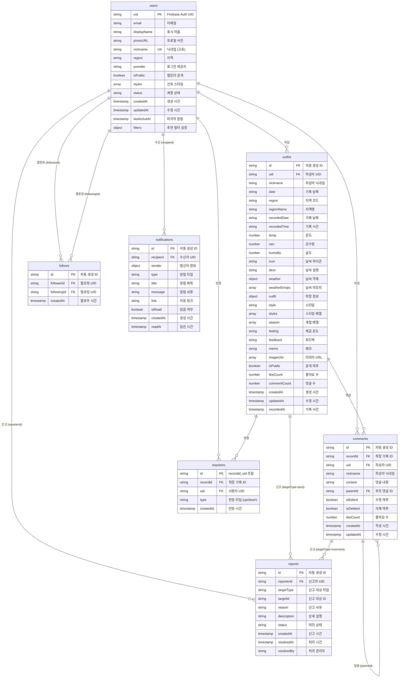

# Fitweather ERD (Entity Relationship Diagram)

## 📊 전체 ERD 다이어그램

### 상세 엔티티 관계도

## 📋 엔티티 상세 정보

### 1. users (사용자)
- **Primary Key**: `uid` (Firebase Auth UID)
- **Unique Key**: `nickname`
- **주요 관계**:
  - 1:N → outfits (작성한 착장 기록)
  - 1:N → comments (작성한 댓글)
  - 1:N → reactions (반응)
  - 1:N → follows (팔로워/팔로잉)
  - 1:N → notifications (수신한 알림)
  - 1:N → reports (신고)

### 2. outfits (착장 기록)
- **Primary Key**: `id` (자동 생성)
- **Foreign Key**: `uid` → users.uid
- **주요 관계**:
  - N:1 → users (작성자)
  - 1:N → comments (댓글)
  - 1:N → reactions (반응)
  - 1:N → reports (신고)

### 3. comments (댓글)
- **Primary Key**: `id` (자동 생성)
- **Foreign Key**: 
  - `recordId` → outfits.id
  - `uid` → users.uid
  - `parentId` → comments.id (자기 참조)
- **주요 관계**:
  - N:1 → outfits (착장 기록)
  - N:1 → users (작성자)
  - 1:N → comments (답글)
  - 1:N → reports (신고)

### 4. reactions (반응)
- **Primary Key**: `id` (`{recordId}_{uid}` 조합)
- **Foreign Key**: 
  - `recordId` → outfits.id
  - `uid` → users.uid
- **주요 관계**:
  - N:1 → outfits (착장 기록)
  - N:1 → users (사용자)

### 5. follows (팔로우)
- **Primary Key**: `id` (자동 생성)
- **Foreign Key**: 
  - `followerId` → users.uid
  - `followingId` → users.uid
- **주요 관계**:
  - N:1 → users (팔로워)
  - N:1 → users (팔로잉)

### 6. notifications (알림)
- **Primary Key**: `id` (자동 생성)
- **Foreign Key**: `recipient` → users.uid
- **주요 관계**:
  - N:1 → users (수신자)

### 7. reports (신고)
- **Primary Key**: `id` (자동 생성)
- **Foreign Key**: `reporterId` → users.uid
- **주요 관계**:
  - N:1 → users (신고자)
  - N:1 → outfits/comments (신고 대상, targetType에 따라)

## 🔗 관계 유형

| 관계 | 부모 엔티티 | 자식 엔티티 | 관계 유형 | 설명 |
|------|------------|------------|-----------|------|
| 작성 | users | outfits | 1:N | 한 사용자는 여러 착장 기록 작성 가능 |
| 작성 | users | comments | 1:N | 한 사용자는 여러 댓글 작성 가능 |
| 반응 | users | reactions | 1:N | 한 사용자는 여러 반응 가능 |
| 반응 | outfits | reactions | 1:N | 한 착장 기록은 여러 반응 받을 수 있음 |
| 댓글 | outfits | comments | 1:N | 한 착장 기록은 여러 댓글 가질 수 있음 |
| 답글 | comments | comments | 1:N | 한 댓글은 여러 답글 가질 수 있음 (자기 참조) |
| 팔로우 | users | follows | 1:N | 한 사용자는 여러 사용자 팔로우 가능 |
| 팔로잉 | users | follows | 1:N | 한 사용자는 여러 사용자에게 팔로우 받음 |
| 알림 | users | notifications | 1:N | 한 사용자는 여러 알림 수신 가능 |
| 신고 | users | reports | 1:N | 한 사용자는 여러 신고 가능 |
| 신고 | outfits | reports | 1:N | 한 착장 기록은 여러 신고 받을 수 있음 |
| 신고 | comments | reports | 1:N | 한 댓글은 여러 신고 받을 수 있음 |

## 📝 참고사항

### Firestore 특성
- **NoSQL 문서 데이터베이스**: 관계형 데이터베이스와 달리 외래 키 제약조건이 없음
- **참조 무결성**: 애플리케이션 레벨에서 관리 필요
- **문서 ID**: 자동 생성 또는 사용자 정의 가능

### 인덱스
- 복합 인덱스가 필요한 쿼리 패턴에 대해 Firestore Console에서 설정 필요
- 자주 사용되는 쿼리:
  - `outfits`: region + isPublic + createdAt
  - `comments`: recordId + createdAt
  - `notifications`: recipient + isRead + createdAt
  - `follows`: followerId + createdAt, followingId + createdAt

### 데이터 무결성
- `users.nickname`: 애플리케이션 레벨에서 고유성 검증
- `reactions.id`: `{recordId}_{uid}` 조합으로 고유성 보장
- `follows`: `followerId + followingId` 조합 고유성 검증 필요

---

*생성일: 2024*
*기반 문서: Database_Schema.md*

