# Fitweather 플로우 차트 (Flow Chart)

## 📋 목차

1. [전체 사용자 여정 플로우](#전체-사용자-여정-플로우)
2. [회원가입 및 로그인 플로우](#회원가입-및-로그인-플로우)
3. [프로필 설정 플로우](#프로필-설정-플로우)
4. [착장 기록 작성 플로우](#착장-기록-작성-플로우)
5. [추천 시스템 플로우](#추천-시스템-플로우)
6. [피드 탐색 플로우](#피드-탐색-플로우)
7. [소셜 상호작용 플로우](#소셜-상호작용-플로우)
8. [알림 처리 플로우](#알림-처리-플로우)
9. [관리자 작업 플로우](#관리자-작업-플로우)
10. [에러 처리 플로우](#에러-처리-플로우)

---

## 전체 사용자 여정 플로우

### 첫 방문 사용자 여정

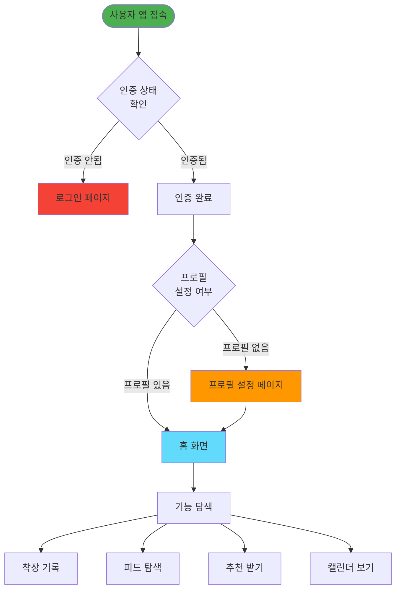

---

## 회원가입 및 로그인 플로우

### 구글 로그인 플로우

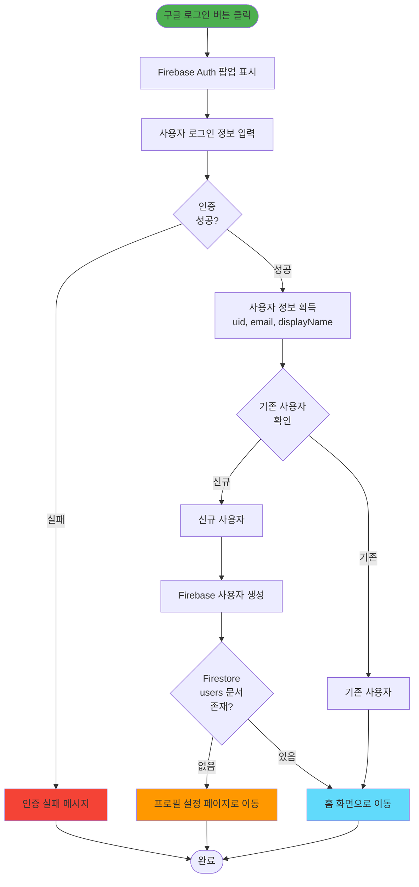

### 카카오 로그인 플로우

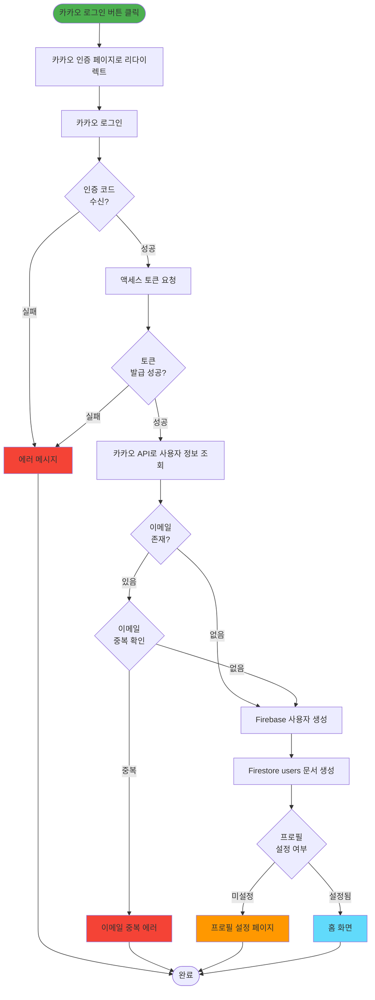

### 로그아웃 플로우

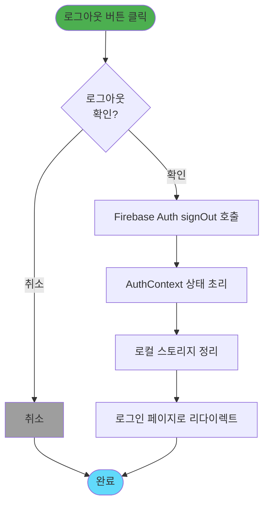

---

## 프로필 설정 플로우

### 프로필 초기 설정

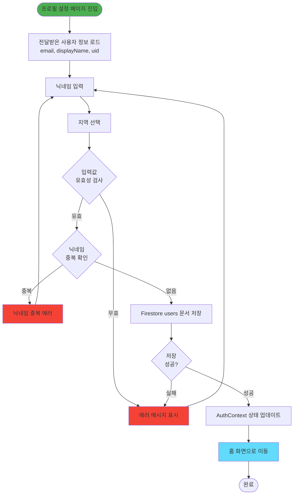

---

## 착장 기록 작성 플로우

### 기록 작성 프로세스

```mermaid
flowchart TD
    Start([기록 작성 페이지 진입])
    LoadProfile[사용자 프로필 로드<br/>region, styles]
    SelectDate[날짜 선택<br/>오늘/과거]
    DateCheck{날짜<br/>선택}
    Today[오늘 날짜]
    Past[과거 날짜]
    FetchCurrentWeather[현재 날씨 조회<br/>WeatherService]
    FetchPastWeather[과거 날씨 조회<br/>PastWeather API]
    WeatherData[날씨 데이터 획득]
    SelectImages[이미지 선택<br/>최대 5장]
    InputOutfit[착장 정보 입력<br/>아우터, 상의, 하의, 신발, 악세서리]
    SelectStyle[스타일 선택<br/>캐주얼, 포멀 등]
    SelectFeeling[체감 온도 선택]
    SelectWeatherEmoji[날씨 이모지 선택<br/>최대 2개]
    InputMemo[메모 입력<br/>선택사항]
    SetPublic{공개 설정<br/>선택}
    Validate{입력값<br/>검증}
    ValidationError[에러 메시지]
    UploadImages[이미지 Firebase Storage 업로드]
    UploadSuccess{업로드<br/>성공?}
    UploadError[업로드 에러]
    CalculateSeason[계절 계산<br/>SeasonUtils]
    SaveRecord[Firestore outfits 문서 저장]
    SaveSuccess{저장<br/>성공?}
    SaveError[저장 에러]
    SuccessMessage[성공 메시지 표시]
    RedirectCalendar[캘린더로 이동<br/>또는 페이지 유지]
    End([완료])
    
    Start --> LoadProfile
    LoadProfile --> SelectDate
    SelectDate --> DateCheck
    DateCheck -->|오늘| Today
    DateCheck -->|과거| Past
    Today --> FetchCurrentWeather
    Past --> FetchPastWeather
    FetchCurrentWeather --> WeatherData
    FetchPastWeather --> WeatherData
    WeatherData --> SelectImages
    SelectImages --> InputOutfit
    InputOutfit --> SelectStyle
    SelectStyle --> SelectFeeling
    SelectFeeling --> SelectWeatherEmoji
    SelectWeatherEmoji --> InputMemo
    InputMemo --> SetPublic
    SetPublic --> Validate
    Validate -->|무효| ValidationError
    Validate -->|유효| UploadImages
    ValidationError --> SelectImages
    UploadImages --> UploadSuccess
    UploadSuccess -->|실패| UploadError
    UploadSuccess -->|성공| CalculateSeason
    UploadError --> SelectImages
    CalculateSeason --> SaveRecord
    SaveRecord --> SaveSuccess
    SaveSuccess -->|실패| SaveError
    SaveSuccess -->|성공| SuccessMessage
    SaveError --> SaveRecord
    SuccessMessage --> RedirectCalendar
    RedirectCalendar --> End
    
    style Start fill:#4caf50
    style ValidationError fill:#f44336
    style UploadError fill:#f44336
    style SaveError fill:#f44336
    style SuccessMessage fill:#4caf50
```

### 이미지 업로드 상세 플로우

```mermaid
flowchart TD
    Start([이미지 선택])
    FileValidation{파일 유효성<br/>확인<br/>크기, 형식}
    InvalidFile[유효하지 않은 파일<br/>에러 메시지]
    Preview[이미지 미리보기 생성]
    Compression{이미지<br/>압축<br/>선택적}
    Resize{이미지<br/>리사이즈<br/>선택적}
    CreateStorageRef[Storage 참조 생성<br/>outfits/{uid}/{timestamp}]
    UploadStart[업로드 시작]
    Progress[업로드 진행률 표시]
    UploadComplete{업로드<br/>완료?}
    UploadError[업로드 에러]
    GetDownloadURL[다운로드 URL 획득]
    AddToArray[URL 배열에 추가]
    AllUploaded{모든 이미지<br/>업로드 완료?}
    ReturnURLs[URL 배열 반환]
    End([완료])
    
    Start --> FileValidation
    FileValidation -->|무효| InvalidFile
    FileValidation -->|유효| Preview
    InvalidFile --> Start
    Preview --> Compression
    Compression --> Resize
    Resize --> CreateStorageRef
    CreateStorageRef --> UploadStart
    UploadStart --> Progress
    Progress --> UploadComplete
    UploadComplete -->|실패| UploadError
    UploadComplete -->|성공| GetDownloadURL
    UploadError --> Start
    GetDownloadURL --> AddToArray
    AddToArray --> AllUploaded
    AllUploaded -->|아직 남음| Compression
    AllUploaded -->|완료| ReturnURLs
    ReturnURLs --> End
    
    style Start fill:#4caf50
    style InvalidFile fill:#f44336
    style UploadError fill:#f44336
    style ReturnURLs fill:#4caf50
```

### 기록 수정 플로우

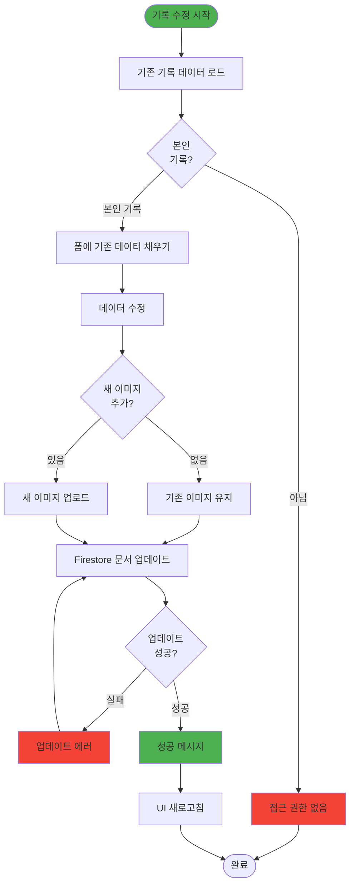

---

## 추천 시스템 플로우

### 홈 추천 생성 플로우

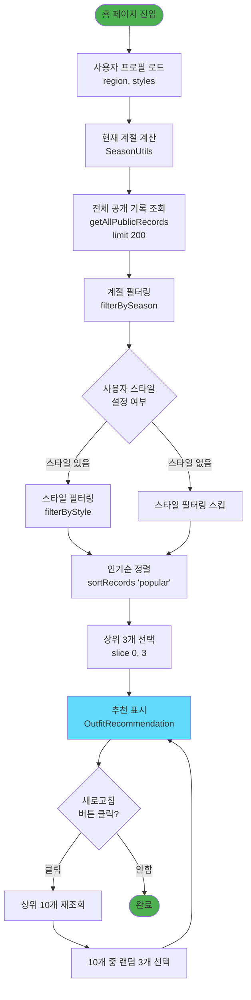

### 정렬 알고리즘 플로우

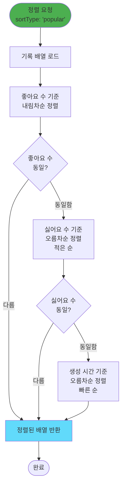

---

## 피드 탐색 플로우

### 피드 필터링 및 정렬 플로우

```mermaid
flowchart TD
    Start([피드 페이지 진입])
    LoadDefaultFilters[기본 필터 로드<br/>지역: 사용자 지역<br/>날짜: 오늘])
    QueryRecords[기록 조회<br/>지역 + 날짜 필터]
    ApplyStyleFilter{스타일 필터<br/>선택?}
    FilterByStyle[스타일 필터 적용]
    SkipStyleFilter[스타일 필터 스킵]
    ApplySort{정렬 방식<br/>선택}
    SortPopular[인기순 정렬]
    SortRecent[최신순 정렬]
    DisplayRecords[기록 목록 표시<br/>카드 그리드]
    ChangeFilter{필터 변경?}
    ChangeSort{정렬 변경?}
    UpdateQuery[쿼리 업데이트]
    UserClick{기록 카드<br/>클릭?}
    NavigateDetail[상세 페이지로 이동<br/>/feed-detail/:id]
    End([완료])
    
    Start --> LoadDefaultFilters
    LoadDefaultFilters --> QueryRecords
    QueryRecords --> ApplyStyleFilter
    ApplyStyleFilter -->|선택됨| FilterByStyle
    ApplyStyleFilter -->|미선택| SkipStyleFilter
    FilterByStyle --> ApplySort
    SkipStyleFilter --> ApplySort
    ApplySort -->|인기순| SortPopular
    ApplySort -->|최신순| SortRecent
    SortPopular --> DisplayRecords
    SortRecent --> DisplayRecords
    DisplayRecords --> ChangeFilter
    ChangeFilter -->|변경| UpdateQuery
    ChangeFilter -->|변경 안함| ChangeSort
    ChangeSort -->|변경| UpdateQuery
    ChangeSort -->|변경 안함| UserClick
    UpdateQuery --> QueryRecords
    UserClick -->|클릭| NavigateDetail
    UserClick -->|안함| End
    NavigateDetail --> End
    
    style Start fill:#4caf50
    style DisplayRecords fill:#61dafb
    style NavigateDetail fill:#ff9800
```

### 피드 상세 조회 플로우

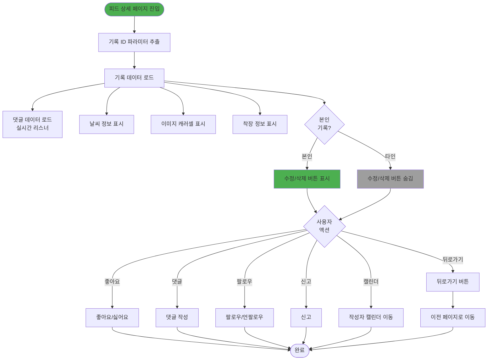

---

## 소셜 상호작용 플로우

### 좋아요/싫어요 플로우

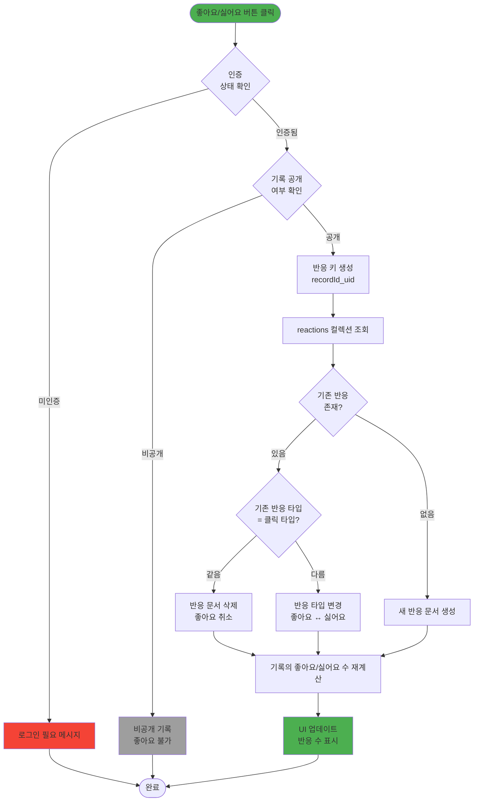

### 댓글 작성 플로우

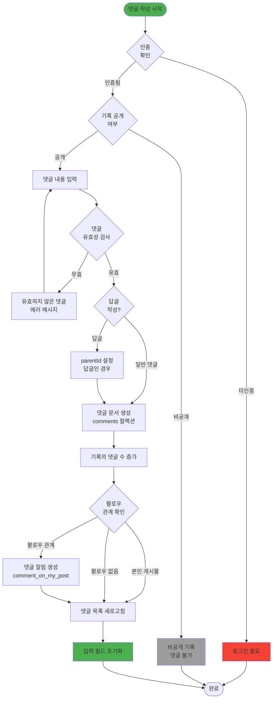

### 팔로우 플로우

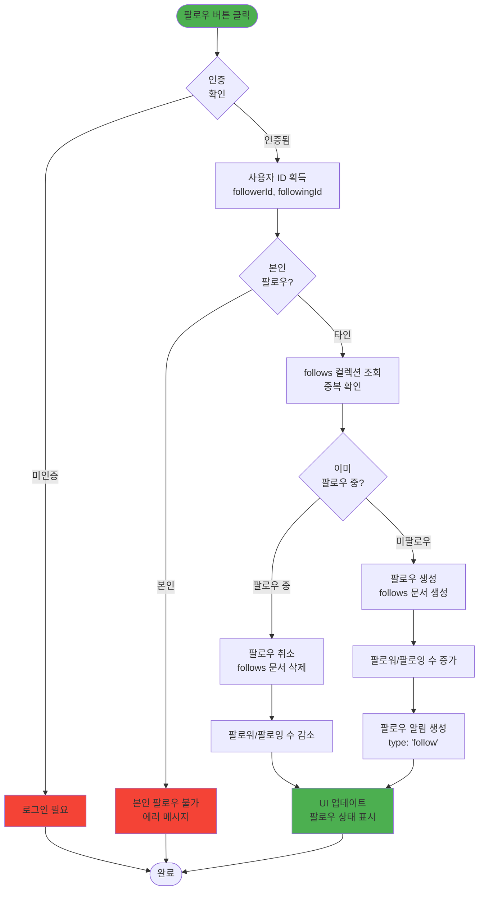

---

## 알림 처리 플로우

### 알림 조회 및 처리 플로우

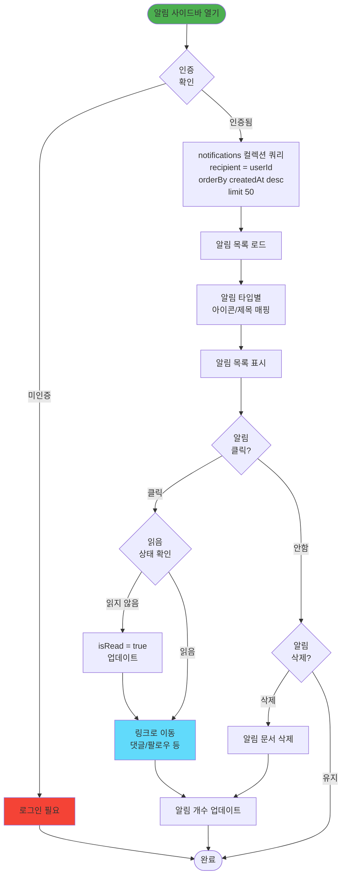

### 알림 생성 플로우

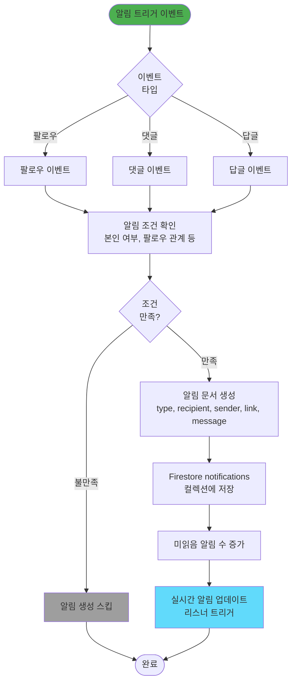

---

## 관리자 작업 플로우

### 관리자 로그인 플로우

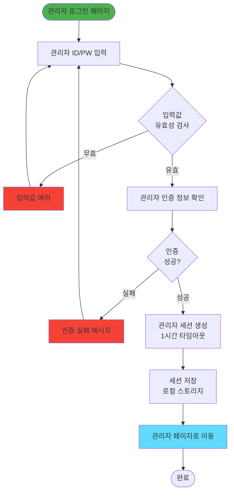

### 신고 처리 플로우

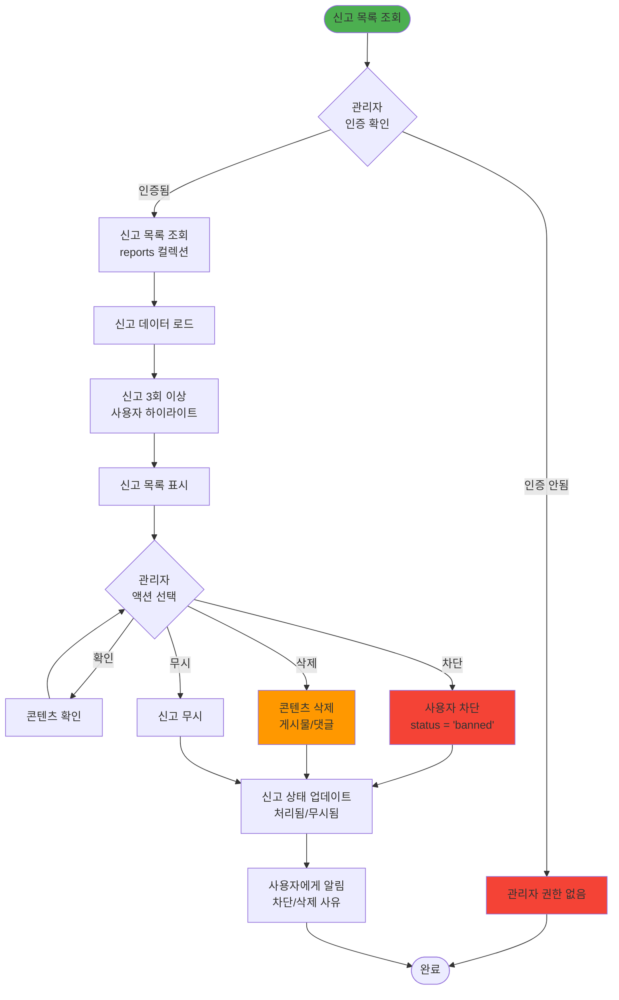

---

## 에러 처리 플로우

### 일반 에러 처리 플로우

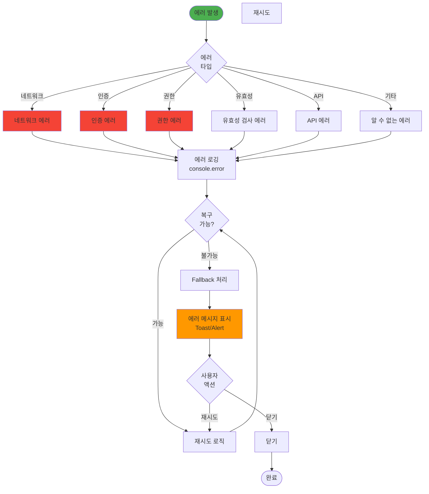

### 날씨 API Fallback 에러 처리 플로우

```mermaid
flowchart TD
    Start([날씨 데이터 요청])
    TryKMA[기상청 API 시도<br/>2초 타임아웃]
    KMASuccess{기상청<br/>성공?}
    KMAData[기상청 데이터 반환]
    TryOWM[OpenWeatherMap 시도]
    OWMSuccess{OWM<br/>성공?}
    OWMData[OWM 데이터 반환]
    TryAccu[AccuWeather 시도]
    AccuSuccess{AccuWeather<br/>성공?}
    AccuData[AccuWeather 데이터 반환]
    TryWeatherAPI[WeatherAPI 시도]
    WeatherAPISuccess{WeatherAPI<br/>성공?}
    WeatherAPIData[WeatherAPI 데이터 반환]
    TryVisualCrossing[Visual Crossing 시도]
    VisualCrossingSuccess{Visual Crossing<br/>성공?}
    VisualCrossingData[Visual Crossing 데이터 반환]
    UseMockData[Mock 데이터 사용<br/>기본값 반환]
    LogFailure[API 실패 로깅]
    StandardizeData[데이터 표준화]
    ReturnData[데이터 반환]
    End([완료])
    
    Start --> TryKMA
    TryKMA --> KMASuccess
    KMASuccess -->|성공| KMAData
    KMASuccess -->|실패/타임아웃| TryOWM
    KMAData --> StandardizeData
    TryOWM --> OWMSuccess
    OWMSuccess -->|성공| OWMData
    OWMSuccess -->|실패| TryAccu
    OWMData --> StandardizeData
    TryAccu --> AccuSuccess
    AccuSuccess -->|성공| AccuData
    AccuSuccess -->|실패| TryWeatherAPI
    AccuData --> StandardizeData
    TryWeatherAPI --> WeatherAPISuccess
    WeatherAPISuccess -->|성공| WeatherAPIData
    WeatherAPISuccess -->|실패| TryVisualCrossing
    WeatherAPIData --> StandardizeData
    TryVisualCrossing --> VisualCrossingSuccess
    VisualCrossingSuccess -->|성공| VisualCrossingData
    VisualCrossingSuccess -->|실패| LogFailure
    VisualCrossingData --> StandardizeData
    LogFailure --> UseMockData
    UseMockData --> StandardizeData
    StandardizeData --> ReturnData
    ReturnData --> End
    
    style Start fill:#4caf50
    style KMAData fill:#4caf50
    style OWMData fill:#4caf50
    style AccuData fill:#4caf50
    style WeatherAPIData fill:#4caf50
    style VisualCrossingData fill:#4caf50
    style UseMockData fill:#ff9800
    style LogFailure fill:#f44336
```

---

## 주요 플로우 패턴 요약

### 1. 인증 플로우 패턴
- **로그인 → 인증 확인 → 사용자 조회 → 프로필 확인 → 페이지 이동**
- 모든 보호된 페이지는 인증 가드를 거침
- 프로필 미설정 시 자동 리다이렉트

### 2. 데이터 생성 플로우 패턴
- **입력 검증 → 파일 업로드 (필요 시) → 데이터 저장 → 상태 업데이트 → UI 반영**
- 모든 입력값에 대한 유효성 검사 필수
- 비동기 작업은 에러 핸들링 포함

### 3. 데이터 조회 플로우 패턴
- **쿼리 생성 → 필터 적용 → 정렬 → 제한 (limit) → 표시**
- 대량 데이터는 페이지네이션 또는 제한 적용
- 실시간 업데이트는 리스너 사용

### 4. 소셜 상호작용 플로우 패턴
- **권한 확인 → 공개 여부 확인 → 작업 수행 → 카운트 업데이트 → 알림 생성 → UI 업데이트**
- 모든 소셜 기능은 공개 콘텐츠에만 가능
- 알림은 조건부 생성 (본인 제외, 팔로우 관계 등)

### 5. 에러 처리 플로우 패턴
- **에러 발생 → 에러 타입 식별 → 로깅 → 복구 시도 → Fallback → 사용자 알림**
- 네트워크 에러는 재시도 메커니즘 포함
- 사용자 친화적 에러 메시지 제공

---

*최종 업데이트: 2024*
