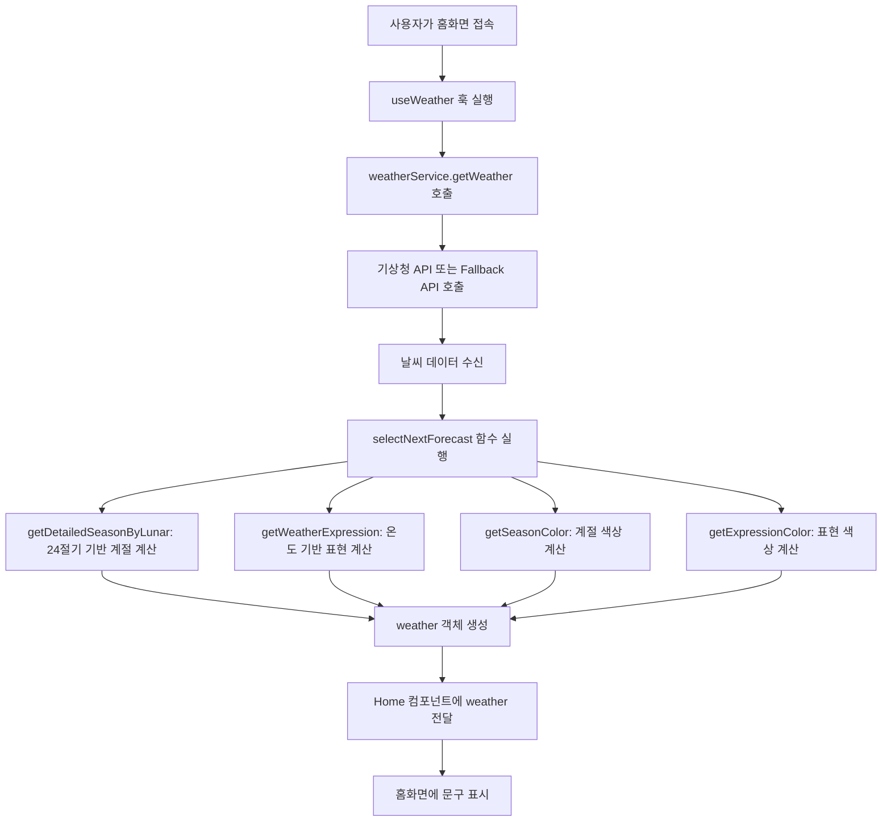
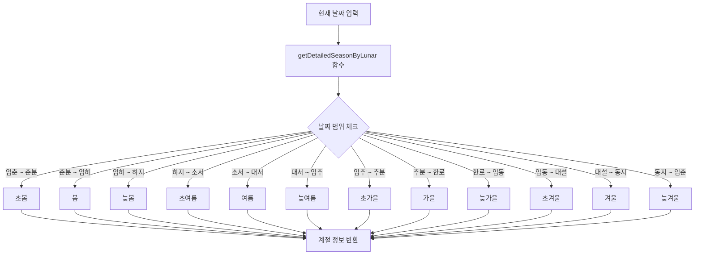
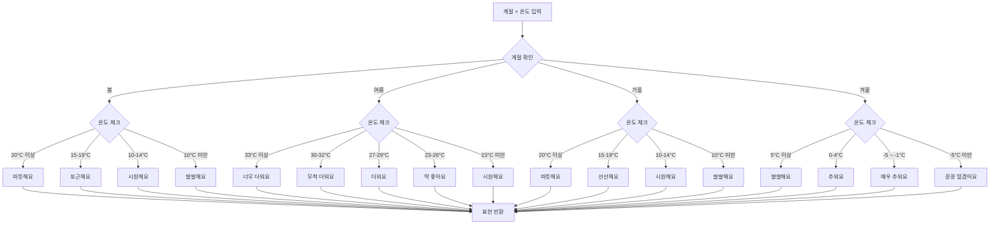

# 홈화면 계절 구분 및 문구 표시 로직 설명

## 📋 목차

1. [전체 흐름 개요](#전체-흐름-개요)
2. [계절 구분 로직](#계절-구분-로직)
3. [문구 표시 로직](#문구-표시-로직)
4. [색상 결정 로직](#색상-결정-로직)
5. [코드 흐름도](#코드-흐름도)

---

## 전체 흐름 개요

홈화면에서 표시되는 계절 정보와 날씨 문구는 다음과 같은 과정을 거쳐 생성됩니다:

```
1. 날씨 데이터 조회 (useWeather 훅)
   ↓
2. 계절 정보 계산 (24절기 기반)
   ↓
3. 날씨 표현 계산 (온도 기반)
   ↓
4. 색상 정보 계산 (계절/표현별)
   ↓
5. 홈화면에 문구 표시
```

---

## 계절 구분 로직

### 1. 24절기 기반 계절 구분

**파일**: `src/utils/forecastUtils.js`  
**함수**: `getDetailedSeasonByLunar(date)`

#### 동작 원리

현재 날짜를 기준으로 24절기 중 12개 주요 절기를 사용하여 세부 계절을 구분합니다.

```javascript
// 평균 절기 날짜 (24절기 중 12개)
const terms = {
  입춘: new Date(y, 1, 4),      // 2월 4일
  춘분: new Date(y, 2, 21),     // 3월 21일
  입하: new Date(y, 4, 6),      // 5월 6일
  하지: new Date(y, 5, 21),     // 6월 21일
  소서: new Date(y, 6, 7),      // 7월 7일
  대서: new Date(y, 6, 22),     // 7월 22일
  입추: new Date(y, 7, 8),      // 8월 8일
  추분: new Date(y, 8, 23),     // 9월 23일
  한로: new Date(y, 9, 8),      // 10월 8일
  입동: new Date(y, 10, 7),     // 11월 7일
  대설: new Date(y, 11, 7),     // 12월 7일
  동지: new Date(y, 11, 22),    // 12월 22일
};
```

#### 계절 구분 기준

| 날짜 범위 | 계절 | 설명 |
|---------|------|------|
| 입춘 ~ 춘분 | 초봄 | 2월 4일 ~ 3월 21일 |
| 춘분 ~ 입하 | 봄 | 3월 21일 ~ 5월 6일 |
| 입하 ~ 하지 | 늦봄 | 5월 6일 ~ 6월 21일 |
| 하지 ~ 소서 | 초여름 | 6월 21일 ~ 7월 7일 |
| 소서 ~ 대서 | 여름 | 7월 7일 ~ 7월 22일 |
| 대서 ~ 입추 | 늦여름 | 7월 22일 ~ 8월 8일 |
| 입추 ~ 추분 | 초가을 | 8월 8일 ~ 9월 23일 |
| 추분 ~ 한로 | 가을 | 9월 23일 ~ 10월 8일 |
| 한로 ~ 입동 | 늦가을 | 10월 8일 ~ 11월 7일 |
| 입동 ~ 대설 | 초겨울 | 11월 7일 ~ 12월 7일 |
| 대설 ~ 동지 | 겨울 | 12월 7일 ~ 12월 22일 |
| 동지 ~ 입춘 | 늦겨울 | 12월 22일 ~ 다음해 2월 4일 |

#### 코드 예시

```javascript
// forecastUtils.js
export function getSeason(tavg, date = new Date()) {
  return getDetailedSeasonByLunar(date);
}

// 예시: 2024년 10월 15일
// → 한로(10월 8일) ~ 입동(11월 7일) 사이
// → 결과: "늦가을"
```

### 2. 월별 간단 계절 구분 (대체용)

**파일**: `src/utils/seasonUtils.js`  
**함수**: `getSeasonInfo(date)`

24절기 계산이 실패하거나 대체 로직이 필요할 때 사용하는 간단한 월별 계절 구분입니다.

```javascript
const seasonMap = {
  // 봄(3-5월)
  3: { season: 'spring', period: 'early', label: '초봄', emoji: '🌸' },
  4: { season: 'spring', period: 'mid', label: '늦봄', emoji: '🌺' },
  5: { season: 'spring', period: 'late', label: '늦봄', emoji: '🌺' },
  
  // 여름(6-8월)
  6: { season: 'summer', period: 'early', label: '초여름', emoji: '☀️' },
  7: { season: 'summer', period: 'mid', label: '한여름', emoji: '🔥' },
  8: { season: 'summer', period: 'late', label: '늦여름', emoji: '🌞' },
  
  // 가을(9-11월)
  9: { season: 'autumn', period: 'early', label: '초가을', emoji: '🍂' },
  10: { season: 'autumn', period: 'early', label: '초가을', emoji: '🍂' },
  11: { season: 'autumn', period: 'late', label: '늦가을', emoji: '🍁' },
  
  // 겨울(12-2월)
  12: { season: 'winter', period: 'early', label: '초겨울', emoji: '❄️' },
  1: { season: 'winter', period: 'mid', label: '한겨울', emoji: '🥶' },
  2: { season: 'winter', period: 'late', label: '늦겨울', emoji: '🌨️' }
};
```

---

## 문구 표시 로직

### 1. 홈화면 문구 구조

**파일**: `src/pages/Home.js` (220-236번 라인)

홈화면에 표시되는 문구는 다음과 같은 구조입니다:

```
"오늘의 날씨는 [계절] [날씨 표현]! 이런 아이템 어때요?"
```

#### 실제 표시 예시

- "오늘의 날씨는 **초가을** **시원해요**! 이런 아이템 어때요?"
- "오늘의 날씨는 **한여름** **더워요**! 이런 아이템 어때요?"
- "오늘의 날씨는 **한겨울** **추워요**! 이런 아이템 어때요?"

### 2. 날씨 표현 계산 로직

**파일**: `src/utils/forecastUtils.js`  
**함수**: `getWeatherExpression(season, temp)`

계절과 온도를 기반으로 감성적인 날씨 표현을 반환합니다.

#### 봄 계절 표현

| 온도 범위 | 표현 |
|---------|------|
| 20°C 이상 | 따뜻해요 |
| 15°C ~ 19°C | 포근해요 |
| 10°C ~ 14°C | 시원해요 |
| 10°C 미만 | 쌀쌀해요 |

#### 여름 계절 표현

| 온도 범위 | 표현 |
|---------|------|
| 33°C 이상 | 너무 더워요 |
| 30°C ~ 32°C | 무척 더워요 |
| 27°C ~ 29°C | 더워요 |
| 23°C ~ 26°C | 딱 좋아요 |
| 23°C 미만 | 시원해요 |

#### 가을 계절 표현

| 온도 범위 | 표현 |
|---------|------|
| 20°C 이상 | 따뜻해요 |
| 15°C ~ 19°C | 선선해요 |
| 10°C ~ 14°C | 시원해요 |
| 10°C 미만 | 쌀쌀해요 |

#### 겨울 계절 표현

| 온도 범위 | 표현 |
|---------|------|
| 5°C 이상 | 쌀쌀해요 |
| 0°C ~ 4°C | 추워요 |
| -5°C ~ -1°C | 매우 추워요 |
| -5°C 미만 | 꽁꽁 얼겠어요 |

#### 코드 예시

```javascript
// forecastUtils.js
function getWeatherExpression(season, temp) {
  const temperature = parseFloat(temp);
  
  if (season.includes("봄")) {
    if (temperature >= 20) return "따뜻해요";
    if (temperature >= 15) return "포근해요";
    if (temperature >= 10) return "시원해요";
    return "쌀쌀해요";
  }
  
  if (season.includes("여름")) {
    if (temperature >= 33) return "너무 더워요";
    if (temperature >= 30) return "무척 더워요";
    if (temperature >= 27) return "더워요";
    if (temperature >= 23) return "딱 좋아요";
    return "시원해요";
  }
  
  // ... 가을, 겨울 로직
}
```

### 3. 홈화면 렌더링 코드

**파일**: `src/pages/Home.js`

```javascript
{/* 날씨에 따른 추천 메시지 */}
<div className="text-center text-gray-600">
  <p className="text-lg">
    오늘의 날씨는{" "}
    <span
      className="font-semibold"
      style={{ color: weather.seasonColor || "#795548" }}
    >
      {weather.season || "초가을"}
    </span>{" "}
    <span
      className="font-semibold"
      style={{ color: weather.expressionColor || "#03A9F4" }}
    >
      {weather.weatherExpression || (weather.temp < 10 ? "추워요" : "시원해요")}
    </span>
    ! 이런 아이템 어때요?
  </p>
</div>
```

#### 설명

1. **계절 표시**: `weather.season` (예: "초가을")
   - 색상: `weather.seasonColor` (계절별 색상)
   - 기본값: "초가을" (날씨 데이터가 없을 때)

2. **날씨 표현 표시**: `weather.weatherExpression` (예: "시원해요")
   - 색상: `weather.expressionColor` (표현별 색상)
   - 기본값: 온도가 10°C 미만이면 "추워요", 아니면 "시원해요"

---

## 색상 결정 로직

### 1. 계절별 색상

**파일**: `src/utils/forecastUtils.js`  
**함수**: `getSeasonColor(season)`

| 계절 | 색상 코드 | 설명 |
|------|---------|------|
| 봄 | `#8BC34A` | 연두색 |
| 여름 | `#2196F3` | 파란색 |
| 가을 | `#795548` | 갈색 |
| 겨울 | `#1A237E` | 진한 남색 |
| 기본값 | `#795548` | 갈색 |

```javascript
function getSeasonColor(season) {
  if (season.includes("봄")) return "#8BC34A";      // 연두색
  else if (season.includes("여름")) return "#2196F3"; // 파란색
  else if (season.includes("가을")) return "#795548"; // 갈색
  else if (season.includes("겨울")) return "#1A237E"; // 진한 남색
  else return "#795548"; // 기본값
}
```

### 2. 날씨 표현별 색상

**파일**: `src/utils/forecastUtils.js`  
**함수**: `getExpressionColor(expression)`

| 표현 | 색상 코드 | 설명 |
|------|---------|------|
| 너무 더워요 / 무척 더워요 | `#F44336` | 빨간색 |
| 따뜻해요 / 포근해요 | `#FF9800` | 주황색 |
| 시원해요 / 선선해요 | `#03A9F4` | 하늘색 |
| 쌀쌀해요 | `#3F51B5` | 남색 |
| 추워요 / 꽁꽁 얼겠어요 | `#81D4FA` | 연한 하늘색 |
| 기본값 | `#03A9F4` | 하늘색 |

```javascript
function getExpressionColor(expression) {
  if (expression === "너무 더워요" || expression === "무척 더워요") 
    return "#F44336"; // 빨간색
  else if (expression === "따뜻해요" || expression === "포근해요") 
    return "#FF9800"; // 주황색
  else if (expression === "시원해요" || expression === "선선해요") 
    return "#03A9F4"; // 하늘색
  else if (expression === "쌀쌀해요") 
    return "#3F51B5"; // 남색
  else if (expression === "추워요" || expression === "꽁꽁 얼겠어요") 
    return "#81D4FA"; // 연한 하늘색
  else 
    return "#03A9F4"; // 기본값
}
```

---

## 코드 흐름도

### 전체 데이터 흐름



### 계절 계산 상세 흐름



### 날씨 표현 계산 상세 흐름



---

## 실제 사용 예시

### 예시 1: 10월 15일, 온도 18°C

1. **계절 계산**:
   - 날짜: 2024년 10월 15일
   - 한로(10월 8일) ~ 입동(11월 7일) 사이
   - 결과: **"늦가을"**

2. **날씨 표현 계산**:
   - 계절: "늦가을" (가을 포함)
   - 온도: 18°C
   - 15°C ~ 19°C 범위
   - 결과: **"선선해요"**

3. **색상 계산**:
   - 계절 색상: 가을 → `#795548` (갈색)
   - 표현 색상: 선선해요 → `#03A9F4` (하늘색)

4. **최종 표시**:
   ```
   오늘의 날씨는 [갈색]늦가을[/] [하늘색]선선해요[/]! 이런 아이템 어때요?
   ```

### 예시 2: 7월 20일, 온도 32°C

1. **계절 계산**:
   - 날짜: 2024년 7월 20일
   - 대서(7월 22일) 이전, 소서(7월 7일) 이후
   - 결과: **"여름"**

2. **날씨 표현 계산**:
   - 계절: "여름"
   - 온도: 32°C
   - 30°C ~ 32°C 범위
   - 결과: **"무척 더워요"**

3. **색상 계산**:
   - 계절 색상: 여름 → `#2196F3` (파란색)
   - 표현 색상: 무척 더워요 → `#F44336` (빨간색)

4. **최종 표시**:
   ```
   오늘의 날씨는 [파란색]여름[/] [빨간색]무척 더워요[/]! 이런 아이템 어때요?
   ```

---

## 주요 파일 위치

| 파일 | 경로 | 설명 |
|------|------|------|
| 계절 계산 | `src/utils/forecastUtils.js` | 24절기 기반 계절 구분 |
| 월별 계절 | `src/utils/seasonUtils.js` | 월별 간단 계절 구분 |
| 날씨 표현 | `src/utils/forecastUtils.js` | 온도 기반 날씨 표현 |
| 색상 계산 | `src/utils/forecastUtils.js` | 계절/표현별 색상 |
| 홈화면 렌더링 | `src/pages/Home.js` | 문구 표시 |
| 날씨 데이터 | `src/hooks/useWeather.js` | 날씨 데이터 조회 훅 |

---

## 개선 가능한 부분

1. **계절 계산 정확도**: 현재는 평균 절기 날짜를 사용하지만, 실제 절기 날짜는 매년 조금씩 다릅니다.
2. **온도 범위 조정**: 사용자 피드백을 바탕으로 온도 범위를 미세 조정할 수 있습니다.
3. **색상 커스터마이징**: 사용자 설정에서 색상을 변경할 수 있는 기능 추가 가능.
4. **다국어 지원**: 현재는 한국어만 지원하지만, i18n을 통해 다국어 지원 가능.

---

**작성일**: 2024년  
**프로젝트**: Fitweather - 날씨 기반 착장 기록 및 공유 플랫폼

