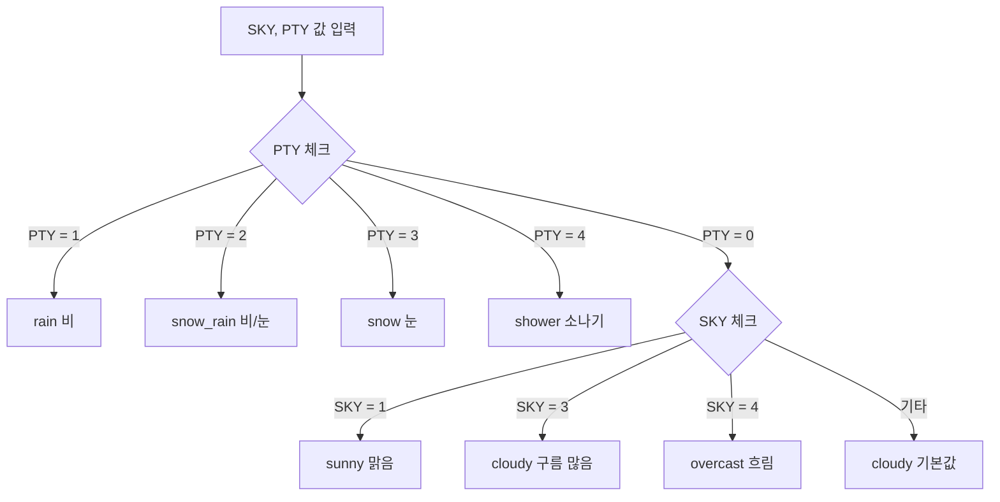
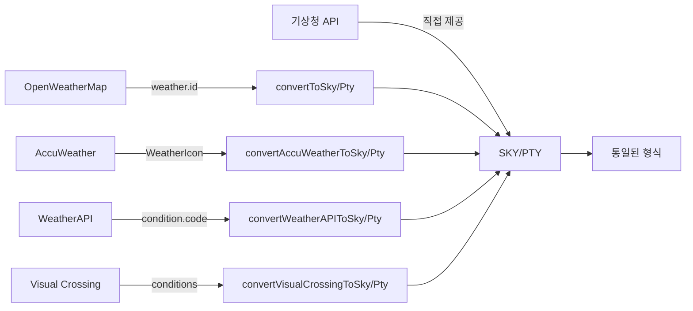

# SKY와 PTY 처리 로직 설명

## 📋 목차

1. [SKY와 PTY란?](#sky와-pty란)
2. [코드 값 의미](#코드-값-의미)
3. [아이콘 결정 로직](#아이콘-결정-로직)
4. [데이터 추출 과정](#데이터-추출-과정)
5. [외부 API 변환](#외부-api-변환)

---

## SKY와 PTY란?

### SKY (하늘 상태)
기상청 API에서 제공하는 **하늘 상태 코드**입니다.

### PTY (강수 형태)
기상청 API에서 제공하는 **강수 형태 코드**입니다.

이 두 값을 조합하여 최종 날씨 아이콘을 결정합니다.

---

## 코드 값 의미

### SKY (하늘 상태) 코드

| 코드 | 의미 | 설명 |
|------|------|------|
| `"1"` | 맑음 | 하늘이 맑음 |
| `"3"` | 구름 많음 | 구름이 많음 |
| `"4"` | 흐림 | 하늘이 흐림 |

**기본값**: `"1"` (맑음)

### PTY (강수 형태) 코드

| 코드 | 의미 | 설명 |
|------|------|------|
| `"0"` | 없음 | 강수 없음 |
| `"1"` | 비 | 비가 옴 |
| `"2"` | 비/눈 | 비와 눈이 섞임 |
| `"3"` | 눈 | 눈이 옴 |
| `"4"` | 소나기 | 소나기가 옴 |

**기본값**: `"0"` (없음)

---

## 아이콘 결정 로직

### 우선순위: PTY > SKY

**PTY(강수 형태)를 먼저 체크**하고, 강수가 없을 때만 SKY(하늘 상태)를 체크합니다.

### 로직 흐름



### 코드 구현

**파일**: `src/utils/forecastUtils.js`

```javascript
function getWeatherIcon(sky, pty) {
  // PTY(강수 형태) 우선 체크
  if (pty === "1") return "rain";      // 비
  if (pty === "2") return "snow_rain"; // 비/눈
  if (pty === "3") return "snow";      // 눈
  if (pty === "4") return "shower";    // 소나기
  
  // PTY가 0일 때 SKY 조건 체크
  if (pty === "0" && sky === "1") return "sunny";     // 맑음
  if (pty === "0" && sky === "3") return "cloudy";    // 구름 많음
  if (pty === "0" && sky === "4") return "overcast";  // 흐림
  
  // 예외 처리
  console.error(`날씨 아이콘 조건 오류 - PTY: ${pty}, SKY: ${sky}`);
  return "cloudy"; // 기본값
}
```

### 아이콘 코드 매핑

| SKY | PTY | 아이콘 코드 | 이모지 | 설명 |
|-----|-----|-----------|--------|------|
| - | `"1"` | `rain` | 🌧️ | 비 |
| - | `"2"` | `snow_rain` | 🌨️ | 비/눈 |
| - | `"3"` | `snow` | ❄️ | 눈 |
| - | `"4"` | `shower` | 🌦️ | 소나기 |
| `"1"` | `"0"` | `sunny` | ☀️ | 맑음 |
| `"3"` | `"0"` | `cloudy` | ☁️ | 구름 많음 |
| `"4"` | `"0"` | `overcast` | 🌥️ | 흐림 |

---

## 데이터 추출 과정

### 1. 기상청 API에서 데이터 추출

**파일**: `src/utils/forecastUtils.js` - `selectNextForecast()`

```javascript
export function selectNextForecast(items) {
  // 현재 시간 이후의 다음 예보 찾기
  const fcstTime = nextTmp.fcstTime;
  
  // 같은 시간대의 SKY, PTY 값 찾기
  const findValue = (category) =>
    items.find((i) => i.category === category && i.fcstTime === fcstTime)?.fcstValue;
  
  const sky = findValue("SKY") || "1";  // 하늘 상태 (기본값: 맑음)
  const pty = findValue("PTY") || "0";  // 강수 형태 (기본값: 없음)
  
  // 아이콘 코드 결정
  const iconCode = getWeatherIcon(sky, pty);
  
  return {
    sky: sky,
    pty: pty,
    iconCode: iconCode,
    // ... 기타 데이터
  };
}
```

### 2. 과거 날씨 데이터에서 추출

**파일**: `src/api/pastWeather.js`

과거 날씨 데이터의 경우, 하루 동안의 여러 시간대 데이터 중 **가장 빈번한 값**을 대표값으로 사용합니다.

```javascript
// SKY, PTY 데이터 추출
const skyData = dayData.filter(item => item.category === 'SKY');
const ptyData = dayData.filter(item => item.category === 'PTY');

// 가장 빈번한 SKY, PTY 값으로 대표값 결정
const skyCounts = {};
const ptyCounts = {};
skyData.forEach(item => { 
  skyCounts[item.fcstValue] = (skyCounts[item.fcstValue] || 0) + 1; 
});
ptyData.forEach(item => { 
  ptyCounts[item.fcstValue] = (ptyCounts[item.fcstValue] || 0) + 1; 
});

const sky = Object.keys(skyCounts).reduce((a, b) => 
  skyCounts[a] > skyCounts[b] ? a : b, "1"
); // 기본값: 맑음

const pty = Object.keys(ptyCounts).reduce((a, b) => 
  ptyCounts[a] > ptyCounts[b] ? a : b, "0"
); // 기본값: 없음

// 아이콘 코드 결정
const iconCode = getWeatherIconFromCodes(sky, pty);
```

---

## 외부 API 변환

### ⚠️ 중요: 다른 API는 SKY/PTY를 직접 제공하지 않음

**기상청(KMA) API만** SKY와 PTY를 직접 제공합니다.

다른 날씨 API들(OpenWeatherMap, AccuWeather, WeatherAPI, Visual Crossing)은:
- ❌ SKY/PTY를 직접 제공하지 않음
- ✅ 자체적인 날씨 코드/조건을 사용
- ✅ 우리가 변환 로직을 통해 기상청 형식(SKY/PTY)으로 변환

### 변환이 필요한 이유

모든 API의 날씨 데이터를 **통일된 형식(SKY/PTY)**으로 변환하여:
1. 일관된 아이콘 표시
2. 동일한 로직으로 날씨 처리
3. API 간 호환성 유지

다른 날씨 API(OpenWeatherMap, AccuWeather 등)의 날씨 코드를 기상청 형식(SKY, PTY)으로 변환합니다.

### OpenWeatherMap 변환

**OpenWeatherMap API 응답 예시:**
```json
{
  "weather": [{
    "id": 800,  // 날씨 코드 (200-800 범위)
    "main": "Clear",
    "description": "맑음"
  }],
  "main": {
    "temp": 20,
    "humidity": 60
  },
  "rain": {
    "1h": 0
  }
}
```

**변환 로직**: `weather[0].id` 코드를 SKY/PTY로 변환

**파일**: `src/api/pastWeatherAPIs.js` - `convertOWMCodeToKmaFormat()`

```javascript
function convertOWMCodeToKmaFormat(weatherCode) {
  let sky = "1"; // 기본값: 맑음
  let pty = "0"; // 기본값: 없음
  let iconCode = "sunny";

  if (weatherCode >= 200 && weatherCode < 300) {
    // 천둥번개
    pty = "4"; // 소나기
    sky = "4";
    iconCode = "rain";
  } else if (weatherCode >= 300 && weatherCode < 400) {
    // 이슬비
    pty = "1"; // 비
    sky = "4";
    iconCode = "rain";
  } else if (weatherCode >= 500 && weatherCode < 600) {
    // 비
    pty = "1"; // 비
    sky = "4";
    iconCode = "rain";
  } else if (weatherCode >= 600 && weatherCode < 700) {
    // 눈
    pty = "3"; // 눈
    sky = "4";
    iconCode = "snow";
  } else if (weatherCode === 800) {
    // 맑음
    sky = "1";
    pty = "0";
    iconCode = "sunny";
  } else if (weatherCode === 801 || weatherCode === 802) {
    // 구름 조금/중간
    sky = "3";
    pty = "0";
    iconCode = "cloudy";
  } else if (weatherCode >= 803) {
    // 구름 많음/흐림
    sky = "4";
    pty = "0";
    iconCode = "overcast";
  }

  return { sky, pty, iconCode };
}
```

### WeatherAPI 변환

**파일**: `src/api/pastWeatherAPIs.js` - `convertWeatherAPICodeToKmaFormat()`

```javascript
function convertWeatherAPICodeToKmaFormat(conditionCode) {
  let sky = "1";
  let pty = "0";
  let iconCode = "sunny";

  if (conditionCode === 1000) {
    // 맑음
    sky = "1";
    pty = "0";
    iconCode = "sunny";
  } else if (conditionCode >= 1003 && conditionCode <= 1006) {
    // 구름 많음
    sky = "3";
    pty = "0";
    iconCode = "cloudy";
  } else if (conditionCode >= 1007 && conditionCode <= 1030) {
    // 흐림
    sky = "4";
    pty = "0";
    iconCode = "overcast";
  } else if (conditionCode >= 1063 && conditionCode <= 1087) {
    // 비/소나기
    sky = "4";
    pty = "1";
    iconCode = "rain";
  } else if (conditionCode >= 1114 && conditionCode <= 1117) {
    // 눈
    sky = "4";
    pty = "3";
    iconCode = "snow";
  }

  return { sky, pty, iconCode };
}
```

### Visual Crossing 변환

**파일**: `src/api/pastWeatherAPIs.js` - `convertVisualCrossingConditionToKmaFormat()`

```javascript
function convertVisualCrossingConditionToKmaFormat(condition) {
  let sky = "1";
  let pty = "0";
  let iconCode = "sunny";

  const lowerCondition = condition.toLowerCase();

  if (lowerCondition.includes('clear') || lowerCondition.includes('sunny')) {
    sky = "1";
    pty = "0";
    iconCode = "sunny";
  } else if (lowerCondition.includes('partly') || lowerCondition.includes('cloud')) {
    sky = "3";
    pty = "0";
    iconCode = "cloudy";
  } else if (lowerCondition.includes('overcast') || lowerCondition.includes('fog')) {
    sky = "4";
    pty = "0";
    iconCode = "overcast";
  } else if (lowerCondition.includes('rain') || lowerCondition.includes('drizzle')) {
    sky = "4";
    pty = "1";
    iconCode = "rain";
  } else if (lowerCondition.includes('snow')) {
    sky = "4";
    pty = "3";
    iconCode = "snow";
  }

  return { sky, pty, iconCode };
}
```

---

## 실제 사용 예시

### 예시 1: 맑은 날씨

```javascript
// 입력
sky = "1"
pty = "0"

// 처리
getWeatherIcon("1", "0")
// → PTY가 "0"이므로 SKY 체크
// → SKY가 "1"이므로 "sunny" 반환

// 결과
iconCode = "sunny"  // ☀️
```

### 예시 2: 비 오는 날씨

```javascript
// 입력
sky = "4"  // 흐림
pty = "1"  // 비

// 처리
getWeatherIcon("4", "1")
// → PTY가 "1"이므로 즉시 "rain" 반환 (SKY 무시)

// 결과
iconCode = "rain"  // 🌧️
```

### 예시 3: 구름 많은 날씨

```javascript
// 입력
sky = "3"
pty = "0"

// 처리
getWeatherIcon("3", "0")
// → PTY가 "0"이므로 SKY 체크
// → SKY가 "3"이므로 "cloudy" 반환

// 결과
iconCode = "cloudy"  // ☁️
```

### 예시 4: 눈 오는 날씨

```javascript
// 입력
sky = "4"  // 흐림
pty = "3"  // 눈

// 처리
getWeatherIcon("4", "3")
// → PTY가 "3"이므로 즉시 "snow" 반환 (SKY 무시)

// 결과
iconCode = "snow"  // ❄️
```

---

## API별 SKY/PTY 제공 여부

| API | SKY/PTY 직접 제공 | 제공 형식 | 변환 필요 |
|-----|-----------------|----------|----------|
| **기상청 (KMA)** | ✅ 예 | `category: "SKY"`, `category: "PTY"` | ❌ 불필요 |
| **OpenWeatherMap** | ❌ 아니오 | `weather[0].id` (200-800 코드) | ✅ 필요 |
| **AccuWeather** | ❌ 아니오 | `WeatherIcon` (1-44 코드) | ✅ 필요 |
| **WeatherAPI** | ❌ 아니오 | `condition.code` (1000번대 코드) | ✅ 필요 |
| **Visual Crossing** | ❌ 아니오 | `conditions` (문자열) | ✅ 필요 |

### 변환 과정 요약



## 주요 파일 위치

| 파일 | 함수 | 설명 |
|------|------|------|
| `src/utils/forecastUtils.js` | `getWeatherIcon(sky, pty)` | SKY/PTY → 아이콘 코드 변환 |
| `src/utils/forecastUtils.js` | `selectNextForecast(items)` | 기상청 데이터에서 SKY/PTY 추출 |
| `src/api/pastWeather.js` | `getWeatherIconFromCodes(sky, pty)` | 과거 날씨용 아이콘 변환 |
| `src/api/pastWeatherAPIs.js` | `convertOWMCodeToKmaFormat()` | OpenWeatherMap → SKY/PTY 변환 |
| `src/api/pastWeatherAPIs.js` | `convertWeatherAPICodeToKmaFormat()` | WeatherAPI → SKY/PTY 변환 |
| `src/api/pastWeatherAPIs.js` | `convertVisualCrossingConditionToKmaFormat()` | Visual Crossing → SKY/PTY 변환 |
| `src/api/weatherService.js` | `getWeatherIcon(sky, pty)` | WeatherService 내부 아이콘 변환 |

---

## 핵심 포인트

1. **PTY 우선순위**: 강수 형태(PTY)가 하늘 상태(SKY)보다 우선합니다.
2. **기본값**: SKY는 `"1"`(맑음), PTY는 `"0"`(없음)이 기본값입니다.
3. **통일된 형식**: 모든 외부 API의 날씨 코드를 기상청 형식(SKY/PTY)으로 변환하여 일관성 유지.
4. **과거 데이터**: 하루 동안의 여러 시간대 데이터 중 가장 빈번한 값을 대표값으로 사용.

---

**작성일**: 2024년  
**프로젝트**: Fitweather - 날씨 기반 착장 기록 및 공유 플랫폼

