# Fitweather 시스템 아키텍처

## 📋 목차

1. [전체 개요](#전체-개요)
2. [시스템 구성도](#시스템-구성도)
3. [아키텍처 레이어](#아키텍처-레이어)
4. [데이터 모델](#데이터-모델)
5. [주요 플로우](#주요-플로우)
6. [라우팅 구조](#라우팅-구조)
7. [컴포넌트 계층 구조](#컴포넌트-계층-구조)
8. [API 통신 구조](#api-통신-구조)

---

## 전체 개요

Fitweather는 날씨 기반 착장 기록 및 공유 플랫폼입니다. React 기반 SPA와 Firebase BaaS를 활용하여 구현되었습니다.

### 기술 스택

- **Frontend**: React (CRA), React Router, Tailwind CSS
- **Backend**: Firebase (Auth, Firestore, Storage)
- **External APIs**: 
  - 날씨 API: 기상청(KMA), OpenWeatherMap, AccuWeather, WeatherAPI, Visual Crossing (Fallback 시스템)
  - OAuth: 구글 로그인 (Firebase Auth), 카카오 로그인

---

## 시스템 구성도

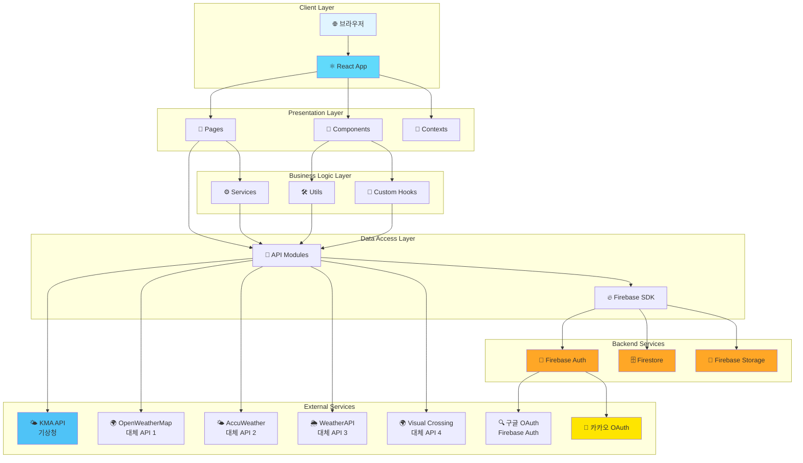

---

## 아키텍처 레이어

### 1. Presentation Layer (표현 계층)

**Pages** (`src/pages/`)
- 사용자 인터페이스 페이지 컴포넌트
- 라우트에 직접 연결되는 최상위 컴포넌트

**Components** (`src/components/`)
- 재사용 가능한 UI 컴포넌트
- 특정 페이지에 종속되지 않는 범용 컴포넌트

**Contexts** (`src/contexts/`)
- 전역 상태 관리 (AuthContext 등)
- 컴포넌트 간 상태 공유

### 2. Business Logic Layer (비즈니스 로직 계층)

**Services** (`src/services/`)
- 복잡한 비즈니스 로직 처리
- 예: `notificationService.js` - 알림 생성 및 관리

**Utils** (`src/utils/`)
- 순수 함수 유틸리티
- 예: `sortingUtils.js`, `seasonUtils.js`, `weatherUtils.js`

**Custom Hooks** (`src/hooks/`)
- 재사용 가능한 상태 로직
- 예: `useUserProfile.js`, `useWeather.js`, `useNotiSidebar.js`

### 3. Data Access Layer (데이터 접근 계층)

**API Modules** (`src/api/`)
- Firebase 및 외부 API 호출
- 데이터 CRUD 작업 캡슐화

**Firebase SDK** (`src/firebase.js`)
- Firebase 초기화 및 설정
- Firebase 서비스 접근

---

## 데이터 모델

### Firestore 컬렉션 구조

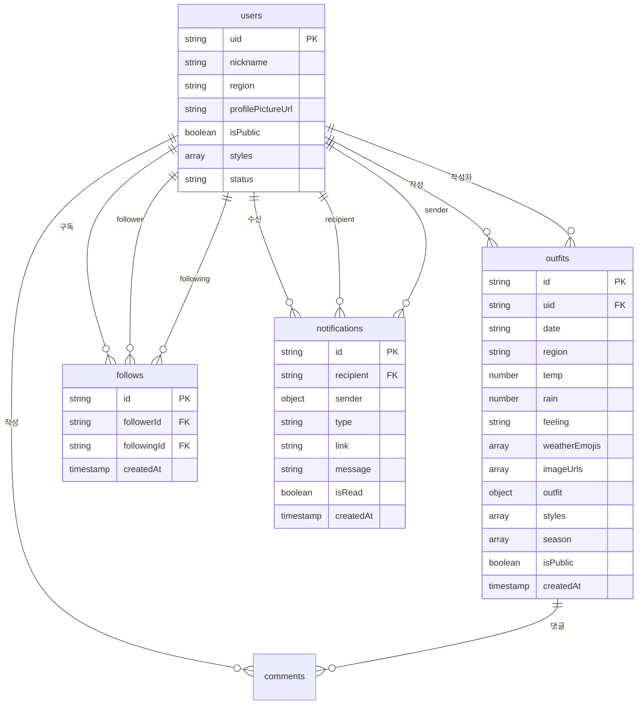

### 주요 컬렉션 상세

#### `users`
- 사용자 프로필 정보
- 캘린더 공개 여부 (`isPublic`)
- 기본 스타일 설정

#### `outfits`
- 착장 기록
- 날씨 정보 포함
- 스타일 및 계절 태그

#### `follows`
- 구독 관계
- `followerId` → `followingId`

#### `notifications`
- 알림 메시지
- 타입: `follow`, `comment_on_my_post`, `reply_to_my_comment`
- 읽음 상태 관리

---

## 주요 플로우

### 1. 홈 추천 플로우

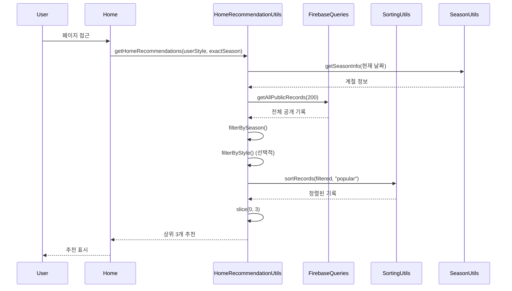

**정렬 알고리즘**:
1. 좋아요 수 내림차순
2. 싫어요 수 오름차순 (적은 순)
3. 생성 시간 오름차순 (빠른 순)

### 2. 기록 저장 플로우

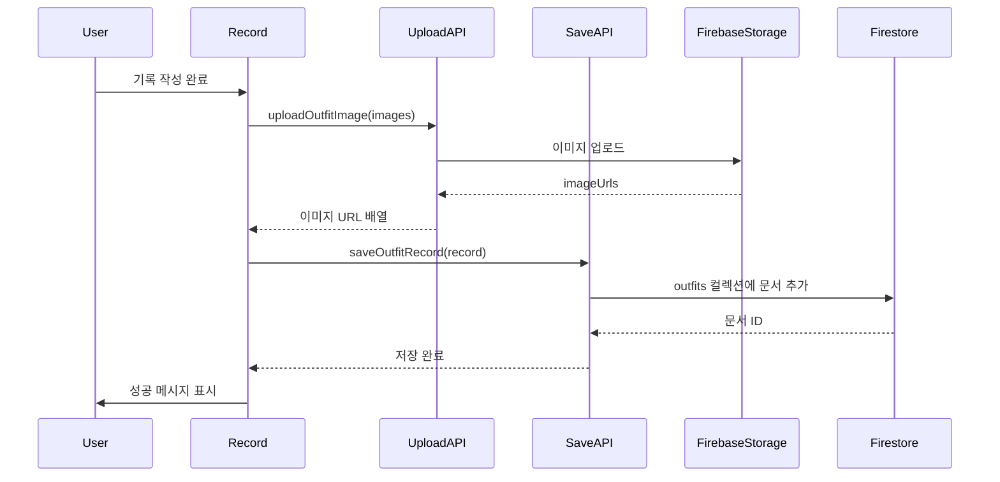

### 3. 캘린더 접근 플로우

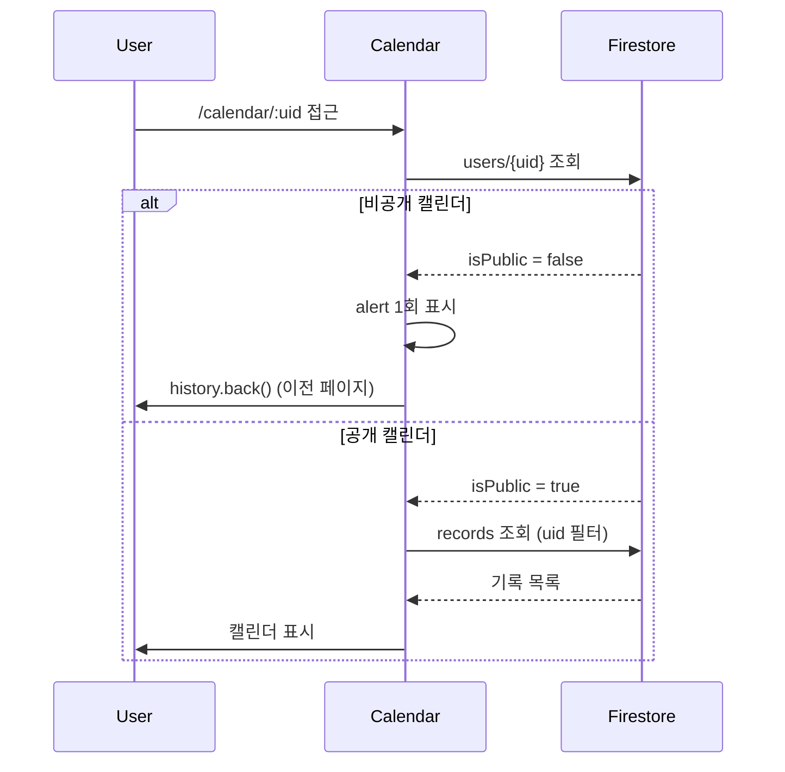

### 4. 알림 표시 플로우

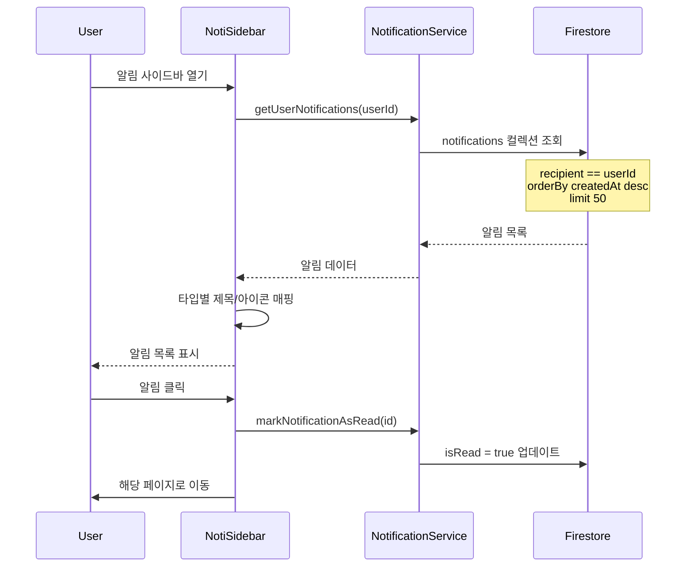

---

## 라우팅 구조

```mermaid
graph TB
    App[App.js<br/>BrowserRouter]
    
    App --> AuthProvider[AuthProvider<br/>전역 인증 상태]
    AuthProvider --> Routes[Routes]
    
    Routes --> PublicRoutes[Public Routes]
    Routes --> ProtectedRoutes[Protected Routes]
    Routes --> AdminRoutes[Admin Routes]
    
    PublicRoutes --> Login[/login]
    PublicRoutes --> ProfileSetup[/profile-setup]
    PublicRoutes --> KakaoCallback[/auth/kakao/callback]
    
    ProtectedRoutes --> Home[/<br/>홈 화면]
    ProtectedRoutes --> Record[/record<br/>기록 작성]
    ProtectedRoutes --> Feed[/feed<br/>피드]
    ProtectedRoutes --> FeedDetail[/feed-detail/:id<br/>상세보기]
    ProtectedRoutes --> Calendar[/calendar<br/>캘린더]
    ProtectedRoutes --> CalendarUser[/calendar/:uid<br/>다른 사용자]
    ProtectedRoutes --> Recommend[/recommend<br/>추천]
    ProtectedRoutes --> RecommendView[/recommend-view]
    ProtectedRoutes --> RecommendFilter[/recommend-filter-settings]
    ProtectedRoutes --> Follow[/follow<br/>구독]
    ProtectedRoutes --> MyPage[/mypage_userinfo<br/>마이페이지]
    ProtectedRoutes --> ProfileEdit[/profile-edit<br/>프로필 수정]
    ProtectedRoutes --> Withdraw[/withdraw<br/>회원탈퇴]
    
    AdminRoutes --> Admin[/admin<br/>관리자]
    AdminRoutes --> AdminLogin[/admin-login]
    AdminRoutes --> SetAdmin[/set-admin]
    
    style PublicRoutes fill:#e8f5e9
    style ProtectedRoutes fill:#fff3e0
    style AdminRoutes fill:#fce4ec
```

### 라우트 가드

- **AuthRouteGuard**: 로그인 필요 페이지 보호
- **ProfileGuard**: 프로필 설정 완료 여부 확인
- **BannedUserMessage**: 차단된 사용자 접근 차단

---

## 컴포넌트 계층 구조

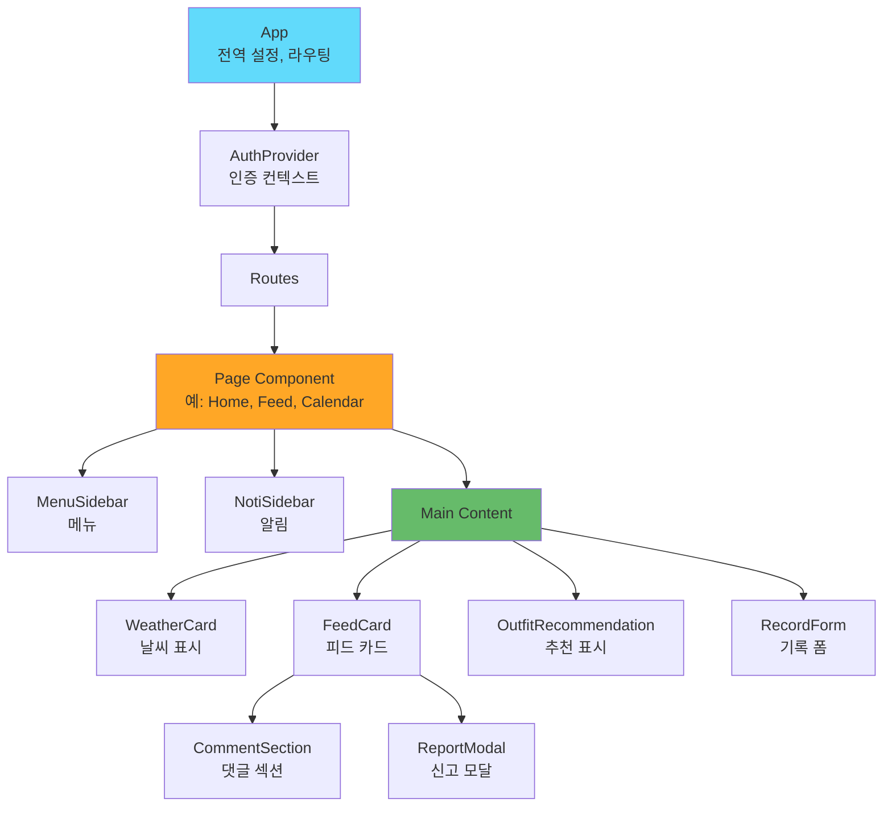

### 주요 컴포넌트

#### Pages
- **Home**: 홈 화면, 추천 표시
- **Feed**: 지역 피드
- **FeedDetail**: 기록 상세
- **Record**: 기록 작성/수정
- **Calendar**: 캘린더 뷰
- **Follow**: 구독 관리
- **Recommend**: 추천 페이지

#### Shared Components
- **MenuSidebar**: 메뉴 사이드바
- **NotiSidebar**: 알림 사이드바
- **FeedCard**: 피드 카드
- **WeatherCard**: 날씨 카드
- **CommentSection**: 댓글 섹션
- **AuthRouteGuard**: 인증 가드
- **ProfileGuard**: 프로필 가드

---

## API 통신 구조

### Firebase 통신

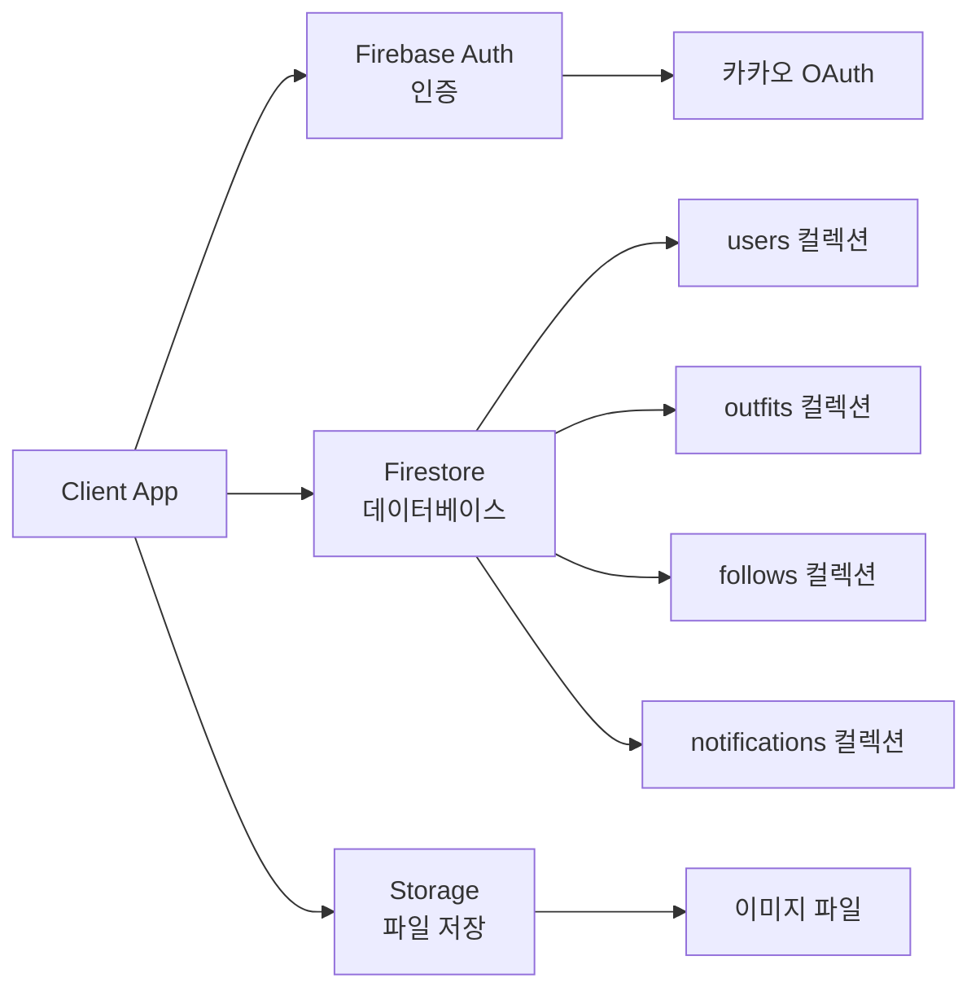

### 외부 API 통신

#### 날씨 API (Fallback 시스템)

Fitweather는 안정적인 날씨 서비스를 제공하기 위해 **다중 API Fallback 시스템**을 구현했습니다.

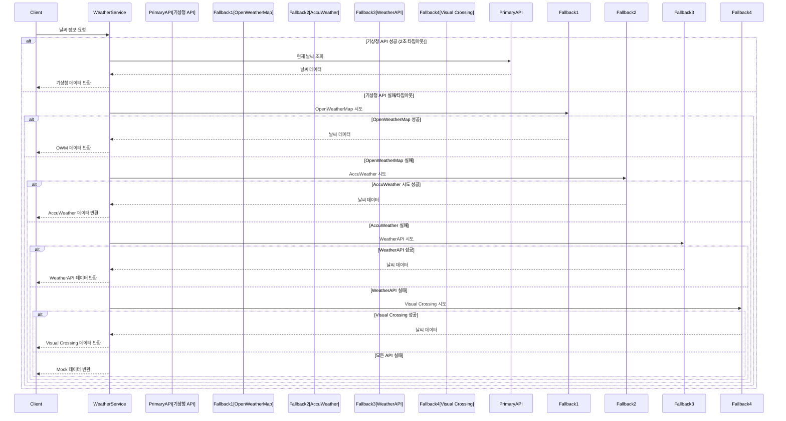

**날씨 API 목록**:

| API 이름 | 우선순위 | 용도 | 환경 변수 |
|---------|---------|------|----------|
| **기상청 (KMA)** | 1순위 (기본) | 현재/예보 날씨 | `REACT_APP_KMA_SERVICE_KEY` |
| **OpenWeatherMap** | 2순위 | 대체 API 1 | `REACT_APP_OPENWEATHER_API_KEY` |
| **AccuWeather** | 3순위 | 대체 API 2 | `REACT_APP_ACCUWEATHER_API_KEY` |
| **WeatherAPI** | 4순위 | 대체 API 3 | `REACT_APP_WEATHERAPI_KEY` |
| **Visual Crossing** | 5순위 | 대체 API 4 | `REACT_APP_VISUALCROSSING_API_KEY` |

**기상청 API 엔드포인트**:
- `getVilageFcst`: 단기예보 (현재/미래)
- `getWthrDataList`: 관측 데이터 (과거)

**Fallback 동작**:
- 기상청 API에 2초 타임아웃 적용
- 실패 시 순차적으로 대체 API 시도
- 모든 API 실패 시 Mock 데이터 반환 (서비스 지속성 보장)
- 사용 중인 API는 `ApiSourceIndicator` 컴포넌트로 표시

#### 구글 OAuth API (Firebase Auth)

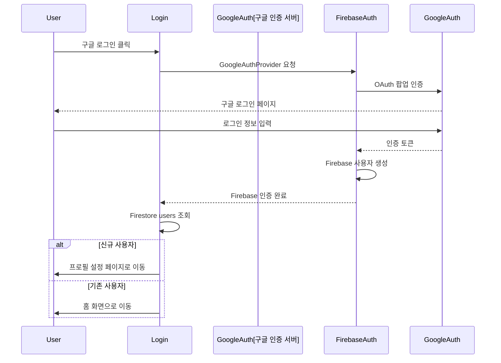

**구글 OAuth 특징**:
- Firebase Authentication의 `GoogleAuthProvider` 사용
- Popup 방식 인증 (팝업 차단 시 오류 처리)
- 자동으로 이메일, 프로필 정보 획득
- Firebase Console에서 구글 로그인 활성화 필요

**환경 변수**:
- Firebase 프로젝트 설정에서 구글 로그인 활성화 필요
- 추가 API 키 설정 불필요 (Firebase 설정만으로 동작)

#### 카카오 OAuth API

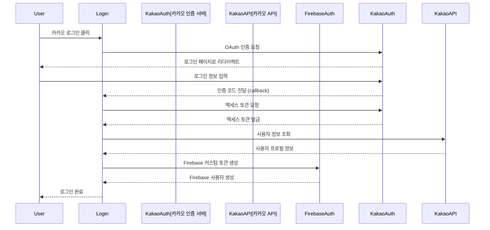

**카카오 OAuth 엔드포인트**:
- 인증: `https://kauth.kakao.com/oauth/authorize`
- 토큰: `https://kauth.kakao.com/oauth/token`
- 사용자 정보: `https://kapi.kakao.com/v2/user/me`
- 로그아웃: `https://kapi.kakao.com/v1/user/logout`

**환경 변수**:
- `REACT_APP_KAKAO_CLIENT_ID`: 카카오 앱 키
- `REACT_APP_KAKAO_REDIRECT_URI`: 리다이렉트 URI (자동 설정)

---

## 보안 및 권한 관리

### 인증 플로우

```mermaid
sequenceDiagram
    participant User
    participant Login
    participant FirebaseAuth
    participant OAuthProvider[OAuth Provider<br/>구글/카카오]
    participant AuthContext
    participant Firestore
    
    User->>Login: 로그인 요청
    alt 구글 로그인
        Login->>FirebaseAuth: GoogleAuthProvider 팝업
        FirebaseAuth->>OAuthProvider: 구글 인증
        OAuthProvider-->>FirebaseAuth: 구글 토큰
        FirebaseAuth-->>Login: Firebase 인증 완료
    else 카카오 로그인
        Login->>OAuthProvider: 카카오 OAuth 리다이렉트
        OAuthProvider-->>Login: 인증 코드
        Login->>OAuthProvider: 액세스 토큰 요청
        OAuthProvider-->>Login: 액세스 토큰
        Login->>OAuthProvider: 사용자 정보 조회
        OAuthProvider-->>Login: 사용자 프로필
        Login->>FirebaseAuth: 커스텀 토큰 생성
        FirebaseAuth-->>Login: Firebase 인증 완료
    end
    Login->>Firestore: users/{uid} 조회
    Firestore-->>Login: 사용자 정보
    Login->>AuthContext: 인증 상태 업데이트
    AuthContext-->>User: 로그인 완료
```

### 권한 체크

1. **인증 상태**: `AuthContext`에서 관리
2. **프로필 완성도**: `ProfileGuard`가 확인
3. **차단 상태**: `users.status === 'banned'` 체크
4. **캘린더 공개**: `users.isPublic` 필드 확인

### 지원하는 OAuth 제공자

| 제공자 | 인증 방식 | 특징 |
|--------|----------|------|
| **구글** | Firebase Auth (Popup) | 간편한 설정, 자동 프로필 정보 |
| **카카오** | 커스텀 OAuth (Redirect) | 한국 사용자 친화적, 리다이렉트 방식 |

---

## 성능 최적화

### 쿼리 최적화

- **제한 설정**: 모든 쿼리에 `limit()` 적용
- **인덱스**: 복합 쿼리를 위한 Firestore 인덱스 설정
- **페이지네이션**: 대량 데이터는 `startAfter()` 사용

### 클라이언트 최적화

- **React.memo**: 불필요한 리렌더링 방지
- **useMemo/useCallback**: 비용이 큰 연산 캐싱
- **코드 스플리팅**: 라우트별 동적 import

### 이미지 최적화

- **썸네일 생성**: Storage에서 썸네일 버전 제공
- **지연 로딩**: Intersection Observer 활용
- **압축**: 업로드 전 이미지 압축

---

## 파일 구조 참고

### 주요 디렉토리

```
src/
├── api/              # API 호출 모듈
├── components/       # 재사용 컴포넌트
├── contexts/         # Context API (상태 관리)
├── hooks/            # Custom Hooks
├── models/           # 데이터 모델 정의
├── pages/            # 페이지 컴포넌트
├── services/         # 비즈니스 로직 서비스
└── utils/            # 유틸리티 함수
```

### 핵심 파일

- **추천 로직**: `utils/homeRecommendationUtils.js`, `utils/sortingUtils.js`
- **날씨**: `api/kmaWeather.js`, `api/kmaPastWeather.js`, `api/weatherService.js`
- **알림**: `services/notificationService.js`, `models/Notification.js`
- **인증**: `contexts/AuthContext.js`, `firebase.js`

---

## 확장 가능성

### 향후 개선 사항

1. **서버리스 함수**: Cloud Functions로 비즈니스 로직 이전
2. **실시간 동기화**: Firestore 실시간 리스너 확대
3. **푸시 알림**: FCM 연동
4. **검색 기능**: Algolia 등 검색 서비스 연동
5. **CDN**: 이미지 CDN 활용

---

*최종 업데이트: 2024*
