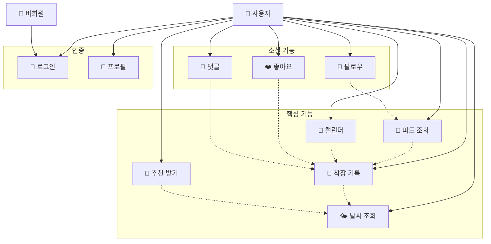
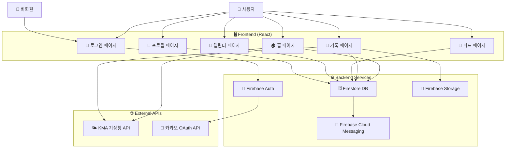

# Fitweather 유스케이스 다이어그램

## 개선된 유스케이스 다이어그램

```mermaid
graph TB
    %% 액터 정의
    User[👤 회원 사용자]
    Guest[👤 비회원 사용자]
    
    %% 시스템 경계
    subgraph System["🌤️ Fitweather 시스템"]
        %% 날씨 관련 유스케이스
        subgraph Weather["🌦️ 날씨 관리"]
            UC1[현재 날씨 조회]
            UC2[과거 날씨 조회]
            UC3[날씨 예보 조회]
        end
        
        %% 착장 기록 관련 유스케이스
        subgraph Outfit["👗 착장 기록 관리"]
            UC4[착장 기록 작성]
            UC5[착장 기록 수정]
            UC6[착장 기록 삭제]
            UC7[착장 기록 조회]
            UC8[착장 사진 업로드]
        end
        
        %% 소셜 기능 관련 유스케이스
        subgraph Social["💬 소셜 기능"]
            UC9[좋아요/싫어요]
            UC10[댓글 작성]
            UC11[댓글 삭제]
            UC12[팔로우하기]
            UC13[팔로우 취소]
            UC14[팔로워 목록 조회]
            UC15[팔로잉 목록 조회]
            UC32[댓글 목록 조회]
            UC33[댓글 수정]
            UC34[대댓글 작성]
            UC35[댓글 좋아요]
        end
        
        %% 추천 시스템 관련 유스케이스
        subgraph Recommendation["🎯 추천 시스템"]
            UC14[착장 추천 받기]
            UC15[지역별 추천]
            UC16[계절별 추천]
            UC17[스타일별 추천]
        end
        
        %% 캘린더 관련 유스케이스
        subgraph Calendar["📅 캘린더 관리"]
            UC18[캘린더 조회]
            UC19[캘린더 공개 설정]
            UC20[다른 사용자 캘린더 조회]
        end
        
        %% 피드 관련 유스케이스
        subgraph Feed["📱 피드 관리"]
            UC21[지역 피드 조회]
            UC22[피드 정렬]
            UC23[피드 필터링]
        end
        
        %% 사용자 관리 관련 유스케이스
        subgraph UserMgmt["👤 사용자 관리"]
            UC24[회원가입]
            UC25[로그인]
            UC26[로그아웃]
            UC27[프로필 설정]
            UC28[회원 탈퇴]
        end
        
        %% 알림 관련 유스케이스
        subgraph Notification["🔔 알림 관리"]
            UC29[알림 조회]
            UC30[알림 설정]
            UC31[푸시 알림]
        end
    end
    
    %% 액터와 유스케이스 간의 관계
    %% 회원 사용자
    User --> UC1
    User --> UC2
    User --> UC3
    User --> UC4
    User --> UC5
    User --> UC6
    User --> UC7
    User --> UC8
    User --> UC9
    User --> UC10
    User --> UC11
    User --> UC12
    User --> UC13
    User --> UC14
    User --> UC15
    User --> UC16
    User --> UC17
    User --> UC18
    User --> UC19
    User --> UC20
    User --> UC21
    User --> UC22
    User --> UC23
    User --> UC25
    User --> UC26
    User --> UC27
    User --> UC28
    User --> UC29
    User --> UC30
    User --> UC31
    
    %% 비회원 사용자 (로그인/회원가입만 가능)
    Guest --> UC24
    Guest --> UC25
    
    %% 유스케이스 간의 관계 (의존성)
    UC4 -.->|포함| UC8
    UC4 -.->|포함| UC1
    UC5 -.->|확장| UC4
    UC6 -.->|확장| UC4
    UC7 -.->|포함| UC1
    UC9 -.->|포함| UC7
    UC10 -.->|포함| UC7
    UC11 -.->|확장| UC10
    UC32 -.->|포함| UC7
    UC33 -.->|확장| UC10
    UC34 -.->|확장| UC10
    UC35 -.->|확장| UC9
    UC12 -.->|포함| UC20
    UC13 -.->|확장| UC12
    UC14 -.->|포함| UC1
    UC14 -.->|포함| UC21
    UC15 -.->|포함| UC21
    UC16 -.->|포함| UC1
    UC16 -.->|포함| UC21
    UC17 -.->|포함| UC1
    UC17 -.->|포함| UC21
    UC18 -.->|포함| UC7
    UC19 -.->|포함| UC18
    UC20 -.->|포함| UC19
    UC21 -.->|포함| UC1
    UC21 -.->|포함| UC7
    UC22 -.->|포함| UC21
    UC23 -.->|포함| UC21
    UC27 -.->|포함| UC4
    UC27 -.->|포함| UC7
    UC27 -.->|포함| UC18
    UC29 -.->|포함| UC9
    UC29 -.->|포함| UC10
    UC29 -.->|포함| UC12
    UC30 -.->|포함| UC29
    UC31 -.->|포함| UC30
```

## 간소화된 핵심 유스케이스 다이어그램

## 유스케이스 상세 설명

### 1. 🌦️ 날씨 관리
- **현재 날씨 조회**: 실시간 날씨 정보 조회 (온도, 습도, 풍속, 날씨 상태)
- **과거 날씨 조회**: 특정 날짜의 과거 날씨 정보 조회 (KMA API 활용)
- **날씨 예보 조회**: 미래 날씨 예보 정보 조회 (3일, 7일 예보)

### 2. 👗 착장 기록 관리
- **착장 기록 작성**: 새로운 착장 기록 생성 (날씨, 착장 정보, 사진, 감정)
- **착장 기록 수정**: 기존 착장 기록 수정 (본인 기록만)
- **착장 기록 삭제**: 착장 기록 삭제 (본인 기록만)
- **착장 기록 조회**: 착장 기록 상세 조회 (개인/공개 기록)
- **착장 사진 업로드**: 착장 사진 업로드 (Firebase Storage)

### 3. 💬 소셜 기능
- **좋아요/싫어요**: 다른 사용자의 착장에 좋아요/싫어요 표시
- **댓글 작성**: 착장에 댓글 작성 (공개 기록에만)
- **댓글 삭제**: 본인이 작성한 댓글 삭제
- **구독/팔로우**: 다른 사용자 구독 (알림 수신)
- **구독 취소**: 구독 취소

### 4. 🎯 추천 시스템
- **착장 추천 받기**: 날씨 기반 착장 추천 (AI 추천 알고리즘)
- **지역별 추천**: 지역 기반 추천 (동일 지역 사용자 패턴 분석)
- **계절별 추천**: 계절에 따른 착장 추천 (절기별 추천)
- **스타일별 추천**: 스타일(캐주얼, 포멀, 스포티 등)에 따른 추천

### 5. 📅 캘린더 관리
- **캘린더 조회**: 개인 캘린더 조회 (월별 착장 기록)
- **캘린더 공개 설정**: 캘린더 공개/비공개 설정
- **다른 사용자 캘린더 조회**: 다른 사용자의 공개된 캘린더 조회

### 6. 📱 피드 관리
- **지역 피드 조회**: 특정 지역의 착장 피드 조회
- **피드 정렬**: 인기순, 최신순 정렬
- **피드 필터링**: 스타일, 계절, 날씨 등으로 필터링

### 7. 👤 사용자 관리
- **회원가입**: 새 계정 생성 (카카오 OAuth)
- **로그인**: 계정 로그인 (카카오 OAuth)
- **로그아웃**: 계정 로그아웃
- **프로필 설정**: 사용자 프로필 정보 설정 (닉네임, 지역, 선호 스타일)
- **회원 탈퇴**: 계정 삭제

### 8. 🔔 알림 관리
- **알림 조회**: 알림 목록 조회 (좋아요, 댓글, 팔로우 알림)
- **알림 설정**: 알림 수신 설정 (푸시 알림, 이메일 알림)
- **푸시 알림**: 실시간 푸시 알림 수신

## 액터별 권한 매트릭스

| 기능 | 회원 사용자 | 비회원 사용자 |
|------|-------------|---------------|
| 날씨 조회 | ✅ | ❌ |
| 착장 기록 작성 | ✅ | ❌ |
| 착장 기록 수정/삭제 | ✅ (본인만) | ❌ |
| 착장 기록 조회 | ✅ | ❌ |
| 소셜 기능 | ✅ | ❌ |
| 추천 받기 | ✅ | ❌ |
| 캘린더 조회 | ✅ | ❌ |
| 캘린더 설정 | ✅ | ❌ |
| 피드 조회 | ✅ | ❌ |
| 회원가입/로그인 | ✅ | ✅ |
| 프로필 관리 | ✅ | ❌ |
| 알림 관리 | ✅ | ❌ |

## 액터별 상세 설명

### 👤 회원 사용자
- **모든 기능 사용 가능**: 날씨 조회, 착장 기록, 소셜 기능, 추천 시스템 등
- **개인 데이터 관리**: 본인의 기록만 수정/삭제 가능
- **소셜 상호작용**: 다른 사용자의 공개된 기록 조회 및 상호작용 가능

### 👤 비회원 사용자
- **로그인/회원가입만 가능**: 모든 서비스 기능 사용 불가
- **로그인 강제**: 앱 접근 시 로그인 페이지로 리다이렉트
- **회원 전환 필요**: 서비스 이용을 위해서는 반드시 회원가입 필요

## 주요 비즈니스 규칙

### 1. 데이터 접근 규칙
- **개인정보 보호**: 본인의 기록만 수정/삭제 가능
- **공개 설정**: 사용자가 설정한 공개/비공개 설정 준수
- **지역 기반**: 동일 지역 사용자 간의 상호작용 우선

### 2. 추천 시스템 규칙
- **날씨 기반**: 현재 날씨와 과거 착장 패턴 분석
- **개인화**: 사용자의 착장 히스토리 기반 개인화 추천
- **지역화**: 동일 지역 사용자의 착장 패턴 반영

### 3. 소셜 기능 규칙
- **공개 기록만**: 공개 설정된 착장에만 좋아요/댓글 가능
- **실명 정책**: 카카오 계정 연동으로 신뢰성 확보
- **스팸 방지**: 과도한 좋아요/댓글 제한

## 시스템 아키텍처 연관성

### Frontend (React)
- **페이지별 라우팅**: 각 유스케이스별 전용 페이지
- **상태 관리**: AuthContext를 통한 사용자 상태 관리
- **API 연동**: RESTful API를 통한 백엔드 연동

### Backend (Firebase)
- **인증**: Firebase Auth (카카오 OAuth)
- **데이터베이스**: Firestore (NoSQL)
- **스토리지**: Firebase Storage (이미지)
- **알림**: Firebase Cloud Messaging

### 외부 API
- **날씨 데이터**: KMA (기상청) API
- **OAuth**: 카카오 로그인 API

## 🔗 시스템 아키텍처 다이어그램

## 📡 API 연동 상세

### 🌤️ 날씨 API (KMA)
- **현재 날씨**: `getVilageFcst` - 단기예보 조회
- **과거 날씨**: `getWthrDataList` - 관측 데이터 조회
- **지역별 격자 좌표**: 20개 주요 도시 지원
- **데이터 형식**: JSON, 실시간 업데이트

### 🔗 OAuth API (카카오)
- **인증 방식**: OAuth 2.0
- **사용자 정보**: 프로필, 이메일, 닉네임
- **토큰 관리**: Firebase Auth 통합
- **보안**: HTTPS, 토큰 갱신

### 🔥 Firebase 서비스
- **Authentication**: 사용자 인증 및 세션 관리
- **Firestore**: NoSQL 문서 데이터베이스
- **Storage**: 이미지 및 파일 저장
- **Cloud Messaging**: 푸시 알림 서비스
