# Fitweather 유스케이스 다이어그램

## 유스케이스 다이어그램

```mermaid
graph TB
    %% 액터 정의
    User[👤 사용자]
    Guest[👤 비회원]
    Admin[👤 관리자]
    
    %% 시스템 경계
    subgraph System["🌤️ Fitweather 시스템"]
        %% 날씨 관련 유스케이스
        subgraph Weather["날씨 관리"]
            UC1[날씨 정보 조회]
            UC2[과거 날씨 조회]
            UC3[날씨 예보 조회]
        end
        
        %% 착장 기록 관련 유스케이스
        subgraph Outfit["착장 기록 관리"]
            UC4[착장 기록 작성]
            UC5[착장 기록 수정]
            UC6[착장 기록 삭제]
            UC7[착장 기록 조회]
            UC8[착장 사진 업로드]
        end
        
        %% 소셜 기능 관련 유스케이스
        subgraph Social["소셜 기능"]
            UC9[좋아요/싫어요]
            UC10[댓글 작성]
            UC11[댓글 삭제]
            UC12[구독/팔로우]
            UC13[구독 취소]
        end
        
        %% 추천 시스템 관련 유스케이스
        subgraph Recommendation["추천 시스템"]
            UC14[착장 추천 받기]
            UC15[지역별 추천]
            UC16[계절별 추천]
            UC17[스타일별 추천]
        end
        
        %% 캘린더 관련 유스케이스
        subgraph Calendar["캘린더 관리"]
            UC18[캘린더 조회]
            UC19[캘린더 공개 설정]
            UC20[다른 사용자 캘린더 조회]
        end
        
        %% 피드 관련 유스케이스
        subgraph Feed["피드 관리"]
            UC21[지역 피드 조회]
            UC22[피드 정렬]
            UC23[피드 필터링]
        end
        
        %% 사용자 관리 관련 유스케이스
        subgraph UserMgmt["사용자 관리"]
            UC24[회원가입]
            UC25[로그인]
            UC26[로그아웃]
            UC27[프로필 설정]
            UC28[회원 탈퇴]
        end
    end
    
    %% 액터와 유스케이스 간의 관계
    %% 사용자 (회원)
    User --> UC1
    User --> UC2
    User --> UC3
    User --> UC4
    User --> UC5
    User --> UC6
    User --> UC7
    User --> UC8
    User --> UC9
    User --> UC10
    User --> UC11
    User --> UC12
    User --> UC13
    User --> UC14
    User --> UC15
    User --> UC16
    User --> UC17
    User --> UC18
    User --> UC19
    User --> UC20
    User --> UC21
    User --> UC22
    User --> UC23
    User --> UC25
    User --> UC26
    User --> UC27
    User --> UC28
    
    %% 비회원
    Guest --> UC1
    Guest --> UC2
    Guest --> UC3
    Guest --> UC7
    Guest --> UC14
    Guest --> UC15
    Guest --> UC16
    Guest --> UC17
    Guest --> UC18
    Guest --> UC20
    Guest --> UC21
    Guest --> UC22
    Guest --> UC23
    Guest --> UC24
    Guest --> UC25
    
    %% 관리자
    Admin --> UC1
    Admin --> UC2
    Admin --> UC3
    Admin --> UC7
    Admin --> UC14
    Admin --> UC15
    Admin --> UC16
    Admin --> UC17
    Admin --> UC18
    Admin --> UC20
    Admin --> UC21
    Admin --> UC22
    Admin --> UC23
    
    %% 유스케이스 간의 관계
    UC4 -.-> UC8
    UC4 -.-> UC1
    UC5 -.-> UC4
    UC6 -.-> UC4
    UC7 -.-> UC1
    UC9 -.-> UC7
    UC10 -.-> UC7
    UC11 -.-> UC10
    UC12 -.-> UC20
    UC13 -.-> UC12
    UC14 -.-> UC1
    UC14 -.-> UC21
    UC15 -.-> UC21
    UC16 -.-> UC1
    UC16 -.-> UC21
    UC17 -.-> UC1
    UC17 -.-> UC21
    UC18 -.-> UC7
    UC19 -.-> UC18
    UC20 -.-> UC19
    UC21 -.-> UC1
    UC21 -.-> UC7
    UC22 -.-> UC21
    UC23 -.-> UC21
    UC27 -.-> UC4
    UC27 -.-> UC7
    UC27 -.-> UC18
```

## 유스케이스 상세 설명

### 1. 날씨 관리
- **날씨 정보 조회**: 현재 날씨 정보를 조회
- **과거 날씨 조회**: 특정 날짜의 과거 날씨 정보 조회
- **날씨 예보 조회**: 미래 날씨 예보 정보 조회

### 2. 착장 기록 관리
- **착장 기록 작성**: 새로운 착장 기록 생성
- **착장 기록 수정**: 기존 착장 기록 수정
- **착장 기록 삭제**: 착장 기록 삭제
- **착장 기록 조회**: 착장 기록 상세 조회
- **착장 사진 업로드**: 착장 사진 업로드

### 3. 소셜 기능
- **좋아요/싫어요**: 다른 사용자의 착장에 좋아요/싫어요 표시
- **댓글 작성**: 착장에 댓글 작성
- **댓글 삭제**: 본인이 작성한 댓글 삭제
- **구독/팔로우**: 다른 사용자 구독
- **구독 취소**: 구독 취소

### 4. 추천 시스템
- **착장 추천 받기**: 날씨 기반 착장 추천
- **지역별 추천**: 지역 기반 추천
- **계절별 추천**: 계절에 따른 착장 추천
- **스타일별 추천**: 스타일(캐주얼, 포멀, 스포티 등)에 따른 추천

### 5. 캘린더 관리
- **캘린더 조회**: 개인 캘린더 조회
- **캘린더 공개 설정**: 캘린더 공개/비공개 설정
- **다른 사용자 캘린더 조회**: 다른 사용자의 공개된 캘린더 조회

### 6. 피드 관리
- **지역 피드 조회**: 특정 지역의 착장 피드 조회
- **피드 정렬**: 인기순, 최신순 정렬
- **피드 필터링**: 스타일, 계절 등으로 필터링

### 7. 사용자 관리
- **회원가입**: 새 계정 생성
- **로그인**: 계정 로그인
- **로그아웃**: 계정 로그아웃
- **프로필 설정**: 사용자 프로필 정보 설정
- **회원 탈퇴**: 계정 삭제

## 액터별 권한

### 사용자 (회원)
- 모든 기능 사용 가능
- 본인의 기록만 수정/삭제 가능
- 다른 사용자의 공개된 기록 조회 가능

### 비회원
- 조회 기능만 사용 가능
- 회원가입/로그인 가능
- 소셜 기능 사용 불가

### 관리자
- 모든 조회 기능 사용 가능
- 사용자 관리 기능 (추후 구현 예정)
