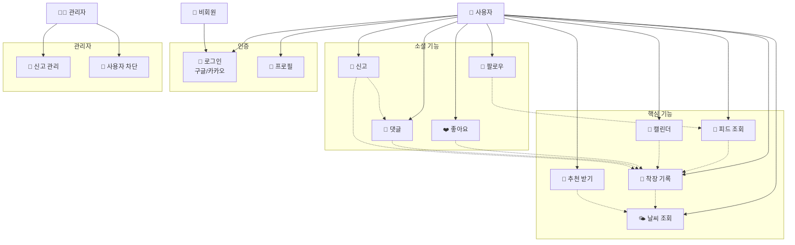

# Fitweather 유스케이스 다이어그램

## 📋 목차

1. [전체 유스케이스 다이어그램](#전체-유스케이스-다이어그램)
2. [간소화된 핵심 유스케이스](#간소화된-핵심-유스케이스)
3. [액터 정의](#액터-정의)
4. [유스케이스 상세 설명](#유스케이스-상세-설명)
5. [액터별 권한 매트릭스](#액터별-권한-매트릭스)

---

## 전체 유스케이스 다이어그램

```mermaid
graph TB
    %% 액터 정의
    User[👤 회원 사용자]
    Guest[👤 비회원 사용자]
    Admin[👨‍💼 관리자]
    
    %% 시스템 경계
    subgraph System["🌤️ Fitweather 시스템"]
        %% 인증 관련 유스케이스
        subgraph Auth["🔐 인증 관리"]
            UC1[구글 로그인]
            UC2[카카오 로그인]
            UC3[로그아웃]
            UC4[회원가입]
            UC5[프로필 설정]
            UC6[회원 탈퇴]
        end
        
        %% 날씨 관련 유스케이스
        subgraph Weather["🌦️ 날씨 관리"]
            UC7[현재 날씨 조회]
            UC8[과거 날씨 조회]
        end
        
        %% 착장 기록 관련 유스케이스
        subgraph Outfit["👗 착장 기록 관리"]
            UC10[착장 기록 작성]
            UC11[착장 기록 수정]
            UC12[착장 기록 삭제]
            UC13[착장 기록 조회]
            UC14[착장 사진 업로드]
        end
        
        %% 소셜 기능 관련 유스케이스
        subgraph Social["💬 소셜 기능"]
            UC15[좋아요/싫어요]
            UC16[댓글 작성]
            UC17[댓글 수정]
            UC18[댓글 삭제]
            UC19[댓글 목록 조회]
            UC20[답글 작성]
            UC21[팔로우하기]
            UC22[팔로우 취소]
            UC23[팔로워 목록 조회]
            UC24[팔로잉 목록 조회]
        end
        
        %% 추천 시스템 관련 유스케이스
        subgraph Recommendation["🎯 추천 시스템"]
            UC25[홈 추천 받기]
            UC26[지역별 추천]
            UC27[계절별 추천]
            UC28[스타일별 추천]
        end
        
        %% 캘린더 관련 유스케이스
        subgraph Calendar["📅 캘린더 관리"]
            UC30[내 캘린더 조회]
            UC31[캘린더 공개 설정]
            UC32[다른 사용자 캘린더 조회]
            UC33[캘린더 날짜 클릭]
        end
        
        %% 피드 관련 유스케이스
        subgraph Feed["📱 피드 관리"]
            UC34[지역 피드 조회]
            UC35[피드 정렬]
            UC36[피드 필터링]
            UC37[피드 상세 조회]
        end
        
        %% 알림 관련 유스케이스
        subgraph Notification["🔔 알림 관리"]
            UC38[알림 조회]
            UC39[알림 읽음 처리]
            UC40[알림 삭제]
        end
        
        %% 신고 관련 유스케이스
        subgraph Report["🚨 신고 관리"]
            UC42[게시물 신고]
            UC43[댓글 신고]
        end
        
        %% 관리자 관련 유스케이스
        subgraph AdminUC["👨‍💼 관리자 기능"]
            UC44[관리자 로그인]
            UC45[신고 목록 조회]
            UC46[사용자 차단]
            UC47[사용자 차단 해제]
            UC48[게시물 삭제]
            UC49[댓글 삭제]
            UC50[사용자 목록 조회]
        end
    end
    
    %% 액터와 유스케이스 간의 관계
    %% 회원 사용자
    User --> UC1
    User --> UC2
    User --> UC3
    User --> UC5
    User --> UC6
    User --> UC7
    User --> UC8
    User --> UC10
    User --> UC11
    User --> UC12
    User --> UC13
    User --> UC14
    User --> UC15
    User --> UC16
    User --> UC17
    User --> UC18
    User --> UC19
    User --> UC20
    User --> UC21
    User --> UC22
    User --> UC23
    User --> UC24
    User --> UC25
    User --> UC26
    User --> UC27
    User --> UC28
    User --> UC30
    User --> UC31
    User --> UC32
    User --> UC33
    User --> UC34
    User --> UC35
    User --> UC36
    User --> UC37
    User --> UC38
    User --> UC39
    User --> UC40
    User --> UC42
    User --> UC43
    
    %% 비회원 사용자
    Guest --> UC1
    Guest --> UC2
    Guest --> UC4
    
    %% 관리자
    Admin --> UC44
    Admin --> UC45
    Admin --> UC46
    Admin --> UC47
    Admin --> UC48
    Admin --> UC49
    Admin --> UC50
    
    %% 유스케이스 간의 관계 (의존성)
    UC10 -.->|포함| UC14
    UC10 -.->|포함| UC7
    UC11 -.->|확장| UC10
    UC12 -.->|확장| UC10
    UC13 -.->|포함| UC7
    UC15 -.->|포함| UC13
    UC16 -.->|포함| UC13
    UC17 -.->|확장| UC16
    UC18 -.->|확장| UC16
    UC19 -.->|포함| UC13
    UC20 -.->|확장| UC16
    UC21 -.->|포함| UC32
    UC22 -.->|확장| UC21
    UC25 -.->|포함| UC7
    UC25 -.->|포함| UC34
    UC26 -.->|포함| UC34
    UC27 -.->|포함| UC7
    UC27 -.->|포함| UC34
    UC28 -.->|포함| UC7
    UC28 -.->|포함| UC34
    UC30 -.->|포함| UC13
    UC31 -.->|포함| UC30
    UC32 -.->|포함| UC31
    UC33 -.->|포함| UC30
    UC34 -.->|포함| UC7
    UC34 -.->|포함| UC13
    UC35 -.->|포함| UC34
    UC36 -.->|포함| UC34
    UC37 -.->|포함| UC13
    UC38 -.->|포함| UC15
    UC38 -.->|포함| UC16
    UC38 -.->|포함| UC21
    UC39 -.->|확장| UC38
    UC40 -.->|확장| UC38
    UC42 -.->|포함| UC13
    UC43 -.->|포함| UC16
    UC45 -.->|포함| UC42
    UC45 -.->|포함| UC43
    UC46 -.->|포함| UC45
    UC47 -.->|확장| UC46
    UC48 -.->|포함| UC45
    UC49 -.->|포함| UC45
```

---

## 간소화된 핵심 유스케이스

---

## 액터 정의

### 👤 회원 사용자 (User)
- **설명**: 서비스에 가입하고 로그인한 일반 사용자
- **권한**: 모든 서비스 기능 사용 가능 (본인 데이터 수정/삭제만 가능)
- **특징**: 
  - 날씨 조회, 착장 기록 작성/수정/삭제
  - 다른 사용자와 소셜 상호작용 (좋아요, 댓글, 팔로우)
  - 추천 시스템 이용
  - 신고 기능 사용

### 👤 비회원 사용자 (Guest)
- **설명**: 회원가입하지 않은 사용자
- **권한**: 로그인/회원가입만 가능
- **특징**:
  - 구글/카카오 로그인으로 회원가입 가능
  - 로그인 전까지 서비스 이용 불가
  - 로그인 강제 시스템

### 👨‍💼 관리자 (Admin)
- **설명**: 시스템 관리 권한을 가진 관리자
- **권한**: 신고 관리, 사용자 차단, 콘텐츠 삭제
- **특징**:
  - 별도 관리자 로그인 필요
  - 신고 목록 조회 및 처리
  - 사용자 차단/해제
  - 부적절한 게시물/댓글 삭제

---

## 유스케이스 상세 설명

### 🔐 인증 관리

#### UC1: 구글 로그인
- **액터**: 회원/비회원 사용자
- **설명**: Firebase Authentication을 통한 구글 OAuth 로그인
- **전제조건**: 구글 계정 보유
- **성공 시나리오**: 
  1. 사용자가 구글 로그인 버튼 클릭
  2. Firebase GoogleAuthProvider 팝업 표시
  3. 구글 로그인 완료
  4. Firebase 인증 완료
  5. 신규 사용자는 프로필 설정으로, 기존 사용자는 홈으로 이동

#### UC2: 카카오 로그인
- **액터**: 회원/비회원 사용자
- **설명**: 카카오 OAuth를 통한 로그인
- **전제조건**: 카카오 계정 보유
- **성공 시나리오**:
  1. 사용자가 카카오 로그인 버튼 클릭
  2. 카카오 인증 페이지로 리다이렉트
  3. 카카오 로그인 완료
  4. 인증 코드를 받아 액세스 토큰 획득
  5. Firebase 커스텀 토큰으로 인증 연동

#### UC5: 프로필 설정
- **액터**: 회원 사용자 (신규)
- **설명**: 필수 프로필 정보 설정 (닉네임, 지역)
- **전제조건**: 회원가입 완료
- **성공 시나리오**: 
  1. 신규 사용자는 프로필 설정 페이지로 이동
  2. 닉네임과 지역 입력
  3. 저장 완료 후 홈 화면으로 이동

### 🌦️ 날씨 관리

#### UC7: 현재 날씨 조회
- **액터**: 회원 사용자
- **설명**: 실시간 날씨 정보 조회 (다중 API Fallback 시스템)
- **API 우선순위**: 
  1. 기상청(KMA) 단기예보 API - 2초 타임아웃 (현재/다음 시간대 예보)
  2. OpenWeatherMap
  3. AccuWeather
  4. WeatherAPI
  5. Visual Crossing
  6. Mock 데이터 (모든 API 실패 시)
- **참고**: 기상청 API는 단기예보 데이터를 제공하지만, 사용자는 현재 날씨만 조회합니다.

#### UC8: 과거 날씨 조회
- **액터**: 회원 사용자
- **설명**: 특정 날짜의 과거 날씨 정보 조회
- **사용 목적**: 과거 착장 기록 작성 시 날씨 정보 제공
- **API**: 기상청 과거 관측 데이터 API (실패 시 예보 API fallback)

### 👗 착장 기록 관리

#### UC10: 착장 기록 작성
- **액터**: 회원 사용자
- **설명**: 새로운 착장 기록 생성
- **포함 기능**: 
  - 날씨 정보 자동 연동
  - 착장 사진 업로드 (Firebase Storage)
  - 스타일 태그 설정
  - 계절 정보 자동 설정
  - 공개/비공개 설정

#### UC11: 착장 기록 수정
- **액터**: 회원 사용자 (본인 기록만)
- **설명**: 기존 착장 기록 수정
- **제한사항**: 본인이 작성한 기록만 수정 가능

#### UC12: 착장 기록 삭제
- **액터**: 회원 사용자 (본인 기록만)
- **설명**: 착장 기록 삭제
- **제한사항**: 본인이 작성한 기록만 삭제 가능

### 💬 소셜 기능

#### UC15: 좋아요/싫어요
- **액터**: 회원 사용자
- **설명**: 다른 사용자의 공개 기록에 좋아요/싫어요 표시
- **제한사항**: 공개 설정된 기록에만 가능

#### UC16: 댓글 작성
- **액터**: 회원 사용자
- **설명**: 공개 기록에 댓글 작성
- **제한사항**: 공개 설정된 기록에만 가능

#### UC20: 답글 작성
- **액터**: 회원 사용자
- **설명**: 댓글에 답글 작성
- **특징**: 계층적 댓글 구조

#### UC21: 팔로우하기
- **액터**: 회원 사용자
- **설명**: 다른 사용자 구독
- **결과**: 팔로우한 사용자의 공개 기록 알림 수신 (기능 제거됨)

### 🎯 추천 시스템

#### UC25: 홈 추천 받기
- **액터**: 회원 사용자
- **설명**: 홈 화면에서 계절 및 스타일 기반 추천
- **알고리즘**:
  1. 전체 공개 기록 조회 (지역 무관)
  2. 현재 계절 필터링
  3. 사용자 스타일 필터링 (선택적)
  4. 인기순 정렬 (좋아요 → 싫어요 → 최신순)
  5. 상위 3개 반환
- **새로고침 기능**: 새로고침 버튼 클릭 시 상위 10개 중 랜덤하게 3개 재선택 (별도 유스케이스 아님)

### 📅 캘린더 관리

#### UC30: 내 캘린더 조회
- **액터**: 회원 사용자
- **설명**: 본인의 월별 착장 기록 캘린더 조회
- **기능**: 날짜 클릭 시 Record 페이지로 이동

#### UC32: 다른 사용자 캘린더 조회
- **액터**: 회원 사용자
- **설명**: 다른 사용자의 공개 캘린더 조회
- **제한사항**: 공개 설정된 캘린더만 조회 가능
- **비공개 처리**: 비공개 캘린더 접근 시 알림 1회 표시 후 이전 페이지로 이동

### 📱 피드 관리

#### UC34: 지역 피드 조회
- **액터**: 회원 사용자
- **설명**: Feed 페이지 (`/feed`) - 특정 지역의 특정 날짜에 작성된 여러 착장 기록을 목록 형태로 조회
- **표시 방식**: 여러 기록을 카드 그리드로 표시 (인기순일 경우 TOP3 강조)
- **필터링 옵션**: 
  - 지역 선택 (드롭다운)
  - 날짜 선택 (년/월/일)
  - 스타일 선택 (전체/캐주얼/포멀 등)
- **정렬 옵션**: 인기순, 최신순
- **기능**: 
  - 지역별 날씨 정보 표시
  - 각 기록 카드 클릭 시 상세 페이지로 이동
  - 좋아요 토글

#### UC35: 피드 정렬
- **액터**: 회원 사용자
- **설명**: 지역 피드에서 정렬 방식 변경
- **옵션**: 
  - 인기순: 좋아요 수 기준 정렬 (TOP3 강조 표시)
  - 최신순: 생성일 기준 최신순 정렬
- **포함**: UC34에 포함된 기능

#### UC36: 피드 필터링
- **액터**: 회원 사용자
- **설명**: 지역 피드에서 필터 조건 변경
- **필터 종류**: 
  - 지역 필터: 드롭다운으로 지역 선택
  - 날짜 필터: 년/월/일 선택
  - 스타일 필터: 전체/캐주얼/포멀/스포티 등
- **포함**: UC34에 포함된 기능

#### UC37: 피드 상세 조회
- **액터**: 회원 사용자
- **설명**: FeedDetail 페이지 (`/feed-detail/:id`) - 특정 기록 하나의 상세 정보를 전체 화면으로 조회
- **표시 방식**: 단일 기록의 상세 화면 (이미지 캐러셀 포함)
- **기능**: 
  - 이미지 상세 확인 (여러 이미지 슬라이드)
  - 착장 정보 전체 확인 (아우터, 상의, 하의, 신발, 악세서리)
  - 날씨 정보 표시
  - 댓글 작성/조회/수정/삭제
  - 답글 작성
  - 좋아요/싫어요
  - 신고
  - 작성자 캘린더로 이동
  - 구독하기/구독취소
- **차이점**: 
  - **UC34 (지역 피드 조회)**: 여러 기록 목록을 그리드로 표시
  - **UC37 (피드 상세 조회)**: 단일 기록의 상세 정보를 전체 화면으로 표시
- **네비게이션**: 
  - 지역 피드에서 기록 카드 클릭 → 피드 상세 페이지로 이동
  - 피드 상세에서 뒤로가기 → 이전 페이지(피드/추천)로 복귀

### 🔔 알림 관리

#### UC38: 알림 조회
- **액터**: 회원 사용자
- **설명**: 알림 사이드바에서 알림 목록 조회
- **알림 타입**: 
  - 구독 알림 (follow)
  - 댓글 알림 (comment_on_my_post)
  - 답글 알림 (reply_to_my_comment)

#### UC39: 알림 읽음 처리
- **액터**: 회원 사용자
- **설명**: 개별 알림 읽음 처리
- **동작**: 알림 클릭 시 자동 읽음 처리

### 🚨 신고 관리

#### UC42: 게시물 신고
- **액터**: 회원 사용자
- **설명**: 부적절한 게시물 신고
- **제한사항**: 중복 신고 불가
- **처리**: 관리자가 신고 목록에서 확인 및 처리

#### UC43: 댓글 신고
- **액터**: 회원 사용자
- **설명**: 부적절한 댓글 신고
- **제한사항**: 중복 신고 불가
- **처리**: 관리자가 신고 목록에서 확인 및 처리

### 👨‍💼 관리자 기능

#### UC44: 관리자 로그인
- **액터**: 관리자
- **설명**: 별도 관리자 로그인
- **세션 관리**: 1시간 세션 타임아웃

#### UC45: 신고 목록 조회
- **액터**: 관리자
- **설명**: 신고된 게시물/댓글 목록 조회
- **기능**: 신고 3회 이상 사용자 하이라이트

#### UC46: 사용자 차단
- **액터**: 관리자
- **설명**: 부적절한 사용자 차단
- **결과**: 차단된 사용자는 앱 접근 불가

---

## 액터별 권한 매트릭스

| 기능 | 회원 사용자 | 비회원 사용자 | 관리자 |
|------|-------------|---------------|--------|
| **인증** |
| 구글 로그인 | ✅ | ✅ | ❌ |
| 카카오 로그인 | ✅ | ✅ | ❌ |
| 로그아웃 | ✅ | ❌ | ✅ |
| 프로필 설정 | ✅ | ❌ | ❌ |
| 회원 탈퇴 | ✅ | ❌ | ❌ |
| 관리자 로그인 | ❌ | ❌ | ✅ |
| **날씨** |
| 현재 날씨 조회 | ✅ | ❌ | ✅ |
| 과거 날씨 조회 | ✅ | ❌ | ✅ |
| **착장 기록** |
| 기록 작성 | ✅ | ❌ | ✅ |
| 기록 수정 (본인만) | ✅ | ❌ | ❌ |
| 기록 삭제 (본인만) | ✅ | ❌ | ❌ |
| 기록 조회 | ✅ | ❌ | ✅ |
| 사진 업로드 | ✅ | ❌ | ❌ |
| **소셜 기능** |
| 좋아요/싫어요 | ✅ | ❌ | ✅ |
| 댓글 작성 | ✅ | ❌ | ✅ |
| 댓글 수정 (본인만) | ✅ | ❌ | ❌ |
| 댓글 삭제 (본인만) | ✅ | ❌ | ✅ |
| 답글 작성 | ✅ | ❌ | ✅ |
| 팔로우 | ✅ | ❌ | ✅ |
| **추천** |
| 홈 추천 받기 | ✅ | ❌ | ✅ |
| 지역별 추천 | ✅ | ❌ | ✅ |
| 계절별 추천 | ✅ | ❌ | ✅ |
| 스타일별 추천 | ✅ | ❌ | ✅ |
| **캘린더** |
| 내 캘린더 조회 | ✅ | ❌ | ✅ |
| 캘린더 공개 설정 | ✅ | ❌ | ❌ |
| 다른 사용자 캘린더 조회 | ✅ | ❌ | ✅ |
| **피드** |
| 피드 조회 | ✅ | ❌ | ✅ |
| 피드 정렬 | ✅ | ❌ | ✅ |
| 피드 필터링 | ✅ | ❌ | ✅ |
| **알림** |
| 알림 조회 | ✅ | ❌ | ❌ |
| 알림 읽음 처리 | ✅ | ❌ | ❌ |
| **신고** |
| 게시물 신고 | ✅ | ❌ | ❌ |
| 댓글 신고 | ✅ | ❌ | ❌ |
| 신고 목록 조회 | ❌ | ❌ | ✅ |
| **관리** |
| 사용자 차단 | ❌ | ❌ | ✅ |
| 사용자 차단 해제 | ❌ | ❌ | ✅ |
| 게시물 삭제 | ❌ | ❌ | ✅ |
| 댓글 삭제 | ❌ | ❌ | ✅ |
| 사용자 목록 조회 | ❌ | ❌ | ✅ |

---

## 주요 비즈니스 규칙

### 1. 데이터 접근 규칙
- **개인정보 보호**: 본인의 기록만 수정/삭제 가능
- **공개 설정**: 사용자가 설정한 공개/비공개 설정 준수
- **지역 기반**: 지역별 필터링 옵션 제공 (추천은 지역 무관)

### 2. 추천 시스템 규칙
- **계절 우선**: 현재 계절에 맞는 기록만 추천
- **스타일 필터**: 사용자 선택 스타일에 맞는 기록 필터링
- **인기순 정렬**: 좋아요 수 → 싫어요 수 → 최신순
- **지역 무관**: 모든 지역의 공개 기록 대상

### 3. 소셜 기능 규칙
- **공개 기록만**: 공개 설정된 착장에만 좋아요/댓글 가능
- **중복 신고 방지**: 동일 사용자가 동일 콘텐츠를 중복 신고 불가
- **신고 처리**: 관리자가 신고 목록 확인 후 차단/삭제 결정

### 4. 캘린더 접근 규칙
- **비공개 캘린더**: 접근 시 알림 1회 표시 후 이전 페이지로 이동
- **공개 캘린더**: 자유롭게 조회 가능
- **날짜 클릭**: 본인 캘린더는 Record로, 타인 캘린더는 FeedDetail로 이동

### 5. 관리자 권한 규칙
- **세션 관리**: 관리자 로그인 후 1시간 세션 유지
- **차단 사용자**: status='banned'로 설정, 앱 접근 불가
- **신고 처리**: 신고 3회 이상 사용자 강조 표시

---

## 시스템 아키텍처 연관성

이 유스케이스 다이어그램은 [SYSTEM_ARCHITECTURE.md](./SYSTEM_ARCHITECTURE.md)와 연계되어 있습니다.

### Frontend (React)
- **페이지별 라우팅**: 각 유스케이스별 전용 페이지
- **상태 관리**: AuthContext를 통한 사용자 상태 관리
- **컴포넌트 재사용**: 공통 컴포넌트 활용

### Backend (Firebase)
- **인증**: Firebase Auth (구글/카카오 OAuth)
- **데이터베이스**: Firestore (NoSQL)
- **스토리지**: Firebase Storage (이미지)

### External APIs
- **날씨 데이터**: KMA, OpenWeatherMap, AccuWeather, WeatherAPI, Visual Crossing
- **OAuth**: 구글 OAuth, 카카오 OAuth

---

*최종 업데이트: 2024*
